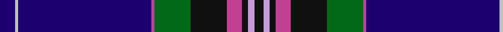

**Bands:** [BWBRGKRKWK](/stripes/bwbrgkrkwk/) · **Stripes:** [DB LB DB M G K M K LP K](/stripes/stripes10/) DB LB DB M G K M K LP K

This was sourced from house-of-tartan.  It is a [10 band tartan](/bands/bands10/).

Original link http://www.house-of-tartan.scotland.net/house/TartanViewjs.asp?colr=Def&tnam=4230

## Thread count
DB/10 N2 DB88 Pa2 G24 K24 Pa10 K4 LPa4 K/6

## Palette
Each colour and its ΔE from the base-6 reference it is a variant of.

| Colour | Shade | Base | ΔE (OKLab) |
|---|---|---|---|
| DB | <code style="background-color:#1C0070;">#1C0070</code> `#1C0070` | B <code style="background-color:#2A418A;">#2A418A</code> | 0.14 |
| G | <code style="background-color:#006818;">#006818</code> `#006818` | G <code style="background-color:#006100;">#006100</code> | 0.02 |
| K | <code style="background-color:#101010;">#101010</code> `#101010` | K <code style="background-color:#000000;">#000000</code> | 0.17 |
| LP | <code style="background-color:#9C68A4;">#9C68A4</code> `#9C68A4` | R <code style="background-color:#CC0000;">#CC0000</code> | 0.21 |
| LPa | <code style="background-color:#C49CD8;">#C49CD8</code> `#C49CD8` | W <code style="background-color:#F7F7F7;">#F7F7F7</code> | 0.25 |
| N | <code style="background-color:#C0C0C0;">#C0C0C0</code> `#C0C0C0` | W <code style="background-color:#F7F7F7;">#F7F7F7</code> | 0.17 |
| P | <code style="background-color:#6C0070;">#6C0070</code> `#6C0070` | B <code style="background-color:#2A418A;">#2A418A</code> | 0.16 |
| Pa | <code style="background-color:#C04094;">#C04094</code> `#C04094` | R <code style="background-color:#CC0000;">#CC0000</code> | 0.16 |

## Nearest tartans

The nearest existing variants by ΔTartan distance.

1. [Incorporation of Weavers (Glasgow)](/setts/s9/db3o3db36db7k3db6g5k1ly3~x2/) — ΔT 0.91
1. [Wcwm 9275-1510-1](/setts/s10/db60lo2db10k9lb2k2r2k2g28lo3~x2/) — ΔT 0.92
1. [Scotland the Brave (Fashion)](/setts/s10/db6w1db40m1k12dg12m6dg2dp2dg4~x2/) — ΔT 1.07
1. [Buckie](/setts/s9/o4k2dg2ly1dg8k20db50r2db2~x2/) — ΔT 1.14
1. [Lanyard Blue (Fashion)](/setts/s11/db90k10ly2k4w2k4b14r12k2r5w4/) — ΔT 1.14
1. [St Andrew's College](/setts/s9/db18w2db2r3db21k28ly1k1g2~x2/) — ΔT 1.15
1. [Scottish Heritage Society (Corporate](/setts/s12/db76p6k6db24g17k4r10k4g17db4k2w6/) — ΔT 1.16
1. [Royal Navy](/setts/s12/db4dp8db3dp2db64t24r4db3t4db3w8r4/) — ΔT 1.18
1. [Victorian Highland Pipe Band Assoc](/setts/s8/db46ly1ly3dg13ly1r7g3ly1~x2/) — ΔT 1.26
1. [Heart of Scotland (Fashion)](/setts/s10/db5w1db44dp1g12k12dp5k2m2k3~x2/) — ΔT 1.30

## Neighbour map

Every grey dot is one of 14313 variants placed by the first two principal components of the ΔTartan feature space (44% of its variance). Red is this tartan; blue dots are its nearest — click one to open its page.

<svg viewBox="0 0 640 380" role="img" style="max-width:100%;height:auto;border:1px solid #e0e0e0;border-radius:4px;display:block" xmlns="http://www.w3.org/2000/svg"><image href="/nn/cloud.v1.png" width="640" height="380"/><a href="/setts/s9/db3o3db36db7k3db6g5k1ly3~x2/"><circle cx="364.7" cy="110.3" r="4" fill="#3465a4"><title>Incorporation of Weavers (Glasgow)</title></circle></a><a href="/setts/s10/db60lo2db10k9lb2k2r2k2g28lo3~x2/"><circle cx="349.1" cy="97.6" r="4" fill="#3465a4"><title>Wcwm 9275-1510-1</title></circle></a><a href="/setts/s10/db6w1db40m1k12dg12m6dg2dp2dg4~x2/"><circle cx="338.9" cy="103.4" r="4" fill="#3465a4"><title>Scotland the Brave (Fashion)</title></circle></a><a href="/setts/s9/o4k2dg2ly1dg8k20db50r2db2~x2/"><circle cx="400.4" cy="99.7" r="4" fill="#3465a4"><title>Buckie</title></circle></a><a href="/setts/s11/db90k10ly2k4w2k4b14r12k2r5w4/"><circle cx="382.0" cy="57.4" r="4" fill="#3465a4"><title>Lanyard Blue (Fashion)</title></circle></a><a href="/setts/s9/db18w2db2r3db21k28ly1k1g2~x2/"><circle cx="322.0" cy="120.8" r="4" fill="#3465a4"><title>St Andrew's College</title></circle></a><a href="/setts/s12/db76p6k6db24g17k4r10k4g17db4k2w6/"><circle cx="352.4" cy="87.2" r="4" fill="#3465a4"><title>Scottish Heritage Society (Corporate</title></circle></a><a href="/setts/s12/db4dp8db3dp2db64t24r4db3t4db3w8r4/"><circle cx="305.8" cy="70.2" r="4" fill="#3465a4"><title>Royal Navy</title></circle></a><a href="/setts/s8/db46ly1ly3dg13ly1r7g3ly1~x2/"><circle cx="391.5" cy="88.3" r="4" fill="#3465a4"><title>Victorian Highland Pipe Band Assoc</title></circle></a><a href="/setts/s10/db5w1db44dp1g12k12dp5k2m2k3~x2/"><circle cx="383.7" cy="105.4" r="4" fill="#3465a4"><title>Heart of Scotland (Fashion)</title></circle></a><circle cx="352.4" cy="88.2" r="5" fill="#c00000"/></svg>

ID: /setts/s10/db5lb1db44m1g12k12m5k2lp2k3~x2/
