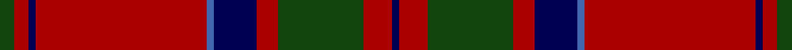

This page is one **sett** — a single exact thread-count. It belongs to the [tartan](/tartans/dg2r2db1r24b1db6r3dg12r4db1/)
(the same proportion at any scale), whose colour order is pattern [BRGRBBRBRG](/stripes/brgrbbrbrg/).

Sourced from weddslist.  It is a [10 stripe tartan](/stripes/stripes10/).

Original link http://www.weddslist.com/cgi-bin/tartans/pg.pl?source=x

## Thread count
DG/2 DR2 DB1 DR24 Ba1 DB6 DR3 DG12 DR4 DB/1

## Palette

Palette: <strong>custom</strong>
<table><thead><tr><th>Colour</th><th>Threads</th><th>Shade</th><th>Base</th><th>OKLCh</th></tr></thead><tbody><tr><td>DG/</td><td style="text-align:right;font-variant-numeric:tabular-nums">2</td><td><code style="background-color:#11450D;">#11450D</code> <small style="color:#888">#11450D</small></td><td>G <code style="background-color:#006100;">#006100</code></td><td><small style="color:#888">oklch(34.4% 0.101 142.1)</small></td></tr><tr><td>DR</td><td style="text-align:right;font-variant-numeric:tabular-nums">2</td><td><code style="background-color:#AA0000;">#AA0000</code> <small style="color:#888">#AA0000</small></td><td>R <code style="background-color:#CC0000;">#CC0000</code></td><td><small style="color:#888">oklch(46.3% 0.190 29.2)</small></td></tr><tr><td>DB</td><td style="text-align:right;font-variant-numeric:tabular-nums">1</td><td><code style="background-color:#000052;">#000052</code> <small style="color:#888">#000052</small></td><td>B <code style="background-color:#2A418A;">#2A418A</code></td><td><small style="color:#888">oklch(19.8% 0.137 264.1)</small></td></tr><tr><td>DR</td><td style="text-align:right;font-variant-numeric:tabular-nums">24</td><td><code style="background-color:#AA0000;">#AA0000</code> <small style="color:#888">#AA0000</small></td><td>R <code style="background-color:#CC0000;">#CC0000</code></td><td><small style="color:#888">oklch(46.3% 0.190 29.2)</small></td></tr><tr><td>Ba</td><td style="text-align:right;font-variant-numeric:tabular-nums">1</td><td><code style="background-color:#4367AE;">#4367AE</code> <small style="color:#888">#4367AE</small></td><td>B <code style="background-color:#2A418A;">#2A418A</code></td><td><small style="color:#888">oklch(52.2% 0.120 262.7)</small></td></tr><tr><td>DB</td><td style="text-align:right;font-variant-numeric:tabular-nums">6</td><td><code style="background-color:#000052;">#000052</code> <small style="color:#888">#000052</small></td><td>B <code style="background-color:#2A418A;">#2A418A</code></td><td><small style="color:#888">oklch(19.8% 0.137 264.1)</small></td></tr><tr><td>DR</td><td style="text-align:right;font-variant-numeric:tabular-nums">3</td><td><code style="background-color:#AA0000;">#AA0000</code> <small style="color:#888">#AA0000</small></td><td>R <code style="background-color:#CC0000;">#CC0000</code></td><td><small style="color:#888">oklch(46.3% 0.190 29.2)</small></td></tr><tr><td>DG</td><td style="text-align:right;font-variant-numeric:tabular-nums">12</td><td><code style="background-color:#11450D;">#11450D</code> <small style="color:#888">#11450D</small></td><td>G <code style="background-color:#006100;">#006100</code></td><td><small style="color:#888">oklch(34.4% 0.101 142.1)</small></td></tr><tr><td>DR</td><td style="text-align:right;font-variant-numeric:tabular-nums">4</td><td><code style="background-color:#AA0000;">#AA0000</code> <small style="color:#888">#AA0000</small></td><td>R <code style="background-color:#CC0000;">#CC0000</code></td><td><small style="color:#888">oklch(46.3% 0.190 29.2)</small></td></tr><tr><td>DB/</td><td style="text-align:right;font-variant-numeric:tabular-nums">1</td><td><code style="background-color:#000052;">#000052</code> <small style="color:#888">#000052</small></td><td>B <code style="background-color:#2A418A;">#2A418A</code></td><td><small style="color:#888">oklch(19.8% 0.137 264.1)</small></td></tr></tbody></table>

## Nearest tartans

The nearest existing variants by ΔTartan distance, with this tartan at the top so the swatches line up against it.

ΔTartan

Tartan

Sett

—

<a href="/ttd/edit/#slug=dg2r2db1r24b1db6r3dg12r4db1">MacDonell of Keppoch</a> <a class="nn-out" href="/setts/s10/dg2r2db1r24b1db6r3dg12r4db1/" title="open its dictionary page">↗</a>

0.00

<a href="/ttd/edit/#slug=dg2r2db1r24b1db6r3dg12r4db1~x2">MacDonell of Keppoch</a> <a class="nn-out" href="/setts/s10/dg2r2db1r24b1db6r3dg12r4db1~x2/" title="open its dictionary page">↗</a>

0.77

<a href="/ttd/edit/#slug=dg2r2db1r24t1db6r3dg12r4db1~x2">MacDonell of Keppoch</a> <a class="nn-out" href="/setts/s10/dg2r2db1r24t1db6r3dg12r4db1~x2/" title="open its dictionary page">↗</a>

0.79

<a href="/ttd/edit/#slug=r6lb1r24dp6dg2dp1dg2dp1dg12r1">Chisholm D</a> <a class="nn-out" href="/setts/s10/r6lb1r24dp6dg2dp1dg2dp1dg12r1/" title="open its dictionary page">↗</a>

0.84

<a href="/ttd/edit/#slug=r4b1db1r32b2r2db12r2dg16r4b1r4db2~x2">MacGillivray</a> <a class="nn-out" href="/setts/s13/r4b1db1r32b2r2db12r2dg16r4b1r4db2~x2/" title="open its dictionary page">↗</a>

0.84

<a href="/ttd/edit/#slug=r4b1db1r32b2r2db12r2dg16r4b1r4db2">MacGillivray</a> <a class="nn-out" href="/setts/s13/r4b1db1r32b2r2db12r2dg16r4b1r4db2/" title="open its dictionary page">↗</a>

0.86

<a href="/ttd/edit/#slug=g4r34dt20r4dt8r6db2r5dt2r3g4">Hughes (Welsh Name)</a> <a class="nn-out" href="/setts/s11/g4r34dt20r4dt8r6db2r5dt2r3g4/" title="open its dictionary page">↗</a>

0.87

<a href="/ttd/edit/#slug=dg4r3k1r28dg14r4dg4lr3dg4r4~x2">Scott</a> <a class="nn-out" href="/setts/s10/dg4r3k1r28dg14r4dg4lr3dg4r4~x2/" title="open its dictionary page">↗</a>

0.94

<a href="/ttd/edit/#slug=r4dg8lr1dg8r4dg4r2dg4r24k2~x2">Cumming VS</a> <a class="nn-out" href="/setts/s10/r4dg8lr1dg8r4dg4r2dg4r24k2~x2/" title="open its dictionary page">↗</a>

0.95

<a href="/ttd/edit/#slug=dg2r2db1r24lb1db6r3dg12r4db1">MacDonell of Keppoch</a> <a class="nn-out" href="/setts/s10/dg2r2db1r24lb1db6r3dg12r4db1/" title="open its dictionary page">↗</a>

0.95

<a href="/ttd/edit/#slug=g2r2db1r24t1db6r3g12r4db1~x2">MacDonell of Keppoch</a> <a class="nn-out" href="/setts/s10/g2r2db1r24t1db6r3g12r4db1~x2/" title="open its dictionary page">↗</a>

## Neighbour map

Every grey dot is one of 14299 variants placed by the first two principal components of the ΔTartan feature space (44% of its variance). Red is this tartan; blue dots are its nearest — click one to open its page.

<svg viewBox="0 0 640 380" role="img" style="max-width:100%;height:auto;border:1px solid #e0e0e0;border-radius:4px;display:block" xmlns="http://www.w3.org/2000/svg"><image href="/nn/cloud.v1.png" width="640" height="380"/><a href="/setts/s10/dg2r2db1r24b1db6r3dg12r4db1~x2/"><circle cx="398.2" cy="136.1" r="4" fill="#3465a4"><title>MacDonell of Keppoch</title></circle></a><a href="/setts/s10/dg2r2db1r24t1db6r3dg12r4db1~x2/"><circle cx="400.5" cy="130.5" r="4" fill="#3465a4"><title>MacDonell of Keppoch</title></circle></a><a href="/setts/s10/r6lb1r24dp6dg2dp1dg2dp1dg12r1/"><circle cx="373.1" cy="125.5" r="4" fill="#3465a4"><title>Chisholm D</title></circle></a><a href="/setts/s13/r4b1db1r32b2r2db12r2dg16r4b1r4db2~x2/"><circle cx="390.9" cy="105.8" r="4" fill="#3465a4"><title>MacGillivray</title></circle></a><a href="/setts/s13/r4b1db1r32b2r2db12r2dg16r4b1r4db2/"><circle cx="390.9" cy="105.8" r="4" fill="#3465a4"><title>MacGillivray</title></circle></a><a href="/setts/s11/g4r34dt20r4dt8r6db2r5dt2r3g4/"><circle cx="366.1" cy="144.7" r="4" fill="#3465a4"><title>Hughes (Welsh Name)</title></circle></a><a href="/setts/s10/dg4r3k1r28dg14r4dg4lr3dg4r4~x2/"><circle cx="408.5" cy="141.2" r="4" fill="#3465a4"><title>Scott</title></circle></a><a href="/setts/s10/r4dg8lr1dg8r4dg4r2dg4r24k2~x2/"><circle cx="395.4" cy="152.8" r="4" fill="#3465a4"><title>Cumming VS</title></circle></a><a href="/setts/s10/dg2r2db1r24lb1db6r3dg12r4db1/"><circle cx="374.6" cy="119.7" r="4" fill="#3465a4"><title>MacDonell of Keppoch</title></circle></a><a href="/setts/s10/g2r2db1r24t1db6r3g12r4db1~x2/"><circle cx="395.6" cy="130.2" r="4" fill="#3465a4"><title>MacDonell of Keppoch</title></circle></a><circle cx="398.2" cy="136.1" r="5" fill="#c00000"/></svg>

ID: /setts/s10/dg2r2db1r24b1db6r3dg12r4db1/
