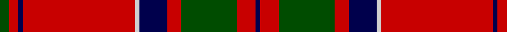

In pattern [BRGRBWRBRG](/stripes/brgrbwrbrg/).

This was sourced from weddslist.  It is a [10 stripe tartan](/stripes/stripes10/).

Original link http://www.weddslist.com/cgi-bin/tartans/pg.pl?source=rb

## Thread count
G/2 R2 DB1 R24 N1 DB6 R3 G12 R4 DB/1

## Palette
Each colour and the base-6 reference it is a variant of.

| Colour | Shade | Base |
|---|---|---|
| DB | <code style="background-color:#00004C;">#00004C</code> `oklch(18.8% 0.130 264.1)` <small>#00004C</small> | B <code style="background-color:#2A418A;">#2A418A</code> |
| G | <code style="background-color:#004C00;">#004C00</code> `oklch(36.1% 0.123 142.5)` <small>#004C00</small> | G <code style="background-color:#006100;">#006100</code> |
| N | <code style="background-color:#D0D0D0;">#D0D0D0</code> `oklch(85.8% 0.000 89.9)` <small>#D0D0D0</small> | W <code style="background-color:#F7F7F7;">#F7F7F7</code> |
| R | <code style="background-color:#C80000;">#C80000</code> `oklch(52.3% 0.215 29.2)` <small>#C80000</small> | R <code style="background-color:#CC0000;">#CC0000</code> |

## Nearest tartans

The nearest existing variants by ΔTartan distance, with this tartan at the top so the swatches line up against it.

ΔTartan

Tartan

Sett

—

<a href="/ttd/edit/#slug=dg2r2db1r24lb1db6r3dg12r4db1">MacDonell of Keppoch</a> <a class="nn-out" href="/setts/s10/dg2r2db1r24lb1db6r3dg12r4db1/" title="open its dictionary page">↗</a>

0.67

<a href="/ttd/edit/#slug=r7w2r36db6dg3db3dg3db3dg12r4~x2">Chisholm of Strathglass</a> <a class="nn-out" href="/setts/s10/r7w2r36db6dg3db3dg3db3dg12r4~x2/" title="open its dictionary page">↗</a>

0.72

<a href="/ttd/edit/#slug=r6w1r24db6g2db1g2db1g12r1~x2">Chisholm</a> <a class="nn-out" href="/setts/s10/r6w1r24db6g2db1g2db1g12r1~x2/" title="open its dictionary page">↗</a>

0.76

<a href="/ttd/edit/#slug=r6lb1r24dp6dg2dp1dg2dp1dg12r1">Chisholm D</a> <a class="nn-out" href="/setts/s10/r6lb1r24dp6dg2dp1dg2dp1dg12r1/" title="open its dictionary page">↗</a>

0.85

<a href="/ttd/edit/#slug=r4lb1db1r32lb2r2db12r2dg16r4lb1r4db2">MacGillivray</a> <a class="nn-out" href="/setts/s13/r4lb1db1r32lb2r2db12r2dg16r4lb1r4db2/" title="open its dictionary page">↗</a>

0.87

<a href="/ttd/edit/#slug=dg4r3k1r28dg14r4dg4lb3dg4r4~x2">Scott</a> <a class="nn-out" href="/setts/s10/dg4r3k1r28dg14r4dg4lb3dg4r4~x2/" title="open its dictionary page">↗</a>

0.88

<a href="/ttd/edit/#slug=r4g8k6r8r6g2r2g2r24g1r3~x2">MacDougal 3</a> <a class="nn-out" href="/setts/s11/r4g8k6r8r6g2r2g2r24g1r3~x2/" title="open its dictionary page">↗</a>

0.89

<a href="/ttd/edit/#slug=r6db1r1dg28r4db8w1r32dg1r4dg2~x2">MacDonell of Keppoch (artefact)</a> <a class="nn-out" href="/setts/s11/r6db1r1dg28r4db8w1r32dg1r4dg2~x2/" title="open its dictionary page">↗</a>

0.90

<a href="/ttd/edit/#slug=k6r4lb3r44k32r3k3lo3k2r3~x2">Smeaton 1985 (Name)</a> <a class="nn-out" href="/setts/s10/k6r4lb3r44k32r3k3lo3k2r3~x2/" title="open its dictionary page">↗</a>

0.90

<a href="/ttd/edit/#slug=r4dg8w1dg8r4dg4r2dg4r24k2~x2">Cumming/Comyn</a> <a class="nn-out" href="/setts/s10/r4dg8w1dg8r4dg4r2dg4r24k2~x2/" title="open its dictionary page">↗</a>

0.91

<a href="/ttd/edit/#slug=r12dg6k1dg2k1dg1k6r24lr2~x2">Stuart of Bute</a> <a class="nn-out" href="/setts/s9/r12dg6k1dg2k1dg1k6r24lr2~x2/" title="open its dictionary page">↗</a>

## Neighbour map

Every grey dot is one of 14299 variants placed by the first two principal components of the ΔTartan feature space (44% of its variance). Red is this tartan; blue dots are its nearest — click one to open its page.

<svg viewBox="0 0 640 380" role="img" style="max-width:100%;height:auto;border:1px solid #e0e0e0;border-radius:4px;display:block" xmlns="http://www.w3.org/2000/svg"><image href="/nn/cloud.v1.png" width="640" height="380"/><a href="/setts/s10/r7w2r36db6dg3db3dg3db3dg12r4~x2/"><circle cx="372.8" cy="130.4" r="4" fill="#3465a4"><title>Chisholm of Strathglass</title></circle></a><a href="/setts/s10/r6w1r24db6g2db1g2db1g12r1~x2/"><circle cx="364.7" cy="123.0" r="4" fill="#3465a4"><title>Chisholm</title></circle></a><a href="/setts/s10/r6lb1r24dp6dg2dp1dg2dp1dg12r1/"><circle cx="373.1" cy="125.5" r="4" fill="#3465a4"><title>Chisholm D</title></circle></a><a href="/setts/s13/r4lb1db1r32lb2r2db12r2dg16r4lb1r4db2/"><circle cx="364.7" cy="87.5" r="4" fill="#3465a4"><title>MacGillivray</title></circle></a><a href="/setts/s10/dg4r3k1r28dg14r4dg4lb3dg4r4~x2/"><circle cx="383.6" cy="124.8" r="4" fill="#3465a4"><title>Scott</title></circle></a><a href="/setts/s11/r4g8k6r8r6g2r2g2r24g1r3~x2/"><circle cx="359.6" cy="127.4" r="4" fill="#3465a4"><title>MacDougal 3</title></circle></a><a href="/setts/s11/r6db1r1dg28r4db8w1r32dg1r4dg2~x2/"><circle cx="374.9" cy="104.2" r="4" fill="#3465a4"><title>MacDonell of Keppoch (artefact)</title></circle></a><a href="/setts/s10/k6r4lb3r44k32r3k3lo3k2r3~x2/"><circle cx="359.5" cy="112.6" r="4" fill="#3465a4"><title>Smeaton 1985 (Name)</title></circle></a><a href="/setts/s10/r4dg8w1dg8r4dg4r2dg4r24k2~x2/"><circle cx="371.6" cy="133.8" r="4" fill="#3465a4"><title>Cumming/Comyn</title></circle></a><a href="/setts/s9/r12dg6k1dg2k1dg1k6r24lr2~x2/"><circle cx="414.1" cy="129.7" r="4" fill="#3465a4"><title>Stuart of Bute</title></circle></a><circle cx="374.6" cy="119.7" r="5" fill="#c00000"/></svg>

ID: /setts/s10/dg2r2db1r24lb1db6r3dg12r4db1/
