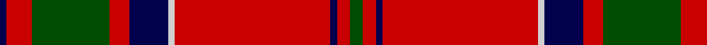

**Bands:** [BRGRBWRBRG](/stripes/brgrbwrbrg/) · **Stripes:** [DB R DG R DB LB R DB R DG](/stripes/stripes10/) DB R DG R DB LB R DB R DG

This was sourced from weddslist.  It is a [10 band tartan](/bands/bands10/).

Original link http://www.weddslist.com/cgi-bin/tartans/pg.pl?source=rb

## Register references

External register numbers recorded for this tartan.

- Scottish Register of Tartans: [2540](https://www.tartanregister.gov.uk/tartanDetails.aspx?ref=2540)
- Scottish Register of Tartans: [2666](https://www.tartanregister.gov.uk/tartanDetails.aspx?ref=2666)
- Scottish Register of Tartans: [3808](https://www.tartanregister.gov.uk/tartanDetails.aspx?ref=3808)
- Scottish Tartans Authority (ITI): 218
- Scottish Tartans World Register: 1010
- Scottish Tartans World Register: 1585
- Scottish Tartans World Register: 218

## Thread count
DB/2 R8 G24 R6 DB12 N2 R48 DB2 R4 G/4

## Palette
Each colour and its ΔE from the base-6 reference it is a variant of.

| Colour | Shade | Base | ΔE (OKLab) |
|---|---|---|---|
| DB | <code style="background-color:#00004C;">#00004C</code> `#00004C` | B <code style="background-color:#2A418A;">#2A418A</code> | 0.21 |
| G | <code style="background-color:#004C00;">#004C00</code> `#004C00` | G <code style="background-color:#006100;">#006100</code> | 0.07 |
| N | <code style="background-color:#D0D0D0;">#D0D0D0</code> `#D0D0D0` | W <code style="background-color:#F7F7F7;">#F7F7F7</code> | 0.12 |
| R | <code style="background-color:#C80000;">#C80000</code> `#C80000` | R <code style="background-color:#CC0000;">#CC0000</code> | 0.01 |

## Nearest tartans

The nearest existing variants by ΔTartan distance.

1. [Chisholm of Strathglass](/setts/s10/r7w2r36db6dg3db3dg3db3dg12r4~x2/) — ΔT 0.67
1. [Chisholm](/setts/s10/r6w1r24db6g2db1g2db1g12r1~x2/) — ΔT 0.72
1. [Chisholm D](/setts/s10/r6lb1r24dp6dg2dp1dg2dp1dg12r1~x2/) — ΔT 0.76
1. [MacGillivray](/setts/s13/r4lb1db1r32lb2r2db12r2dg16r4lb1r4db2~x2/) — ΔT 0.85
1. [Scott](/setts/s10/dg4r3k1r28dg14r4dg4lb3dg4r4/) — ΔT 0.87
1. [MacDougal 3](/setts/s11/r4g8k6r8r6g2r2g2r24g1r3~x2/) — ΔT 0.88
1. [MacDonell of Keppoch (artefact)](/setts/s11/r6db1r1dg28r4db8w1r32dg1r4dg2~x2/) — ΔT 0.89
1. [Smeaton 1985 (Name)](/setts/s10/k6r4lb3r44k32r3k3lo3k2r3~x2/) — ΔT 0.90
1. [Cumming/Comyn](/setts/s10/r4dg8w1dg8r4dg4r2dg4r24k2~x2/) — ΔT 0.90
1. [Stuart of Bute](/setts/s9/r12dg6k1dg2k1dg1k6r24lr2~x2/) — ΔT 0.91

## Neighbour map

Every grey dot is one of 14313 variants placed by the first two principal components of the ΔTartan feature space (44% of its variance). Red is this tartan; blue dots are its nearest — click one to open its page.

<svg viewBox="0 0 640 380" role="img" style="max-width:100%;height:auto;border:1px solid #e0e0e0;border-radius:4px;display:block" xmlns="http://www.w3.org/2000/svg"><image href="/nn/cloud.v1.png" width="640" height="380"/><a href="/setts/s10/r7w2r36db6dg3db3dg3db3dg12r4~x2/"><circle cx="373.2" cy="130.5" r="4" fill="#3465a4"><title>Chisholm of Strathglass</title></circle></a><a href="/setts/s10/r6w1r24db6g2db1g2db1g12r1~x2/"><circle cx="365.1" cy="123.1" r="4" fill="#3465a4"><title>Chisholm</title></circle></a><a href="/setts/s10/r6lb1r24dp6dg2dp1dg2dp1dg12r1~x2/"><circle cx="373.5" cy="125.6" r="4" fill="#3465a4"><title>Chisholm D</title></circle></a><a href="/setts/s13/r4lb1db1r32lb2r2db12r2dg16r4lb1r4db2~x2/"><circle cx="365.1" cy="87.6" r="4" fill="#3465a4"><title>MacGillivray</title></circle></a><a href="/setts/s10/dg4r3k1r28dg14r4dg4lb3dg4r4/"><circle cx="384.0" cy="124.9" r="4" fill="#3465a4"><title>Scott</title></circle></a><a href="/setts/s11/r4g8k6r8r6g2r2g2r24g1r3~x2/"><circle cx="360.0" cy="127.5" r="4" fill="#3465a4"><title>MacDougal 3</title></circle></a><a href="/setts/s11/r6db1r1dg28r4db8w1r32dg1r4dg2~x2/"><circle cx="375.4" cy="104.3" r="4" fill="#3465a4"><title>MacDonell of Keppoch (artefact)</title></circle></a><a href="/setts/s10/k6r4lb3r44k32r3k3lo3k2r3~x2/"><circle cx="359.8" cy="112.7" r="4" fill="#3465a4"><title>Smeaton 1985 (Name)</title></circle></a><a href="/setts/s10/r4dg8w1dg8r4dg4r2dg4r24k2~x2/"><circle cx="372.0" cy="134.0" r="4" fill="#3465a4"><title>Cumming/Comyn</title></circle></a><a href="/setts/s9/r12dg6k1dg2k1dg1k6r24lr2~x2/"><circle cx="414.4" cy="129.9" r="4" fill="#3465a4"><title>Stuart of Bute</title></circle></a><circle cx="375.0" cy="119.9" r="5" fill="#c00000"/></svg>

ID: /setts/s10/dg2r2db1r24lb1db6r3dg12r4db1~x2/
