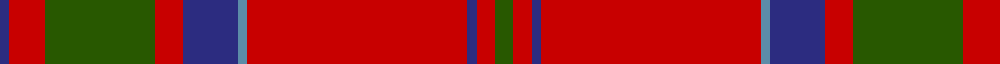

**Bands:** [BRGRBBRBRG](/stripes/brgrbbrbrg/) · **Stripes:** [DB R DG R DB T R DB R DG](/stripes/stripes10/) DB R DG R DB T R DB R DG

This was sourced from register-of-tartans.  It is a [10 band tartan](/bands/bands10/).

Original link https://www.tartanregister.gov.uk/tartanDetails.aspx?ref=2386

## Attestations

This cloth appears in 2 source records; the oldest owns this page.

- 01/01/1746 — MacDonell of Keppoch (register-of-tartans, [record](https://www.tartanregister.gov.uk/tartanDetails.aspx?ref=2386))
- pre 1746 — MacDonell of Keppoch - 1800 (Clan) (tartans-authority, [record](http://www.tartansauthority.com/tartan-ferret/display/511/))

## Register references

External register numbers recorded for this tartan.

- Scottish Register of Tartans: [2386](https://www.tartanregister.gov.uk/tartanDetails.aspx?ref=2386)
- Scottish Tartans Authority (ITI): 511
- Scottish Tartans World Register: 511

## Thread count
DB/2 R8 G24 R6 DB12 B2 R48 DB2 R4 G/4

## Palette
Each colour and its ΔE from the base-6 reference it is a variant of.

| Colour | Shade | Base | ΔE (OKLab) |
|---|---|---|---|
| B | <code style="background-color:#5C8CA8;">#5C8CA8</code> `#5C8CA8` | B <code style="background-color:#2A418A;">#2A418A</code> | 0.23 |
| DB | <code style="background-color:#2C2C80;">#2C2C80</code> `#2C2C80` | B <code style="background-color:#2A418A;">#2A418A</code> | 0.06 |
| G | <code style="background-color:#285800;">#285800</code> `#285800` | G <code style="background-color:#006100;">#006100</code> | 0.03 |
| R | <code style="background-color:#C80000;">#C80000</code> `#C80000` | R <code style="background-color:#CC0000;">#CC0000</code> | 0.01 |

## Nearest tartans

The nearest existing variants by ΔTartan distance.

1. [Chisholm D](/setts/s10/r6lb1r24dp6dg2dp1dg2dp1dg12r1~x2/) — ΔT 0.46
1. [MacDonell of Keppoch](/setts/s10/g2r2db1r24t1db6r3g12r4db1~x2/) — ΔT 0.48
1. [Chisholm of Strathglass](/setts/s10/r7w2r36db6g3db3g3db3g12r4~x2/) — ΔT 0.68
1. [Chisholm of Strathglass (Clan)](/setts/s10/r7w2r36b6g3b3g3b3g12r4~x2/) — ΔT 0.70
1. [Chisholm](/setts/s10/r6w1r24db6g2db1g2db1g12r1~x2/) — ΔT 0.71
1. [Chisholm, The](/setts/s10/r12w2r37db6g3db3r4db3g21r4~x2/) — ΔT 0.76
1. [Chisholm, The (MacGregor-Hastie)](/setts/s10/r12w2r37b6g3b3r4b3g21r4~x2/) — ΔT 0.76
1. [MacDonell of Keppoch](/setts/s10/dg2r2db1r24b1db6r3dg12r4db1~x2/) — ΔT 0.77
1. [MacGillivray](/setts/s13/r4t1db1r32t2r2db12r2g16r4t1r4db2~x2/) — ΔT 0.85
1. [Hughes (Welsh Name)](/setts/s11/g4r34dt20r4dt8r6db2r5dt2r3g4/) — ΔT 0.87

## Neighbour map

Every grey dot is one of 14313 variants placed by the first two principal components of the ΔTartan feature space (44% of its variance). Red is this tartan; blue dots are its nearest — click one to open its page.

<svg viewBox="0 0 640 380" role="img" style="max-width:100%;height:auto;border:1px solid #e0e0e0;border-radius:4px;display:block" xmlns="http://www.w3.org/2000/svg"><image href="/nn/cloud.v1.png" width="640" height="380"/><a href="/setts/s10/r6lb1r24dp6dg2dp1dg2dp1dg12r1~x2/"><circle cx="373.5" cy="125.6" r="4" fill="#3465a4"><title>Chisholm D</title></circle></a><a href="/setts/s10/g2r2db1r24t1db6r3g12r4db1~x2/"><circle cx="396.1" cy="130.3" r="4" fill="#3465a4"><title>MacDonell of Keppoch</title></circle></a><a href="/setts/s10/r7w2r36db6g3db3g3db3g12r4~x2/"><circle cx="380.0" cy="135.3" r="4" fill="#3465a4"><title>Chisholm of Strathglass</title></circle></a><a href="/setts/s10/r7w2r36b6g3b3g3b3g12r4~x2/"><circle cx="381.0" cy="135.0" r="4" fill="#3465a4"><title>Chisholm of Strathglass (Clan)</title></circle></a><a href="/setts/s10/r6w1r24db6g2db1g2db1g12r1~x2/"><circle cx="365.1" cy="123.1" r="4" fill="#3465a4"><title>Chisholm</title></circle></a><a href="/setts/s10/r12w2r37db6g3db3r4db3g21r4~x2/"><circle cx="381.5" cy="141.8" r="4" fill="#3465a4"><title>Chisholm, The</title></circle></a><a href="/setts/s10/r12w2r37b6g3b3r4b3g21r4~x2/"><circle cx="379.8" cy="140.4" r="4" fill="#3465a4"><title>Chisholm, The (MacGregor-Hastie)</title></circle></a><a href="/setts/s10/dg2r2db1r24b1db6r3dg12r4db1~x2/"><circle cx="398.5" cy="136.2" r="4" fill="#3465a4"><title>MacDonell of Keppoch</title></circle></a><a href="/setts/s13/r4t1db1r32t2r2db12r2g16r4t1r4db2~x2/"><circle cx="396.0" cy="103.1" r="4" fill="#3465a4"><title>MacGillivray</title></circle></a><a href="/setts/s11/g4r34dt20r4dt8r6db2r5dt2r3g4/"><circle cx="366.5" cy="144.7" r="4" fill="#3465a4"><title>Hughes (Welsh Name)</title></circle></a><circle cx="400.9" cy="130.6" r="5" fill="#c00000"/></svg>

ID: /setts/s10/dg2r2db1r24t1db6r3dg12r4db1~x2/
