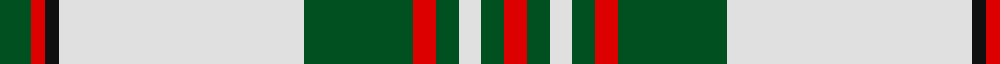

In pattern [GRKWGRGWGR](/stripes/grkwgrgwgr/).

This was sourced from register-of-tartans.  It is a [10 stripe tartan](/stripes/stripes10/).

Original link https://www.tartanregister.gov.uk/tartanDetails.aspx?ref=3698

## Register references

External register numbers recorded for this tartan.

- Scottish Register of Tartans: [3698](https://www.tartanregister.gov.uk/tartanDetails.aspx?ref=3698)
- Scottish Tartans World Register: 1007

## Thread count
G/14 R6 K6 LN108 G48 R10 G10 LN10 G10 R/10

## Palette
Each colour and its ΔE from the base-6 reference it is a variant of.

| Colour | Shade | Base | ΔE (OKLab) |
|---|---|---|---|
| G | <code style="background-color:#005020;">#005020</code> `#005020` | G <code style="background-color:#006100;">#006100</code> | 0.07 |
| K | <code style="background-color:#101010;">#101010</code> `#101010` | K <code style="background-color:#000000;">#000000</code> | 0.17 |
| LN | <code style="background-color:#E0E0E0;">#E0E0E0</code> `#E0E0E0` | W <code style="background-color:#F7F7F7;">#F7F7F7</code> | 0.07 |
| R | <code style="background-color:#DC0000;">#DC0000</code> `#DC0000` | R <code style="background-color:#CC0000;">#CC0000</code> | 0.03 |

## Nearest tartans

The nearest existing variants by ΔTartan distance.

1. [Hughes (USA) (Name)](/setts/s10/b4k12db3b4db3k3ly36db3b2ly3~x2/) — ΔT 0.75
1. [Ben Ledi (Fashion)](/setts/s11/w60o3w3o8w3o3y24dt12o3dt16o4/) — ΔT 0.91
1. [Royal Stuart / Stewart](/setts/s11/r3w28k2w2k2w2g12r8k1r1w1~x2/) — ΔT 0.92
1. [Veron](/setts/s13/w12dg2o2w5dg31w5dg2ly5dg2w11dg2o2w2~x2/) — ΔT 0.97
1. [Glenmore Green](/setts/s11/w38k10do2k3w2k3y8o3k2o3w2~x2/) — ΔT 1.06
1. [Glen Moy](/setts/s12/lb98y12k16w5k5w5k5y28lb16k5lb16w6/) — ΔT 1.09
1. [Ben Cleuch](/setts/s10/w68o3w3o8w3o27dy16r3dy20o3~x2/) — ΔT 1.13
1. [Unidentified (shirt fabric)](/setts/s9/w5db3w25k2w2k16g8k1w4/) — ΔT 1.15
1. [Glen Moy Tartan Tartan Number: 1293. Earliest known date: pre 1986 A colour variation of the Royal Stewart woven by Edgars, Pitlochry around 1986, named after the place in Angus described as follows: Its mainly Sheep farming in Glen Moy. Off the beaten track, its a very quiet area of the Angus glens close to Cortachy castle and great for walking if you like it to yourself! See products available Copyright © Blair Urquhart, Comrie, 2015](/setts/s12/lb98n12k16w5k5w5k5n28lb16k5lb16w6/) — ΔT 1.15
1. [Balmoral, Green lines](/setts/s13/lb4g2lb25n16k5lb2n2lb2n8lb4k2lb2g2~x2/) — ΔT 1.19

## Neighbour map

Every grey dot is one of 14299 variants placed by the first two principal components of the ΔTartan feature space (44% of its variance). Red is this tartan; blue dots are its nearest — click one to open its page.

<svg viewBox="0 0 640 380" role="img" style="max-width:100%;height:auto;border:1px solid #e0e0e0;border-radius:4px;display:block" xmlns="http://www.w3.org/2000/svg"><image href="/nn/cloud.v1.png" width="640" height="380"/><a href="/setts/s10/b4k12db3b4db3k3ly36db3b2ly3~x2/"><circle cx="270.4" cy="102.6" r="4" fill="#3465a4"><title>Hughes (USA) (Name)</title></circle></a><a href="/setts/s11/w60o3w3o8w3o3y24dt12o3dt16o4/"><circle cx="236.4" cy="96.4" r="4" fill="#3465a4"><title>Ben Ledi (Fashion)</title></circle></a><a href="/setts/s11/r3w28k2w2k2w2g12r8k1r1w1~x2/"><circle cx="289.5" cy="78.9" r="4" fill="#3465a4"><title>Royal Stuart / Stewart</title></circle></a><a href="/setts/s13/w12dg2o2w5dg31w5dg2ly5dg2w11dg2o2w2~x2/"><circle cx="249.9" cy="112.4" r="4" fill="#3465a4"><title>Veron</title></circle></a><a href="/setts/s11/w38k10do2k3w2k3y8o3k2o3w2~x2/"><circle cx="267.0" cy="73.7" r="4" fill="#3465a4"><title>Glenmore Green</title></circle></a><a href="/setts/s12/lb98y12k16w5k5w5k5y28lb16k5lb16w6/"><circle cx="319.4" cy="96.1" r="4" fill="#3465a4"><title>Glen Moy</title></circle></a><a href="/setts/s10/w68o3w3o8w3o27dy16r3dy20o3~x2/"><circle cx="271.1" cy="99.2" r="4" fill="#3465a4"><title>Ben Cleuch</title></circle></a><a href="/setts/s9/w5db3w25k2w2k16g8k1w4/"><circle cx="278.1" cy="117.5" r="4" fill="#3465a4"><title>Unidentified (shirt fabric)</title></circle></a><a href="/setts/s12/lb98n12k16w5k5w5k5n28lb16k5lb16w6/"><circle cx="330.9" cy="101.3" r="4" fill="#3465a4"><title>Glen Moy Tartan Tartan Number: 1293. Earliest known date: pre 1986 A colour variation of the Royal Stewart woven by Edgars, Pitlochry around 1986, named after the place in Angus described as follows: Its mainly Sheep farming in Glen Moy. Off the beaten track, its a very quiet area of the Angus glens close to Cortachy castle and great for walking if you like it to yourself! See products available Copyright © Blair Urquhart, Comrie, 2015</title></circle></a><a href="/setts/s13/lb4g2lb25n16k5lb2n2lb2n8lb4k2lb2g2~x2/"><circle cx="258.4" cy="128.0" r="4" fill="#3465a4"><title>Balmoral, Green lines</title></circle></a><circle cx="279.4" cy="108.7" r="5" fill="#c00000"/></svg>

ID: /setts/s10/dg7r3k3w54dg24r5dg5w5dg5r5~x2/
