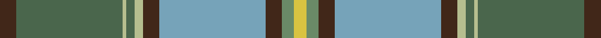

In pattern [BGYGYBYBGY](/stripes/bgygybybgy/).

This was sourced from register-of-tartans.  It is a [10 stripe tartan](/stripes/stripes10/).

Original link https://www.tartanregister.gov.uk/tartanDetails.aspx?ref=10259

## Register references

External register numbers recorded for this tartan.

- Scottish Register of Tartans: [10259](https://www.tartanregister.gov.uk/tartanDetails.aspx?ref=10259)

## Thread count
T/8 N52 Na2 N4 Na4 T8 B52 T8 G6 Y/6

## Palette
Each colour and the base-6 reference it is a variant of.

| Colour | Shade | Base |
|---|---|---|
| B | <code style="background-color:#76A3B9;">#76A3B9</code> `oklch(69.1% 0.058 229.7)` <small>#76A3B9</small> | Y <code style="background-color:#F2BF00;">#F2BF00</code> |
| G | <code style="background-color:#6A8A67;">#6A8A67</code> `oklch(59.9% 0.064 142.6)` <small>#6A8A67</small> | G <code style="background-color:#006100;">#006100</code> |
| N | <code style="background-color:#4A664C;">#4A664C</code> `oklch(48.0% 0.053 146.5)` <small>#4A664C</small> | G <code style="background-color:#006100;">#006100</code> |
| Na | <code style="background-color:#B6BE8F;">#B6BE8F</code> `oklch(78.3% 0.064 115.8)` <small>#B6BE8F</small> | Y <code style="background-color:#F2BF00;">#F2BF00</code> |
| T | <code style="background-color:#412719;">#412719</code> `oklch(30.2% 0.046 48.7)` <small>#412719</small> | B <code style="background-color:#2A418A;">#2A418A</code> |
| Y | <code style="background-color:#D9C341;">#D9C341</code> `oklch(81.3% 0.146 99.4)` <small>#D9C341</small> | Y <code style="background-color:#F2BF00;">#F2BF00</code> |

## Nearest tartans

The nearest existing variants by ΔTartan distance.

1. [Chisholm Colonial](/setts/s10/dt6w1lo24g6n3g1n3g1n12r1~x2/) — ΔT 0.86
1. [O'Rourke (Estimated threadcount)](/setts/s9/t25k1dy6k1lr10w3lr10k1ly3~x4/) — ΔT 1.00
1. [Carter (Savannah) (Personal)](/setts/s10/dy4g26lb1g2lb2dy4lg26dy4g3ly3~x2/) — ΔT 1.08
1. [State Seal of Idaho (Fashion)](/setts/s12/lb4k1b33lb4lo15g4lo3b4lo15lo2g30k2~x2/) — ΔT 1.10
1. [Hobkirk (School)](/setts/s10/b5w1m9b5r4b5g20ly1g1ly1~x4/) — ΔT 1.15
1. [The Climb (Fashion)](/setts/s8/y2dg9r16r2b30y3dg6lb1~x2/) — ΔT 1.19
1. [Connecticut](/setts/s10/db20y2w1y5dg8ly1dg2r1dg8y16~x4/) — ΔT 1.22
1. [State Seal of Pennsylvania (Fashion)](/setts/s9/lo4k1g28k6dy18lb4b41k1lb3~x2/) — ΔT 1.22
1. [Yorkland](/setts/s8/db30r2db4w1o11g4ly2g22~x2/) — ΔT 1.26
1. [Connecticut, State of](/setts/s10/b20o2w1o5g8ly1g2r1g8o8~x4/) — ΔT 1.26

## Neighbour map

Every grey dot is one of 14299 variants placed by the first two principal components of the ΔTartan feature space (44% of its variance). Red is this tartan; blue dots are its nearest — click one to open its page.

<svg viewBox="0 0 640 380" role="img" style="max-width:100%;height:auto;border:1px solid #e0e0e0;border-radius:4px;display:block" xmlns="http://www.w3.org/2000/svg"><image href="/nn/cloud.v1.png" width="640" height="380"/><a href="/setts/s10/dt6w1lo24g6n3g1n3g1n12r1~x2/"><circle cx="265.1" cy="127.5" r="4" fill="#3465a4"><title>Chisholm Colonial</title></circle></a><a href="/setts/s9/t25k1dy6k1lr10w3lr10k1ly3~x4/"><circle cx="238.4" cy="115.6" r="4" fill="#3465a4"><title>O'Rourke (Estimated threadcount)</title></circle></a><a href="/setts/s10/dy4g26lb1g2lb2dy4lg26dy4g3ly3~x2/"><circle cx="228.4" cy="112.8" r="4" fill="#3465a4"><title>Carter (Savannah) (Personal)</title></circle></a><a href="/setts/s12/lb4k1b33lb4lo15g4lo3b4lo15lo2g30k2~x2/"><circle cx="205.9" cy="104.0" r="4" fill="#3465a4"><title>State Seal of Idaho (Fashion)</title></circle></a><a href="/setts/s10/b5w1m9b5r4b5g20ly1g1ly1~x4/"><circle cx="240.6" cy="136.8" r="4" fill="#3465a4"><title>Hobkirk (School)</title></circle></a><a href="/setts/s8/y2dg9r16r2b30y3dg6lb1~x2/"><circle cx="266.9" cy="127.7" r="4" fill="#3465a4"><title>The Climb (Fashion)</title></circle></a><a href="/setts/s10/db20y2w1y5dg8ly1dg2r1dg8y16~x4/"><circle cx="217.9" cy="139.8" r="4" fill="#3465a4"><title>Connecticut</title></circle></a><a href="/setts/s9/lo4k1g28k6dy18lb4b41k1lb3~x2/"><circle cx="226.8" cy="101.7" r="4" fill="#3465a4"><title>State Seal of Pennsylvania (Fashion)</title></circle></a><a href="/setts/s8/db30r2db4w1o11g4ly2g22~x2/"><circle cx="276.5" cy="130.5" r="4" fill="#3465a4"><title>Yorkland</title></circle></a><a href="/setts/s10/b20o2w1o5g8ly1g2r1g8o8~x4/"><circle cx="229.1" cy="150.1" r="4" fill="#3465a4"><title>Connecticut, State of</title></circle></a><circle cx="236.3" cy="110.0" r="5" fill="#c00000"/></svg>

ID: /setts/s10/do4y26ly1y2ly2do4lg26do4y3ly3~x2/
