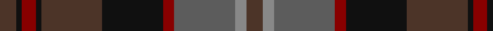

This page is one **sett** — a single exact thread-count. It belongs to the [tartan](/tartans/t6na4n22dr4k22t22k2dr5k2t6/)
(the same proportion at any scale), whose colour order is pattern [BKRKBKRBRB](/stripes/bkrkbkrbrb/).

Sourced from register-of-tartans.  It is a [10 stripe tartan](/stripes/stripes10/).

Original link https://www.tartanregister.gov.uk/tartanDetails.aspx?ref=2163

## Register references

External register numbers recorded for this tartan.

- Scottish Register of Tartans: [2163](https://www.tartanregister.gov.uk/tartanDetails.aspx?ref=2163)
- Scottish Tartans Authority (ITI): 5456

## Thread count
T/12 Na8 N44 DR8 K44 T44 K4 DR10 K4 T/12

## Palette
Each colour and the base-6 reference it is a variant of.

| Colour | Shade | Base |
|---|---|---|
| DR | <code style="background-color:#880000;">#880000</code> `oklch(39.4% 0.162 29.2)` <small>#880000</small> | R <code style="background-color:#CC0000;">#CC0000</code> |
| K | <code style="background-color:#101010;">#101010</code> `oklch(17.3% 0.000 89.9)` <small>#101010</small> | K <code style="background-color:#000000;">#000000</code> |
| N | <code style="background-color:#5C5C5C;">#5C5C5C</code> `oklch(47.5% 0.000 89.9)` <small>#5C5C5C</small> | B <code style="background-color:#2A418A;">#2A418A</code> |
| Na | <code style="background-color:#888888;">#888888</code> `oklch(62.7% 0.000 89.9)` <small>#888888</small> | R <code style="background-color:#CC0000;">#CC0000</code> |
| T | <code style="background-color:#4C3428;">#4C3428</code> `oklch(34.9% 0.040 47.5)` <small>#4C3428</small> | B <code style="background-color:#2A418A;">#2A418A</code> |

## Nearest tartans

The nearest existing variants by ΔTartan distance, with this tartan at the top so the swatches line up against it.

ΔTartan

Tartan

Sett

—

<a href="/ttd/edit/#slug=do6o4n22r4k22do22k2r5k2do6~x2">Lochaber (Ingles Buchan)</a> <a class="nn-out" href="/setts/s10/do6o4n22r4k22do22k2r5k2do6~x2/" title="open its dictionary page">↗</a>

0.81

<a href="/ttd/edit/#slug=do24g5n2k14dr2k3g3k3n14do6k4do3g2~x2">Berwick (Fashion)</a> <a class="nn-out" href="/setts/s13/do24g5n2k14dr2k3g3k3n14do6k4do3g2~x2/" title="open its dictionary page">↗</a>

1.07

<a href="/ttd/edit/#slug=dr12dy1dg12dy12ly2dy12dg12dy1dr12t2~x2">United Distillers Corporate Tartan Tartan Number: 2098. Earliest known date: 1989 An expression of evocative Scottish colours to reflect the corporate image of quality and style. (weft) lb4 b24 lb2 dg24 g24 r4 See products available Copyright © Blair Urquhart, Comrie, 2015</a> <a class="nn-out" href="/setts/s10/dr12dy1dg12dy12ly2dy12dg12dy1dr12t2~x2/" title="open its dictionary page">↗</a>

1.21

<a href="/ttd/edit/#slug=dg3dt22dr10o5dg21r6dt3~x2">Swankie</a> <a class="nn-out" href="/setts/s7/dg3dt22dr10o5dg21r6dt3~x2/" title="open its dictionary page">↗</a>

1.24

<a href="/ttd/edit/#slug=r1n12k6k1do10r1~x4">Andover</a> <a class="nn-out" href="/setts/s6/r1n12k6k1do10r1~x4/" title="open its dictionary page">↗</a>

1.24

<a href="/ttd/edit/#slug=do6lo4do3dt2do5dt2do3dt2y14r3dt2~x2">Limerick, County</a> <a class="nn-out" href="/setts/s11/do6lo4do3dt2do5dt2do3dt2y14r3dt2~x2/" title="open its dictionary page">↗</a>

1.26

<a href="/ttd/edit/#slug=dp11k1r1k1r1k7dg8k1dg8k7dp8k1r1~x4">Red Hackle (Military)</a> <a class="nn-out" href="/setts/s13/dp11k1r1k1r1k7dg8k1dg8k7dp8k1r1~x4/" title="open its dictionary page">↗</a>

1.28

<a href="/ttd/edit/#slug=r2dg3dy18r2dy2r21y6dg2y2dg24lo2~x2">Methven</a> <a class="nn-out" href="/setts/s11/r2dg3dy18r2dy2r21y6dg2y2dg24lo2~x2/" title="open its dictionary page">↗</a>

1.32

<a href="/ttd/edit/#slug=b1db5dp6dg2dp1dg12r1dg2dp1r5lo1~x4">Telfer, Jamie of the Fair Dodhead</a> <a class="nn-out" href="/setts/s11/b1db5dp6dg2dp1dg12r1dg2dp1r5lo1~x4/" title="open its dictionary page">↗</a>

1.32

<a href="/ttd/edit/#slug=dy35dg19r3g8r3dg8r3db3~x2">John Muir Way</a> <a class="nn-out" href="/setts/s8/dy35dg19r3g8r3dg8r3db3~x2/" title="open its dictionary page">↗</a>

1.33

<a href="/ttd/edit/#slug=k3r7k4dy7r3dy7k4dg3k3dg19k2dg2k2r3~x2">Anderson (Coulson Bonner #1)</a> <a class="nn-out" href="/setts/s14/k3r7k4dy7r3dy7k4dg3k3dg19k2dg2k2r3~x2/" title="open its dictionary page">↗</a>

## Neighbour map

Every grey dot is one of 14299 variants placed by the first two principal components of the ΔTartan feature space (44% of its variance). Red is this tartan; blue dots are its nearest — click one to open its page.

<svg viewBox="0 0 640 380" role="img" style="max-width:100%;height:auto;border:1px solid #e0e0e0;border-radius:4px;display:block" xmlns="http://www.w3.org/2000/svg"><image href="/nn/cloud.v1.png" width="640" height="380"/><a href="/setts/s13/do24g5n2k14dr2k3g3k3n14do6k4do3g2~x2/"><circle cx="252.4" cy="185.6" r="4" fill="#3465a4"><title>Berwick (Fashion)</title></circle></a><a href="/setts/s10/dr12dy1dg12dy12ly2dy12dg12dy1dr12t2~x2/"><circle cx="234.0" cy="226.3" r="4" fill="#3465a4"><title>United Distillers Corporate Tartan Tartan Number: 2098. Earliest known date: 1989 An expression of evocative Scottish colours to reflect the corporate image of quality and style. (weft) lb4 b24 lb2 dg24 g24 r4 See products available Copyright © Blair Urquhart, Comrie, 2015</title></circle></a><a href="/setts/s7/dg3dt22dr10o5dg21r6dt3~x2/"><circle cx="217.3" cy="248.4" r="4" fill="#3465a4"><title>Swankie</title></circle></a><a href="/setts/s6/r1n12k6k1do10r1~x4/"><circle cx="255.5" cy="216.6" r="4" fill="#3465a4"><title>Andover</title></circle></a><a href="/setts/s11/do6lo4do3dt2do5dt2do3dt2y14r3dt2~x2/"><circle cx="224.6" cy="228.3" r="4" fill="#3465a4"><title>Limerick, County</title></circle></a><a href="/setts/s13/dp11k1r1k1r1k7dg8k1dg8k7dp8k1r1~x4/"><circle cx="218.5" cy="190.4" r="4" fill="#3465a4"><title>Red Hackle (Military)</title></circle></a><a href="/setts/s11/r2dg3dy18r2dy2r21y6dg2y2dg24lo2~x2/"><circle cx="251.5" cy="179.7" r="4" fill="#3465a4"><title>Methven</title></circle></a><a href="/setts/s11/b1db5dp6dg2dp1dg12r1dg2dp1r5lo1~x4/"><circle cx="248.0" cy="174.8" r="4" fill="#3465a4"><title>Telfer, Jamie of the Fair Dodhead</title></circle></a><a href="/setts/s8/dy35dg19r3g8r3dg8r3db3~x2/"><circle cx="300.4" cy="205.5" r="4" fill="#3465a4"><title>John Muir Way</title></circle></a><a href="/setts/s14/k3r7k4dy7r3dy7k4dg3k3dg19k2dg2k2r3~x2/"><circle cx="190.1" cy="186.6" r="4" fill="#3465a4"><title>Anderson (Coulson Bonner #1)</title></circle></a><circle cx="236.1" cy="206.2" r="5" fill="#c00000"/></svg>

ID: /setts/s10/do6o4n22r4k22do22k2r5k2do6~x2/
