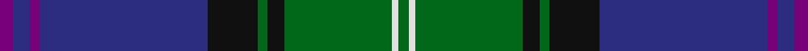

In pattern [BBBBKGKGWG](/stripes/bbbbkgkgwg/).

This was sourced from tartans-authority.  It is a [10 stripe tartan](/stripes/stripes10/).

Original link http://www.tartansauthority.com/tartan-ferret/display/5817/

## Thread count
P/4 DB5 P3 DB50 K15 G3 K5 G32 LN2 G/3

## Palette
Each colour and the base-6 reference it is a variant of.

| Colour | Shade | Base |
|---|---|---|
| DB | <code style="background-color:#2C2C80;">#2C2C80</code> `oklch(35.0% 0.138 276.6)` <small>#2C2C80</small> | B <code style="background-color:#2A418A;">#2A418A</code> |
| G | <code style="background-color:#006818;">#006818</code> `oklch(45.0% 0.142 145.0)` <small>#006818</small> | G <code style="background-color:#006100;">#006100</code> |
| K | <code style="background-color:#101010;">#101010</code> `oklch(17.3% 0.000 89.9)` <small>#101010</small> | K <code style="background-color:#000000;">#000000</code> |
| LN | <code style="background-color:#E0E0E0;">#E0E0E0</code> `oklch(90.7% 0.000 89.9)` <small>#E0E0E0</small> | W <code style="background-color:#F7F7F7;">#F7F7F7</code> |
| P | <code style="background-color:#780078;">#780078</code> `oklch(40.2% 0.185 328.4)` <small>#780078</small> | B <code style="background-color:#2A418A;">#2A418A</code> |

## Nearest tartans

The nearest existing variants by ΔTartan distance.

1. [West Lothian](/setts/s9/g40k8g4k8g4r14db64t9db3/) — ΔT 0.63
1. [Coopers & Lybrand](/setts/s11/t4g4r1db24t4k2g24r1db10t4db2~x2/) — ΔT 0.79
1. [Strachan (Name)](/setts/s9/r2k3db42k3ly2k3g22k3r2~x2/) — ΔT 0.81
1. [Weisfeld](/setts/s12/k6db3g28w1db28db2w3~x2/) — ΔT 0.84
1. [Sinclair-Brown (Personal)](/setts/s8/db64k11r2k4r2k4g32lo4~x2/) — ΔT 0.89
1. [Royal Highland Yacht Club (Corporate](/setts/s11/db26db3db1m2db1db3db3db12g14db2w2~x2/) — ΔT 0.93
1. [Weisfeld (Name)](/setts/s7/k6db3g28w1db28db2w3~x2/) — ΔT 1.01
1. [Polkemmet (Corporate)](/setts/s11/k7lo3db62o16g5o5g5o5g16db16k4/) — ΔT 1.01
1. [Sidey Family Tartan (Name)](/setts/s10/db4w1k2db25k12b1k2g16k2r1~x2/) — ΔT 1.03
1. [Huaum, Patrick Antoine (Personal))](/setts/s11/g10db9dp4r2dp4g6k10w4g24db60k4/) — ΔT 1.06

## Neighbour map

Every grey dot is one of 14299 variants placed by the first two principal components of the ΔTartan feature space (44% of its variance). Red is this tartan; blue dots are its nearest — click one to open its page.

<svg viewBox="0 0 640 380" role="img" style="max-width:100%;height:auto;border:1px solid #e0e0e0;border-radius:4px;display:block" xmlns="http://www.w3.org/2000/svg"><image href="/nn/cloud.v1.png" width="640" height="380"/><a href="/setts/s9/g40k8g4k8g4r14db64t9db3/"><circle cx="261.3" cy="145.9" r="4" fill="#3465a4"><title>West Lothian</title></circle></a><a href="/setts/s11/t4g4r1db24t4k2g24r1db10t4db2~x2/"><circle cx="291.4" cy="143.0" r="4" fill="#3465a4"><title>Coopers &amp; Lybrand</title></circle></a><a href="/setts/s9/r2k3db42k3ly2k3g22k3r2~x2/"><circle cx="322.3" cy="132.5" r="4" fill="#3465a4"><title>Strachan (Name)</title></circle></a><a href="/setts/s12/k6db3g28w1db28db2w3~x2/"><circle cx="292.3" cy="141.3" r="4" fill="#3465a4"><title>Weisfeld</title></circle></a><a href="/setts/s8/db64k11r2k4r2k4g32lo4~x2/"><circle cx="347.9" cy="132.3" r="4" fill="#3465a4"><title>Sinclair-Brown (Personal)</title></circle></a><a href="/setts/s11/db26db3db1m2db1db3db3db12g14db2w2~x2/"><circle cx="315.7" cy="142.0" r="4" fill="#3465a4"><title>Royal Highland Yacht Club (Corporate</title></circle></a><a href="/setts/s7/k6db3g28w1db28db2w3~x2/"><circle cx="268.8" cy="152.0" r="4" fill="#3465a4"><title>Weisfeld (Name)</title></circle></a><a href="/setts/s11/k7lo3db62o16g5o5g5o5g16db16k4/"><circle cx="323.1" cy="135.9" r="4" fill="#3465a4"><title>Polkemmet (Corporate)</title></circle></a><a href="/setts/s10/db4w1k2db25k12b1k2g16k2r1~x2/"><circle cx="275.2" cy="129.7" r="4" fill="#3465a4"><title>Sidey Family Tartan (Name)</title></circle></a><a href="/setts/s11/g10db9dp4r2dp4g6k10w4g24db60k4/"><circle cx="304.1" cy="105.1" r="4" fill="#3465a4"><title>Huaum, Patrick Antoine (Personal))</title></circle></a><circle cx="293.4" cy="135.4" r="5" fill="#c00000"/></svg>

ID: /setts/s10/dp4db5dp3db50k15g3k5g32w2g3/
