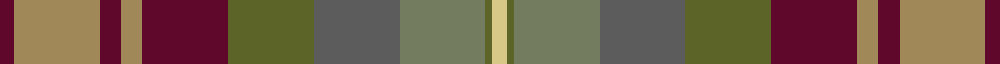

**Bands:** [YGGBGBYBYB](/stripes/yggbgbybyb/) · **Stripes:** [LY Y Y N Y DR LO DR LO DR](/stripes/stripes10/) LY Y Y N Y DR LO DR LO DR

This was sourced from register-of-tartans.  It is a [10 band tartan](/bands/bands10/).

Original link https://www.tartanregister.gov.uk/tartanDetails.aspx?ref=134

## Attestations

This cloth appears in 2 source records; the oldest owns this page.

- 01/09/2007 — Auld Scotland (register-of-tartans, [record](https://www.tartanregister.gov.uk/tartanDetails.aspx?ref=134))
- September 2007 — Auld Scotland (Fashion) (tartans-authority, [record](http://www.tartansauthority.com/tartan-ferret/display/7303/))

## Register references

External register numbers recorded for this tartan.

- Scottish Register of Tartans: [134](https://www.tartanregister.gov.uk/tartanDetails.aspx?ref=134)
- Scottish Tartans Authority (ITI): 7303

## Thread count
DR/4 LT24 DR6 LT6 DR24 Ga24 N24 G24 Ga2 LG/4

## Palette
Each colour and its ΔE from the base-6 reference it is a variant of.

| Colour | Shade | Base | ΔE (OKLab) |
|---|---|---|---|
| DR | <code style="background-color:#60082C;">#60082C</code> `#60082C` | B <code style="background-color:#2A418A;">#2A418A</code> | 0.20 |
| G | <code style="background-color:#747C60;">#747C60</code> `#747C60` | G <code style="background-color:#006100;">#006100</code> | 0.18 |
| Ga | <code style="background-color:#5C6428;">#5C6428</code> `#5C6428` | G <code style="background-color:#006100;">#006100</code> | 0.10 |
| LG | <code style="background-color:#D8C888;">#D8C888</code> `#D8C888` | Y <code style="background-color:#F2BF00;">#F2BF00</code> | 0.09 |
| LGa | <code style="background-color:#789484;">#789484</code> `#789484` | G <code style="background-color:#006100;">#006100</code> | 0.24 |
| LT | <code style="background-color:#A08858;">#A08858</code> `#A08858` | Y <code style="background-color:#F2BF00;">#F2BF00</code> | 0.21 |
| N | <code style="background-color:#5C5C5C;">#5C5C5C</code> `#5C5C5C` | B <code style="background-color:#2A418A;">#2A418A</code> | 0.15 |

## Nearest tartans

The nearest existing variants by ΔTartan distance.

1. [Auld Scotland Weavers Tartan Tartan Number: 7303. Earliest known date: September 2007 A new design from Lochcarron for the 2008 season. See products available Copyright © Blair Urquhart, Comrie, 2015](/setts/s10/k2lo12dr3lo3dr12y12n12y12y1ly2~x2/) — ΔT 1.13
1. [Teallach](/setts/s9/ly4r24dy19w3y23y13dy3n13dy3~x2/) — ΔT 1.30
1. [Teallach Family Tartan Tartan Number: 832. Earliest known date: pre 2003 The tartan of the present chairman of the Scottish Tartans Society, Dr Gordon Teall of Teallach. See products available Copyright © Blair Urquhart, Comrie, 2015](/setts/s9/ly4r24dy19w3y23o13dy3n13dy3~x2/) — ΔT 1.33
1. [Bracken (WCWM)](/setts/s11/dy30k6dy6r6lo6o14k4o3n14k6n16~x2/) — ΔT 1.35
1. [Grewar (Name)](/setts/s10/o2g2o16g2dp17dg10g10g15dg1w2~x2/) — ΔT 1.49
1. [Roscommon Irish County Tartan Tartan Number: 2246. Earliest known date: 1996 One of a series of Irish District tartans designed by Polly Wittering of the House of Edgar, with colours reminiscent of the Country with soft warm colours dominating. See products available Copyright © Blair Urquhart, Comrie, 2015](/setts/s10/o5lo3o19do6lo5do6dg12n5dg12n3~x2/) — ΔT 1.56
1. [Teallach (Personal)](/setts/s9/lo4o24dy19w3y23n13dy3o13dy3~x2/) — ΔT 1.57
1. [Meath Irish County Tartan Tartan Number: 2269. Earliest known date: 1996 One of a series of Irish District tartans designed by Polly Wittering of the House of Edgar, with colours reminiscent of the Country with soft warm colours dominating. See products available Copyright © Blair Urquhart, Comrie, 2015](/setts/s12/lo5n2o14dy9dg8n3o3n3o3n3dg19ly3~x2/) — ΔT 1.60
1. [Blaylock Hunting](/setts/s12/g4lr2g8do8o2do8o16k2do5lr2o5ly2~x2/) — ΔT 1.71
1. [Cuillins of Skye (Fashion)](/setts/s18/r43dy5g27dy5lo40r5lo40dy5g27dy5dg40g27dg40dy5g27dy5r43do8/) — ΔT 1.78

## Neighbour map

Every grey dot is one of 14299 variants placed by the first two principal components of the ΔTartan feature space (44% of its variance). Red is this tartan; blue dots are its nearest — click one to open its page.

<svg viewBox="0 0 640 380" role="img" style="max-width:100%;height:auto;border:1px solid #e0e0e0;border-radius:4px;display:block" xmlns="http://www.w3.org/2000/svg"><image href="/nn/cloud.v1.png" width="640" height="380"/><a href="/setts/s10/k2lo12dr3lo3dr12y12n12y12y1ly2~x2/"><circle cx="79.5" cy="164.1" r="4" fill="#3465a4"><title>Auld Scotland Weavers Tartan Tartan Number: 7303. Earliest known date: September 2007 A new design from Lochcarron for the 2008 season. See products available Copyright © Blair Urquhart, Comrie, 2015</title></circle></a><a href="/setts/s9/ly4r24dy19w3y23y13dy3n13dy3~x2/"><circle cx="93.6" cy="181.9" r="4" fill="#3465a4"><title>Teallach</title></circle></a><a href="/setts/s9/ly4r24dy19w3y23o13dy3n13dy3~x2/"><circle cx="93.6" cy="181.1" r="4" fill="#3465a4"><title>Teallach Family Tartan Tartan Number: 832. Earliest known date: pre 2003 The tartan of the present chairman of the Scottish Tartans Society, Dr Gordon Teall of Teallach. See products available Copyright © Blair Urquhart, Comrie, 2015</title></circle></a><a href="/setts/s11/dy30k6dy6r6lo6o14k4o3n14k6n16~x2/"><circle cx="149.6" cy="177.6" r="4" fill="#3465a4"><title>Bracken (WCWM)</title></circle></a><a href="/setts/s10/o2g2o16g2dp17dg10g10g15dg1w2~x2/"><circle cx="129.9" cy="155.5" r="4" fill="#3465a4"><title>Grewar (Name)</title></circle></a><a href="/setts/s10/o5lo3o19do6lo5do6dg12n5dg12n3~x2/"><circle cx="166.8" cy="233.9" r="4" fill="#3465a4"><title>Roscommon Irish County Tartan Tartan Number: 2246. Earliest known date: 1996 One of a series of Irish District tartans designed by Polly Wittering of the House of Edgar, with colours reminiscent of the Country with soft warm colours dominating. See products available Copyright © Blair Urquhart, Comrie, 2015</title></circle></a><a href="/setts/s9/lo4o24dy19w3y23n13dy3o13dy3~x2/"><circle cx="126.2" cy="203.0" r="4" fill="#3465a4"><title>Teallach (Personal)</title></circle></a><a href="/setts/s12/lo5n2o14dy9dg8n3o3n3o3n3dg19ly3~x2/"><circle cx="211.1" cy="194.2" r="4" fill="#3465a4"><title>Meath Irish County Tartan Tartan Number: 2269. Earliest known date: 1996 One of a series of Irish District tartans designed by Polly Wittering of the House of Edgar, with colours reminiscent of the Country with soft warm colours dominating. See products available Copyright © Blair Urquhart, Comrie, 2015</title></circle></a><a href="/setts/s12/g4lr2g8do8o2do8o16k2do5lr2o5ly2~x2/"><circle cx="174.3" cy="185.9" r="4" fill="#3465a4"><title>Blaylock Hunting</title></circle></a><a href="/setts/s18/r43dy5g27dy5lo40r5lo40dy5g27dy5dg40g27dg40dy5g27dy5r43do8/"><circle cx="108.1" cy="170.3" r="4" fill="#3465a4"><title>Cuillins of Skye (Fashion)</title></circle></a><circle cx="129.5" cy="189.1" r="5" fill="#c00000"/></svg>

ID: /setts/s10/dr2lo12dr3lo3dr12y12n12y12y1ly2~x2/
