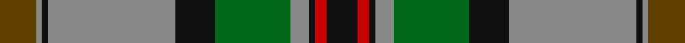

In pattern [GRKRKGRKRK](/stripes/grkrkgrkrk/).

This was sourced from tartans-authority.  It is a [10 stripe tartan](/stripes/stripes10/).

Original link http://www.tartansauthority.com/tartan-ferret/display/2660/

## Thread count
T/24 N4 K4 N84 K26 G50 N12 K4 R8 K/20

## Palette
Each colour and the base-6 reference it is a variant of.

| Colour | Shade | Base |
|---|---|---|
| G | <code style="background-color:#006818;">#006818</code> `oklch(45.0% 0.142 145.0)` <small>#006818</small> | G <code style="background-color:#006100;">#006100</code> |
| K | <code style="background-color:#101010;">#101010</code> `oklch(17.3% 0.000 89.9)` <small>#101010</small> | K <code style="background-color:#000000;">#000000</code> |
| N | <code style="background-color:#888888;">#888888</code> `oklch(62.7% 0.000 89.9)` <small>#888888</small> | R <code style="background-color:#CC0000;">#CC0000</code> |
| R | <code style="background-color:#C80000;">#C80000</code> `oklch(52.3% 0.215 29.2)` <small>#C80000</small> | R <code style="background-color:#CC0000;">#CC0000</code> |
| T | <code style="background-color:#604000;">#604000</code> `oklch(39.8% 0.083 76.8)` <small>#604000</small> | G <code style="background-color:#006100;">#006100</code> |

## Nearest tartans

The nearest existing variants by ΔTartan distance, with this tartan at the top so the swatches line up against it.

ΔTartan

Tartan

Sett

—

<a href="/ttd/edit/#slug=dy12o2k2o42k13g25o6k2r4k10~x2">Dinwoodie (Name)</a> <a class="nn-out" href="/setts/s10/dy12o2k2o42k13g25o6k2r4k10~x2/" title="open its dictionary page">↗</a>

0.48

<a href="/ttd/edit/#slug=r4n12k18n4y22lb1y2lb2y3lb2~x4">Windsor</a> <a class="nn-out" href="/setts/s10/r4n12k18n4y22lb1y2lb2y3lb2~x4/" title="open its dictionary page">↗</a>

0.82

<a href="/ttd/edit/#slug=k10y26k2y4k2y26k3r36k3g30k3r2">Pope (Welsh Name)</a> <a class="nn-out" href="/setts/s12/k10y26k2y4k2y26k3r36k3g30k3r2/" title="open its dictionary page">↗</a>

0.84

<a href="/ttd/edit/#slug=k10r26k2r4k2r26k3g36k3g30k3y2">Pope of Wales</a> <a class="nn-out" href="/setts/s12/k10r26k2r4k2r26k3g36k3g30k3y2/" title="open its dictionary page">↗</a>

0.89

<a href="/ttd/edit/#slug=g3n5k4n33g12k4w2k18lo3~x2">Smoke Showing (UFES)</a> <a class="nn-out" href="/setts/s9/g3n5k4n33g12k4w2k18lo3~x2/" title="open its dictionary page">↗</a>

0.92

<a href="/ttd/edit/#slug=g19r1g2r2g15r1dt13w1db2r2db21r1w3~x2">Ontario (Official)</a> <a class="nn-out" href="/setts/s13/g19r1g2r2g15r1dt13w1db2r2db21r1w3~x2/" title="open its dictionary page">↗</a>

0.98

<a href="/ttd/edit/#slug=dg50db12o7db12r10o7k2o7k2o7r10~x2">Norham and Ladykirk (District)</a> <a class="nn-out" href="/setts/s11/dg50db12o7db12r10o7k2o7k2o7r10~x2/" title="open its dictionary page">↗</a>

0.98

<a href="/ttd/edit/#slug=r2g10k12n1ly2n14k1n1g2~x2">McWilliams Wedding (Personal)</a> <a class="nn-out" href="/setts/s9/r2g10k12n1ly2n14k1n1g2~x2/" title="open its dictionary page">↗</a>

0.98

<a href="/ttd/edit/#slug=g3n1g1n12k2n2k2n3k12g24w3~x2">Selby (Name)</a> <a class="nn-out" href="/setts/s11/g3n1g1n12k2n2k2n3k12g24w3~x2/" title="open its dictionary page">↗</a>

1.06

<a href="/ttd/edit/#slug=k2g2r3db18r2g6r4t1db6r3g18r3k2g2~x2">Glen Orchy #2 or MacIntyre</a> <a class="nn-out" href="/setts/s14/k2g2r3db18r2g6r4t1db6r3g18r3k2g2~x2/" title="open its dictionary page">↗</a>

1.06

<a href="/ttd/edit/#slug=dg2dr13dg11ly5dr1o21dg2o1~x2">St Lawrence Trade</a> <a class="nn-out" href="/setts/s8/dg2dr13dg11ly5dr1o21dg2o1~x2/" title="open its dictionary page">↗</a>

## Neighbour map

Every grey dot is one of 14299 variants placed by the first two principal components of the ΔTartan feature space (44% of its variance). Red is this tartan; blue dots are its nearest — click one to open its page.

<svg viewBox="0 0 640 380" role="img" style="max-width:100%;height:auto;border:1px solid #e0e0e0;border-radius:4px;display:block" xmlns="http://www.w3.org/2000/svg"><image href="/nn/cloud.v1.png" width="640" height="380"/><a href="/setts/s10/r4n12k18n4y22lb1y2lb2y3lb2~x4/"><circle cx="215.0" cy="132.9" r="4" fill="#3465a4"><title>Windsor</title></circle></a><a href="/setts/s12/k10y26k2y4k2y26k3r36k3g30k3r2/"><circle cx="203.2" cy="128.9" r="4" fill="#3465a4"><title>Pope (Welsh Name)</title></circle></a><a href="/setts/s12/k10r26k2r4k2r26k3g36k3g30k3y2/"><circle cx="209.2" cy="134.7" r="4" fill="#3465a4"><title>Pope of Wales</title></circle></a><a href="/setts/s9/g3n5k4n33g12k4w2k18lo3~x2/"><circle cx="240.3" cy="148.3" r="4" fill="#3465a4"><title>Smoke Showing (UFES)</title></circle></a><a href="/setts/s13/g19r1g2r2g15r1dt13w1db2r2db21r1w3~x2/"><circle cx="237.1" cy="122.7" r="4" fill="#3465a4"><title>Ontario (Official)</title></circle></a><a href="/setts/s11/dg50db12o7db12r10o7k2o7k2o7r10~x2/"><circle cx="247.2" cy="133.6" r="4" fill="#3465a4"><title>Norham and Ladykirk (District)</title></circle></a><a href="/setts/s9/r2g10k12n1ly2n14k1n1g2~x2/"><circle cx="191.3" cy="160.0" r="4" fill="#3465a4"><title>McWilliams Wedding (Personal)</title></circle></a><a href="/setts/s11/g3n1g1n12k2n2k2n3k12g24w3~x2/"><circle cx="223.9" cy="128.0" r="4" fill="#3465a4"><title>Selby (Name)</title></circle></a><a href="/setts/s14/k2g2r3db18r2g6r4t1db6r3g18r3k2g2~x2/"><circle cx="225.6" cy="130.9" r="4" fill="#3465a4"><title>Glen Orchy #2 or MacIntyre</title></circle></a><a href="/setts/s8/dg2dr13dg11ly5dr1o21dg2o1~x2/"><circle cx="208.2" cy="140.5" r="4" fill="#3465a4"><title>St Lawrence Trade</title></circle></a><circle cx="229.1" cy="135.8" r="5" fill="#c00000"/></svg>

ID: /setts/s10/dy12o2k2o42k13g25o6k2r4k10~x2/
