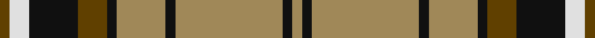

In pattern [GWKGKYKYKY](/stripes/gwkgkykyky/).

This was sourced from house-of-tartan.  It is a [10 stripe tartan](/stripes/stripes10/).

Original link http://www.house-of-tartan.scotland.net/house/TartanViewjs.asp?colr=Def&tnam=1741

## Thread count
T/4 LN8 K20 T12 K4 LT20 K4 LT44 K4 LT/4

## Palette
Each colour and the base-6 reference it is a variant of.

| Colour | Shade | Base |
|---|---|---|
| K | <code style="background-color:#101010;">#101010</code> `oklch(17.3% 0.000 89.9)` <small>#101010</small> | K <code style="background-color:#000000;">#000000</code> |
| LN | <code style="background-color:#E0E0E0;">#E0E0E0</code> `oklch(90.7% 0.000 89.9)` <small>#E0E0E0</small> | W <code style="background-color:#F7F7F7;">#F7F7F7</code> |
| LT | <code style="background-color:#A08858;">#A08858</code> `oklch(63.7% 0.071 84.0)` <small>#A08858</small> | Y <code style="background-color:#F2BF00;">#F2BF00</code> |
| T | <code style="background-color:#604000;">#604000</code> `oklch(39.8% 0.083 76.8)` <small>#604000</small> | G <code style="background-color:#006100;">#006100</code> |

## Nearest tartans

The nearest existing variants by ΔTartan distance, with this tartan at the top so the swatches line up against it.

ΔTartan

Tartan

Sett

—

<a href="/ttd/edit/#slug=dy1w2k5dy3k1lo5k1lo11k1lo1~x4">Braemar or Blair Atholl Trade Tartan Tartan Number: 1741. Earliest known date: 1984 Nothing See products available Copyright © Blair Urquhart, Comrie, 2015</a> <a class="nn-out" href="/setts/s10/dy1w2k5dy3k1lo5k1lo11k1lo1~x4/" title="open its dictionary page">↗</a>

0.76

<a href="/ttd/edit/#slug=ly5dg14o4db4o27dg3o4ly5~x2">Invertere</a> <a class="nn-out" href="/setts/s8/ly5dg14o4db4o27dg3o4ly5~x2/" title="open its dictionary page">↗</a>

0.79

<a href="/ttd/edit/#slug=o15y1o2lo2o2y1o3k8y10o3~x4">Annan</a> <a class="nn-out" href="/setts/s10/o15y1o2lo2o2y1o3k8y10o3~x4/" title="open its dictionary page">↗</a>

0.86

<a href="/ttd/edit/#slug=dy22b2dy3ly4dy3b2dy12b4w19dy3~x2">Burns Battalion (Fashion)</a> <a class="nn-out" href="/setts/s10/dy22b2dy3ly4dy3b2dy12b4w19dy3~x2/" title="open its dictionary page">↗</a>

0.91

<a href="/ttd/edit/#slug=r5w2g3w2r10g10r2w1r2dg1~x4">Glenfinnan (Fashion)</a> <a class="nn-out" href="/setts/s10/r5w2g3w2r10g10r2w1r2dg1~x4/" title="open its dictionary page">↗</a>

0.96

<a href="/ttd/edit/#slug=o1w2k5o3k1o5k1o11k1o1~x4">Braemar, or Blair Atholl</a> <a class="nn-out" href="/setts/s10/o1w2k5o3k1o5k1o11k1o1~x4/" title="open its dictionary page">↗</a>

1.03

<a href="/ttd/edit/#slug=o1w2k5o3k1o4k1o10k1o1~x4">Braemar, Camel</a> <a class="nn-out" href="/setts/s10/o1w2k5o3k1o4k1o10k1o1~x4/" title="open its dictionary page">↗</a>

1.08

<a href="/ttd/edit/#slug=do2w2k6do3k2o14k1o1~x4">Braemar or Blair Atholl</a> <a class="nn-out" href="/setts/s8/do2w2k6do3k2o14k1o1~x4/" title="open its dictionary page">↗</a>

1.09

<a href="/ttd/edit/#slug=dg5r4dg17lt5r32lt5dg17r4dg5w2~x2">Wilson's No.005</a> <a class="nn-out" href="/setts/s10/dg5r4dg17lt5r32lt5dg17r4dg5w2~x2/" title="open its dictionary page">↗</a>

1.09

<a href="/ttd/edit/#slug=db4o17db4g4db2g4db4g27db4ly4~x2">Cape Breton University</a> <a class="nn-out" href="/setts/s10/db4o17db4g4db2g4db4g27db4ly4~x2/" title="open its dictionary page">↗</a>

1.11

<a href="/ttd/edit/#slug=do2lr2k6do3k2o14k1o1~x4">Blair Atholl (Fashion)</a> <a class="nn-out" href="/setts/s8/do2lr2k6do3k2o14k1o1~x4/" title="open its dictionary page">↗</a>

## Neighbour map

Every grey dot is one of 14299 variants placed by the first two principal components of the ΔTartan feature space (44% of its variance). Red is this tartan; blue dots are its nearest — click one to open its page.

<svg viewBox="0 0 640 380" role="img" style="max-width:100%;height:auto;border:1px solid #e0e0e0;border-radius:4px;display:block" xmlns="http://www.w3.org/2000/svg"><image href="/nn/cloud.v1.png" width="640" height="380"/><a href="/setts/s8/ly5dg14o4db4o27dg3o4ly5~x2/"><circle cx="271.1" cy="188.9" r="4" fill="#3465a4"><title>Invertere</title></circle></a><a href="/setts/s10/o15y1o2lo2o2y1o3k8y10o3~x4/"><circle cx="286.8" cy="157.2" r="4" fill="#3465a4"><title>Annan</title></circle></a><a href="/setts/s10/dy22b2dy3ly4dy3b2dy12b4w19dy3~x2/"><circle cx="282.1" cy="154.3" r="4" fill="#3465a4"><title>Burns Battalion (Fashion)</title></circle></a><a href="/setts/s10/r5w2g3w2r10g10r2w1r2dg1~x4/"><circle cx="261.9" cy="177.7" r="4" fill="#3465a4"><title>Glenfinnan (Fashion)</title></circle></a><a href="/setts/s10/o1w2k5o3k1o5k1o11k1o1~x4/"><circle cx="270.3" cy="159.4" r="4" fill="#3465a4"><title>Braemar, or Blair Atholl</title></circle></a><a href="/setts/s10/o1w2k5o3k1o4k1o10k1o1~x4/"><circle cx="235.7" cy="159.2" r="4" fill="#3465a4"><title>Braemar, Camel</title></circle></a><a href="/setts/s8/do2w2k6do3k2o14k1o1~x4/"><circle cx="256.5" cy="154.6" r="4" fill="#3465a4"><title>Braemar or Blair Atholl</title></circle></a><a href="/setts/s10/dg5r4dg17lt5r32lt5dg17r4dg5w2~x2/"><circle cx="261.7" cy="148.5" r="4" fill="#3465a4"><title>Wilson's No.005</title></circle></a><a href="/setts/s10/db4o17db4g4db2g4db4g27db4ly4~x2/"><circle cx="251.5" cy="159.3" r="4" fill="#3465a4"><title>Cape Breton University</title></circle></a><a href="/setts/s8/do2lr2k6do3k2o14k1o1~x4/"><circle cx="268.1" cy="161.1" r="4" fill="#3465a4"><title>Blair Atholl (Fashion)</title></circle></a><circle cx="276.6" cy="162.1" r="5" fill="#c00000"/></svg>

ID: /setts/s10/dy1w2k5dy3k1lo5k1lo11k1lo1~x4/
