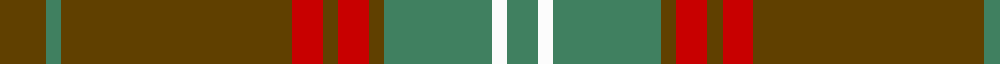

In pattern [GGGRGRGGWG](/stripes/gggrgrggwg/).

This was sourced from tartans-authority.  It is a [10 stripe tartan](/stripes/stripes10/).

Original link http://www.tartansauthority.com/tartan-ferret/display/938/

## Thread count
T/12 G4 T60 R8 T4 R8 T4 G28 W4 G/8

## Palette
Each colour and its ΔE from the base-6 reference it is a variant of.

| Colour | Shade | Base | ΔE (OKLab) |
|---|---|---|---|
| G | <code style="background-color:#408060;">#408060</code> `#408060` | G <code style="background-color:#006100;">#006100</code> | 0.14 |
| R | <code style="background-color:#C80000;">#C80000</code> `#C80000` | R <code style="background-color:#CC0000;">#CC0000</code> | 0.01 |
| T | <code style="background-color:#604000;">#604000</code> `#604000` | G <code style="background-color:#006100;">#006100</code> | 0.14 |
| W | <code style="background-color:#FCFCFC;">#FCFCFC</code> `#FCFCFC` | W <code style="background-color:#F7F7F7;">#F7F7F7</code> | 0.01 |

## Nearest tartans

The nearest existing variants by ΔTartan distance.

1. [Land's End (Unnamed Camel)](/setts/s9/o24dr2o3o6o3dr2dg15o20dr4~x2/) — ΔT 1.11
1. [Seton Hunting](/setts/s18/dy3g1dy15r2dy1r2dy1g7w1g2~x4/) — ΔT 1.20
1. [Gleneil (Spoof)](/setts/s8/k2o2k1o18g24k1g2lo2~x2/) — ΔT 1.34
1. [Unidentified #25](/setts/s12/r4lo27dy9w2b2dy2b4~x3/) — ΔT 1.36
1. [McAlifyfe (Personal)](/setts/s11/k3y3lo2y30k2y3m12y6m6k3y3~x2/) — ΔT 1.37
1. [Williams](/setts/s11/dy46dy6r3dy3w3dy3dg10dy8dy3dy6w3~x2/) — ΔT 1.44
1. [Sarna (District)](/setts/s13/g8ly2dy4dp4g3dp4dy42g4r3g4dy4dp5r3/) — ΔT 1.47
1. [Ulster Red (District)](/setts/s12/g10k1g10r1g1k1g1k1r10k1lo1k1~x4/) — ΔT 1.50
1. [Manitoba Province](/setts/s14/r12g1dg3g20t1g1t3g1t1g20dg3g1r12lo3~x4/) — ΔT 1.51
1. [Toyokawa Check](/setts/s11/n36dr10lo2dr5g2dr5lo10n5lo2n10w2~x2/) — ΔT 1.52

## Neighbour map

Every grey dot is one of 14299 variants placed by the first two principal components of the ΔTartan feature space (44% of its variance). Red is this tartan; blue dots are its nearest — click one to open its page.

<svg viewBox="0 0 640 380" role="img" style="max-width:100%;height:auto;border:1px solid #e0e0e0;border-radius:4px;display:block" xmlns="http://www.w3.org/2000/svg"><image href="/nn/cloud.v1.png" width="640" height="380"/><a href="/setts/s9/o24dr2o3o6o3dr2dg15o20dr4~x2/"><circle cx="410.3" cy="212.4" r="4" fill="#3465a4"><title>Land's End (Unnamed Camel)</title></circle></a><a href="/setts/s18/dy3g1dy15r2dy1r2dy1g7w1g2~x4/"><circle cx="375.8" cy="148.1" r="4" fill="#3465a4"><title>Seton Hunting</title></circle></a><a href="/setts/s8/k2o2k1o18g24k1g2lo2~x2/"><circle cx="376.9" cy="158.0" r="4" fill="#3465a4"><title>Gleneil (Spoof)</title></circle></a><a href="/setts/s12/r4lo27dy9w2b2dy2b4~x3/"><circle cx="358.3" cy="147.9" r="4" fill="#3465a4"><title>Unidentified #25</title></circle></a><a href="/setts/s11/k3y3lo2y30k2y3m12y6m6k3y3~x2/"><circle cx="373.9" cy="146.9" r="4" fill="#3465a4"><title>McAlifyfe (Personal)</title></circle></a><a href="/setts/s11/dy46dy6r3dy3w3dy3dg10dy8dy3dy6w3~x2/"><circle cx="407.9" cy="148.0" r="4" fill="#3465a4"><title>Williams</title></circle></a><a href="/setts/s13/g8ly2dy4dp4g3dp4dy42g4r3g4dy4dp5r3/"><circle cx="388.2" cy="129.8" r="4" fill="#3465a4"><title>Sarna (District)</title></circle></a><a href="/setts/s12/g10k1g10r1g1k1g1k1r10k1lo1k1~x4/"><circle cx="344.8" cy="177.8" r="4" fill="#3465a4"><title>Ulster Red (District)</title></circle></a><a href="/setts/s14/r12g1dg3g20t1g1t3g1t1g20dg3g1r12lo3~x4/"><circle cx="350.3" cy="144.8" r="4" fill="#3465a4"><title>Manitoba Province</title></circle></a><a href="/setts/s11/n36dr10lo2dr5g2dr5lo10n5lo2n10w2~x2/"><circle cx="384.5" cy="157.9" r="4" fill="#3465a4"><title>Toyokawa Check</title></circle></a><circle cx="391.9" cy="175.8" r="5" fill="#c00000"/></svg>

ID: /setts/s10/dy3g1dy15r2dy1r2dy1g7w1g2~x4/
