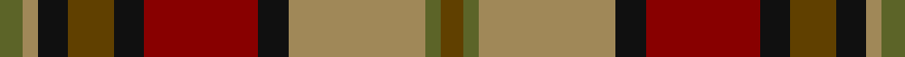

In pattern [GGYKRKGKYG](/stripes/ggykrkgkyg/).

This was sourced from tartans-authority.  It is a [10 stripe tartan](/stripes/stripes10/).

Original link http://www.tartansauthority.com/tartan-ferret/display/6808/

## Attestations

This cloth appears in 2 source records; the oldest owns this page.

- pre 2005 — Fitzsimmons Red (Name) (tartans-authority, [record](http://www.tartansauthority.com/tartan-ferret/display/6808/))
- 01/08/2007 — Fitzsimmons Red (register-of-tartans, [record](https://www.tartanregister.gov.uk/tartanDetails.aspx?ref=1202))

## Register references

External register numbers recorded for this tartan.

- Scottish Register of Tartans: [1202](https://www.tartanregister.gov.uk/tartanDetails.aspx?ref=1202)
- Scottish Tartans Authority (ITI): 6808

## Thread count
G/6 LT4 K8 T12 K8 DR30 K8 LT36 G4 T/6

## Palette
Each colour and the base-6 reference it is a variant of.

| Colour | Shade | Base |
|---|---|---|
| DR | <code style="background-color:#880000;">#880000</code> `oklch(39.4% 0.162 29.2)` <small>#880000</small> | R <code style="background-color:#CC0000;">#CC0000</code> |
| G | <code style="background-color:#5C6428;">#5C6428</code> `oklch(48.3% 0.084 116.0)` <small>#5C6428</small> | G <code style="background-color:#006100;">#006100</code> |
| K | <code style="background-color:#101010;">#101010</code> `oklch(17.3% 0.000 89.9)` <small>#101010</small> | K <code style="background-color:#000000;">#000000</code> |
| LT | <code style="background-color:#A08858;">#A08858</code> `oklch(63.7% 0.071 84.0)` <small>#A08858</small> | Y <code style="background-color:#F2BF00;">#F2BF00</code> |
| T | <code style="background-color:#604000;">#604000</code> `oklch(39.8% 0.083 76.8)` <small>#604000</small> | G <code style="background-color:#006100;">#006100</code> |

## Nearest tartans

The nearest existing variants by ΔTartan distance, with this tartan at the top so the swatches line up against it.

ΔTartan

Tartan

Sett

—

<a href="/ttd/edit/#slug=dy3y2lo18k4r15k4dy6k4lo2y3~x2">Fitzsimmons Red (Name)</a> <a class="nn-out" href="/setts/s10/dy3y2lo18k4r15k4dy6k4lo2y3~x2/" title="open its dictionary page">↗</a>

0.78

<a href="/ttd/edit/#slug=o2o2o2o16n10k3n2k2n2k10ly2~x2">Dryburgh</a> <a class="nn-out" href="/setts/s11/o2o2o2o16n10k3n2k2n2k10ly2~x2/" title="open its dictionary page">↗</a>

1.08

<a href="/ttd/edit/#slug=t4dy27lo8k4lo8k4lo8r11ly3~x2">Brittany National Walking</a> <a class="nn-out" href="/setts/s9/t4dy27lo8k4lo8k4lo8r11ly3~x2/" title="open its dictionary page">↗</a>

1.10

<a href="/ttd/edit/#slug=r5ly3r19do6ly5do6dg12db5dg12db3~x2">Roscommon, County</a> <a class="nn-out" href="/setts/s10/r5ly3r19do6ly5do6dg12db5dg12db3~x2/" title="open its dictionary page">↗</a>

1.13

<a href="/ttd/edit/#slug=y4lr2y2lr3y20k6do4k2do2k2do16o3~x2">Dorcas</a> <a class="nn-out" href="/setts/s12/y4lr2y2lr3y20k6do4k2do2k2do16o3~x2/" title="open its dictionary page">↗</a>

1.14

<a href="/ttd/edit/#slug=o30k4o3k4o3g20dt20ly4~x2">Sikh (Corporate)</a> <a class="nn-out" href="/setts/s8/o30k4o3k4o3g20dt20ly4~x2/" title="open its dictionary page">↗</a>

1.17

<a href="/ttd/edit/#slug=o56k12o7k12o7g50db50ly10">Sikh</a> <a class="nn-out" href="/setts/s8/o56k12o7k12o7g50db50ly10/" title="open its dictionary page">↗</a>

1.17

<a href="/ttd/edit/#slug=r13lr4r13dg28lr3dy26lr10dy2dy2dy2lr10r14lr4dy4r4~x2">MacPherson #9</a> <a class="nn-out" href="/setts/s15/r13lr4r13dg28lr3dy26lr10dy2dy2dy2lr10r14lr4dy4r4~x2/" title="open its dictionary page">↗</a>

1.18

<a href="/ttd/edit/#slug=dy22y22dr2lb6dr2lo2dr16g5dy8lb2~x2">Bruce of Kinnaird (Vivienne Westwood Design)</a> <a class="nn-out" href="/setts/s10/dy22y22dr2lb6dr2lo2dr16g5dy8lb2~x2/" title="open its dictionary page">↗</a>

1.18

<a href="/ttd/edit/#slug=r3dy16db2dy2db2dy3db6o20lr3o2lr2o3~x2">Callum, Brown (Fashion)</a> <a class="nn-out" href="/setts/s12/r3dy16db2dy2db2dy3db6o20lr3o2lr2o3~x2/" title="open its dictionary page">↗</a>

1.19

<a href="/ttd/edit/#slug=y3k2dg18k4y15k4o6k4y2ly3~x2">Fitzsimmons</a> <a class="nn-out" href="/setts/s10/y3k2dg18k4y15k4o6k4y2ly3~x2/" title="open its dictionary page">↗</a>

## Neighbour map

Every grey dot is one of 14299 variants placed by the first two principal components of the ΔTartan feature space (44% of its variance). Red is this tartan; blue dots are its nearest — click one to open its page.

<svg viewBox="0 0 640 380" role="img" style="max-width:100%;height:auto;border:1px solid #e0e0e0;border-radius:4px;display:block" xmlns="http://www.w3.org/2000/svg"><image href="/nn/cloud.v1.png" width="640" height="380"/><a href="/setts/s11/o2o2o2o16n10k3n2k2n2k10ly2~x2/"><circle cx="164.6" cy="162.6" r="4" fill="#3465a4"><title>Dryburgh</title></circle></a><a href="/setts/s9/t4dy27lo8k4lo8k4lo8r11ly3~x2/"><circle cx="152.5" cy="169.8" r="4" fill="#3465a4"><title>Brittany National Walking</title></circle></a><a href="/setts/s10/r5ly3r19do6ly5do6dg12db5dg12db3~x2/"><circle cx="116.9" cy="208.2" r="4" fill="#3465a4"><title>Roscommon, County</title></circle></a><a href="/setts/s12/y4lr2y2lr3y20k6do4k2do2k2do16o3~x2/"><circle cx="208.6" cy="153.9" r="4" fill="#3465a4"><title>Dorcas</title></circle></a><a href="/setts/s8/o30k4o3k4o3g20dt20ly4~x2/"><circle cx="195.5" cy="175.2" r="4" fill="#3465a4"><title>Sikh (Corporate)</title></circle></a><a href="/setts/s8/o56k12o7k12o7g50db50ly10/"><circle cx="142.6" cy="188.6" r="4" fill="#3465a4"><title>Sikh</title></circle></a><a href="/setts/s15/r13lr4r13dg28lr3dy26lr10dy2dy2dy2lr10r14lr4dy4r4~x2/"><circle cx="162.7" cy="140.7" r="4" fill="#3465a4"><title>MacPherson #9</title></circle></a><a href="/setts/s10/dy22y22dr2lb6dr2lo2dr16g5dy8lb2~x2/"><circle cx="170.3" cy="160.0" r="4" fill="#3465a4"><title>Bruce of Kinnaird (Vivienne Westwood Design)</title></circle></a><a href="/setts/s12/r3dy16db2dy2db2dy3db6o20lr3o2lr2o3~x2/"><circle cx="204.5" cy="145.7" r="4" fill="#3465a4"><title>Callum, Brown (Fashion)</title></circle></a><a href="/setts/s10/y3k2dg18k4y15k4o6k4y2ly3~x2/"><circle cx="163.5" cy="186.7" r="4" fill="#3465a4"><title>Fitzsimmons</title></circle></a><circle cx="156.5" cy="174.7" r="5" fill="#c00000"/></svg>

ID: /setts/s10/dy3y2lo18k4r15k4dy6k4lo2y3~x2/
