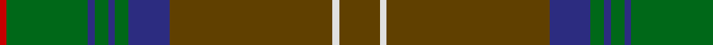

**Bands:** [GWGBGBGBGR](/stripes/gwgbgbgbgr/) · **Stripes:** [DY W DY DB G DB G DB G R](/stripes/stripes10/) DY W DY DB G DB G DB G R

This was sourced from house-of-tartan.  It is a [10 band tartan](/bands/bands10/).

Original link http://www.house-of-tartan.scotland.net/house/TartanViewjs.asp?colr=Def&tnam=1458

## Variants

Other setts woven to the same stripe pattern.

- [Chisholm Hunting #2](/setts/s10/dy5w3dy30db6g3db3g3db3g15r3~x2/)

## Thread count
R/2 G24 DB2 G4 DB2 G4 DB12 T48 LN2 T/12

## Palette
Each colour and its ΔE from the base-6 reference it is a variant of.

| Colour | Shade | Base | ΔE (OKLab) |
|---|---|---|---|
| DB | <code style="background-color:#2C2C80;">#2C2C80</code> `#2C2C80` | B <code style="background-color:#2A418A;">#2A418A</code> | 0.06 |
| G | <code style="background-color:#006818;">#006818</code> `#006818` | G <code style="background-color:#006100;">#006100</code> | 0.02 |
| LN | <code style="background-color:#E0E0E0;">#E0E0E0</code> `#E0E0E0` | W <code style="background-color:#F7F7F7;">#F7F7F7</code> | 0.07 |
| R | <code style="background-color:#C80000;">#C80000</code> `#C80000` | R <code style="background-color:#CC0000;">#CC0000</code> | 0.01 |
| T | <code style="background-color:#604000;">#604000</code> `#604000` | G <code style="background-color:#006100;">#006100</code> | 0.14 |

## Nearest tartans

The nearest existing variants by ΔTartan distance.

1. [Chisholm hunting](/setts/s10/o6w1o24db6g2db1g2db1g12r1~x2/) — ΔT 0.84
1. [Westmeath Irish County Tartan Tartan Number: 2278. Earliest known date: 1996 One of a series of Irish District tartans designed by Polly Wittering of the House of Edgar, with colours reminiscent of the Country with soft warm colours dominating. See products available Copyright © Blair Urquhart, Comrie, 2015](/setts/s14/g11r6db6dy2g3dy2db6r6g36ly2dy3ly2db5r5~x2/) — ΔT 1.09
1. [Manitoba Province](/setts/s14/r12g1dg3g20t1g1t3g1t1g20dg3g1r12lo3~x4/) — ΔT 1.15
1. [Sarna (District)](/setts/s13/g8ly2dy4dp4g3dp4dy42g4r3g4dy4dp5r3/) — ΔT 1.21
1. [Hickory](/setts/s10/db4y30do2y2do14w2do2w1do6y3~x2/) — ΔT 1.26
1. [Westmeath (District)](/setts/s14/g11r6dt6do2g3do2dt6r6g36lo2do3lo2dt5r5~x2/) — ΔT 1.27
1. [Proctor (Name)](/setts/s14/dg39k2dg2k2dg2k3dt13k2lb4k2dt13k3dg24lo3~x2/) — ΔT 1.30
1. [New South Wales Waratah](/setts/s10/y12db2r2db2dt26dg2y3dg3y24r4~x2/) — ΔT 1.32
1. [Walker, Gauvin (Personal)](/setts/s12/ly1y3dt2g5dp4g1dt14y1dt4g25y2ly1~x2/) — ΔT 1.32
1. [Inchforth (Personal)](/setts/s9/o4dg2o7n30o8n7g5dg1w2~x2/) — ΔT 1.39

## Neighbour map

Every grey dot is one of 14313 variants placed by the first two principal components of the ΔTartan feature space (44% of its variance). Red is this tartan; blue dots are its nearest — click one to open its page.

<svg viewBox="0 0 640 380" role="img" style="max-width:100%;height:auto;border:1px solid #e0e0e0;border-radius:4px;display:block" xmlns="http://www.w3.org/2000/svg"><image href="/nn/cloud.v1.png" width="640" height="380"/><a href="/setts/s10/o6w1o24db6g2db1g2db1g12r1~x2/"><circle cx="383.0" cy="151.9" r="4" fill="#3465a4"><title>Chisholm hunting</title></circle></a><a href="/setts/s14/g11r6db6dy2g3dy2db6r6g36ly2dy3ly2db5r5~x2/"><circle cx="341.2" cy="146.4" r="4" fill="#3465a4"><title>Westmeath Irish County Tartan Tartan Number: 2278. Earliest known date: 1996 One of a series of Irish District tartans designed by Polly Wittering of the House of Edgar, with colours reminiscent of the Country with soft warm colours dominating. See products available Copyright © Blair Urquhart, Comrie, 2015</title></circle></a><a href="/setts/s14/r12g1dg3g20t1g1t3g1t1g20dg3g1r12lo3~x4/"><circle cx="350.5" cy="144.8" r="4" fill="#3465a4"><title>Manitoba Province</title></circle></a><a href="/setts/s13/g8ly2dy4dp4g3dp4dy42g4r3g4dy4dp5r3/"><circle cx="388.6" cy="129.7" r="4" fill="#3465a4"><title>Sarna (District)</title></circle></a><a href="/setts/s10/db4y30do2y2do14w2do2w1do6y3~x2/"><circle cx="365.6" cy="133.7" r="4" fill="#3465a4"><title>Hickory</title></circle></a><a href="/setts/s14/g11r6dt6do2g3do2dt6r6g36lo2do3lo2dt5r5~x2/"><circle cx="331.6" cy="145.2" r="4" fill="#3465a4"><title>Westmeath (District)</title></circle></a><a href="/setts/s14/dg39k2dg2k2dg2k3dt13k2lb4k2dt13k3dg24lo3~x2/"><circle cx="386.6" cy="148.9" r="4" fill="#3465a4"><title>Proctor (Name)</title></circle></a><a href="/setts/s10/y12db2r2db2dt26dg2y3dg3y24r4~x2/"><circle cx="323.7" cy="184.2" r="4" fill="#3465a4"><title>New South Wales Waratah</title></circle></a><a href="/setts/s12/ly1y3dt2g5dp4g1dt14y1dt4g25y2ly1~x2/"><circle cx="342.8" cy="138.4" r="4" fill="#3465a4"><title>Walker, Gauvin (Personal)</title></circle></a><a href="/setts/s9/o4dg2o7n30o8n7g5dg1w2~x2/"><circle cx="409.2" cy="160.6" r="4" fill="#3465a4"><title>Inchforth (Personal)</title></circle></a><circle cx="390.3" cy="159.3" r="5" fill="#c00000"/></svg>

ID: /setts/s10/dy6w1dy24db6g2db1g2db1g12r1~x2/
