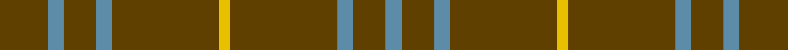

In pattern [BGBGYGBGBG](/stripes/bgbgygbgbg/).

This was sourced from register-of-tartans.  It is a [10 stripe tartan](/stripes/stripes10/).

Original link https://www.tartanregister.gov.uk/tartanDetails.aspx?ref=3245

## Also known as

This cloth is also recorded under:

- Oman RAF, Sultanate of
- Oman, Sultanate of / Oliver dress
- Oman, Sultanate of..

## Register references

External register numbers recorded for this tartan.

- Scottish Register of Tartans: [3245](https://www.tartanregister.gov.uk/tartanDetails.aspx?ref=3245)
- Scottish Tartans Authority (ITI): 717
- Scottish Tartans World Register: 717

## Thread count
T/18 B6 T12 B6 T40 Y4 T40 B6 T12 B/6

## Palette
Each colour and the base-6 reference it is a variant of.

| Colour | Shade | Base |
|---|---|---|
| B | <code style="background-color:#5C8CA8;">#5C8CA8</code> `oklch(61.7% 0.067 235.0)` <small>#5C8CA8</small> | B <code style="background-color:#2A418A;">#2A418A</code> |
| T | <code style="background-color:#604000;">#604000</code> `oklch(39.8% 0.083 76.8)` <small>#604000</small> | G <code style="background-color:#006100;">#006100</code> |
| Y | <code style="background-color:#E8C000;">#E8C000</code> `oklch(81.9% 0.168 93.7)` <small>#E8C000</small> | Y <code style="background-color:#F2BF00;">#F2BF00</code> |

## Nearest tartans

The nearest existing variants by ΔTartan distance.

1. [Oman RAF, Sultanate of (Military)](/setts/s6/dy9t3dy6t3dy20ly2~x2/) — ΔT 1.11
1. [Scott Htg (Error 2)](/setts/s8/r3dy16dy10r3dy3lb2dy3r3~x2/) — ΔT 1.64
1. [VersaCold/Atlas (Corporate)](/setts/s9/db3n44k9n10k9n10k9n44r3~x2/) — ΔT 1.87
1. [Dunbar, John Telfer (Personal)](/setts/s7/o5k2o28k10o26k4o4~x2/) — ΔT 2.01
1. [Connell (Dalgliesh) (Personal)](/setts/s10/r3g12r1g2r2g2r1g12r3k1~x4/) — ΔT 2.02
1. [Welsh National](/setts/s8/r8g3r4g44w4~x2/) — ΔT 2.03
1. [Welsh National #2](/setts/s12/k4dy2r2dy2k2dy15lo2~x4/) — ΔT 2.05
1. [Highland Spring (1997)](/setts/s6/g23r3g7r3g23dp7~x2/) — ΔT 2.08
1. [Brooks Brothers Tattersall Camel](/setts/s5/db1lo9db2lo9r1~x4/) — ΔT 2.16
1. [Unnamed C19th - Portrait by Ansdell](/setts/s11/dg22r3k10r3dg24r2k4r2dg24r2k4~x2/) — ΔT 2.26

## Neighbour map

Every grey dot is one of 14299 variants placed by the first two principal components of the ΔTartan feature space (44% of its variance). Red is this tartan; blue dots are its nearest — click one to open its page.

<svg viewBox="0 0 640 380" role="img" style="max-width:100%;height:auto;border:1px solid #e0e0e0;border-radius:4px;display:block" xmlns="http://www.w3.org/2000/svg"><image href="/nn/cloud.v1.png" width="640" height="380"/><a href="/setts/s6/dy9t3dy6t3dy20ly2~x2/"><circle cx="559.0" cy="256.1" r="4" fill="#3465a4"><title>Oman RAF, Sultanate of (Military)</title></circle></a><a href="/setts/s8/r3dy16dy10r3dy3lb2dy3r3~x2/"><circle cx="511.7" cy="252.2" r="4" fill="#3465a4"><title>Scott Htg (Error 2)</title></circle></a><a href="/setts/s9/db3n44k9n10k9n10k9n44r3~x2/"><circle cx="519.9" cy="207.0" r="4" fill="#3465a4"><title>VersaCold/Atlas (Corporate)</title></circle></a><a href="/setts/s7/o5k2o28k10o26k4o4~x2/"><circle cx="602.2" cy="250.8" r="4" fill="#3465a4"><title>Dunbar, John Telfer (Personal)</title></circle></a><a href="/setts/s10/r3g12r1g2r2g2r1g12r3k1~x4/"><circle cx="475.1" cy="206.4" r="4" fill="#3465a4"><title>Connell (Dalgliesh) (Personal)</title></circle></a><a href="/setts/s8/r8g3r4g44w4~x2/"><circle cx="576.1" cy="207.4" r="4" fill="#3465a4"><title>Welsh National</title></circle></a><a href="/setts/s12/k4dy2r2dy2k2dy15lo2~x4/"><circle cx="456.0" cy="197.7" r="4" fill="#3465a4"><title>Welsh National #2</title></circle></a><a href="/setts/s6/g23r3g7r3g23dp7~x2/"><circle cx="515.8" cy="278.0" r="4" fill="#3465a4"><title>Highland Spring (1997)</title></circle></a><a href="/setts/s5/db1lo9db2lo9r1~x4/"><circle cx="534.7" cy="248.8" r="4" fill="#3465a4"><title>Brooks Brothers Tattersall Camel</title></circle></a><a href="/setts/s11/dg22r3k10r3dg24r2k4r2dg24r2k4~x2/"><circle cx="478.0" cy="229.4" r="4" fill="#3465a4"><title>Unnamed C19th - Portrait by Ansdell</title></circle></a><circle cx="561.4" cy="240.3" r="5" fill="#c00000"/></svg>

ID: /setts/s10/dy9t3dy6t3dy20ly2~x2/
