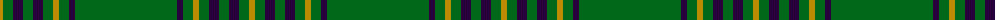

In pattern [GBGYGBGBGY](/patterns/gbgygbgbgy/).

This was sourced from tartans-authority.  It is a [10 stripes tartan](/stripes/stripes10/).

Original link http://www.tartansauthority.com/tartan-ferret/display/5189/

## Thread count
DY/6 G10 DP10 G10 DP10 G10 DY6 G10 DP6 G/102

## Palette
Each colour and its ΔE from the base-6 reference it is a variant of.

| Colour | Shade | Base | ΔE (OKLab) |
|---|---|---|---|
| DP | <code style="background-color:#28003C;">#28003C</code> `#28003C` | B <code style="background-color:#2C4084;">#2C4084</code> | 0.20 |
| DY | <code style="background-color:#BC8C00;">#BC8C00</code> `#BC8C00` | Y <code style="background-color:#E8C000;">#E8C000</code> | 0.16 |
| G | <code style="background-color:#006818;">#006818</code> `#006818` | G <code style="background-color:#006400;">#006400</code> | 0.02 |

## Nearest tartans

The nearest existing variants by ΔTartan distance.

1. [Madoc (Welsh Name)](/setts/s11/k3g3k2g4r2g6k6g4k4g36k2-g005410-k00002c-rc80000/) — ΔT 1.25
1. [Loch Laggan District Tartan Tartan Number: 796. Earliest known date: pre 1820 Loch Laggan lies on the historic route between Lochaber and the Great Glen and the Central Highlands of Badenoch at the head of Glen Spean. See products available Copyright © Blair Urquhart, Comrie, 2015](/setts/s6/r19g6r7g101k7g7-g006818-k101010-rc80000/) — ΔT 1.29
1. [Welsh National](/setts/s8/r16g6r8g88w8g88r8g6-g00643c-rc8002c-we0e0e0/) — ΔT 1.32
1. [Owen (Welsh Name)](/setts/s10/g6r2g4b2g6r6g4r4g36r4-b002048-g006818-rc80000/) — ΔT 1.44
1. [Menzies](/setts/s8/g96r8g4r8g12r4g6r18-g006818-rc80000/) — ΔT 1.54
1. [Highland Hospice](/setts/s18/g102b6g10y6g10b10g10b10g10y6g10b10g10b10g10y6g10b6-b28003c-g006818-ybc8c00/) — ΔT 1.62
1. [Delta Lambda Phi (Corporate)](/setts/s12/y10k2y12g40w2g6w2g6w2g60k2y4-g006818-k101010-wfcfcfc-ybc8c00/) — ΔT 1.62
1. [Menzies Hunting](/setts/s8/g48r4g2r4g6r2g3r9-g004c00-rc80000/) — ΔT 1.67
1. [Loch Laggan](/setts/s6/r19g6r7g101k7g7-g008000-k000000-rc00000/) — ΔT 1.68
1. [Menzies, hunting](/setts/s8/g96r8g4r8g12r4g6r18-g008000-rc00000/) — ΔT 1.68

## Neighbour map

Every grey dot is one of 15726 variants placed by the first two principal components of the ΔTartan feature space (44% of its variance). Red is this tartan; blue dots are its nearest — click one to open its page.

<svg viewBox="0 0 640 380" role="img" style="max-width:100%;height:auto;border:1px solid #e0e0e0;border-radius:4px;display:block" xmlns="http://www.w3.org/2000/svg"><image href="/nn/cloud.v1.png" width="640" height="380"/><a href="/setts/s11/k3g3k2g4r2g6k6g4k4g36k2-g005410-k00002c-rc80000/"><circle cx="517.3" cy="176.5" r="4" fill="#3465a4"><title>Madoc (Welsh Name)</title></circle></a><a href="/setts/s6/r19g6r7g101k7g7-g006818-k101010-rc80000/"><circle cx="560.3" cy="200.7" r="4" fill="#3465a4"><title>Loch Laggan District Tartan Tartan Number: 796. Earliest known date: pre 1820 Loch Laggan lies on the historic route between Lochaber and the Great Glen and the Central Highlands of Badenoch at the head of Glen Spean. See products available Copyright © Blair Urquhart, Comrie, 2015</title></circle></a><a href="/setts/s8/r16g6r8g88w8g88r8g6-g00643c-rc8002c-we0e0e0/"><circle cx="576.1" cy="204.3" r="4" fill="#3465a4"><title>Welsh National</title></circle></a><a href="/setts/s10/g6r2g4b2g6r6g4r4g36r4-b002048-g006818-rc80000/"><circle cx="513.0" cy="165.8" r="4" fill="#3465a4"><title>Owen (Welsh Name)</title></circle></a><a href="/setts/s8/g96r8g4r8g12r4g6r18-g006818-rc80000/"><circle cx="584.2" cy="185.0" r="4" fill="#3465a4"><title>Menzies</title></circle></a><a href="/setts/s18/g102b6g10y6g10b10g10b10g10y6g10b10g10b10g10y6g10b6-b28003c-g006818-ybc8c00/"><circle cx="480.2" cy="142.4" r="4" fill="#3465a4"><title>Highland Hospice</title></circle></a><a href="/setts/s12/y10k2y12g40w2g6w2g6w2g60k2y4-g006818-k101010-wfcfcfc-ybc8c00/"><circle cx="512.2" cy="128.0" r="4" fill="#3465a4"><title>Delta Lambda Phi (Corporate)</title></circle></a><a href="/setts/s8/g48r4g2r4g6r2g3r9-g004c00-rc80000/"><circle cx="581.3" cy="184.3" r="4" fill="#3465a4"><title>Menzies Hunting</title></circle></a><a href="/setts/s6/r19g6r7g101k7g7-g008000-k000000-rc00000/"><circle cx="528.4" cy="188.0" r="4" fill="#3465a4"><title>Loch Laggan</title></circle></a><a href="/setts/s8/g96r8g4r8g12r4g6r18-g008000-rc00000/"><circle cx="575.5" cy="181.8" r="4" fill="#3465a4"><title>Menzies, hunting</title></circle></a><circle cx="557.8" cy="174.8" r="5" fill="#c00000"/></svg>

ID: /setts/s10/g102b6g10y6g10b10g10b10g10y6-b28003c-g006818-ybc8c00/
