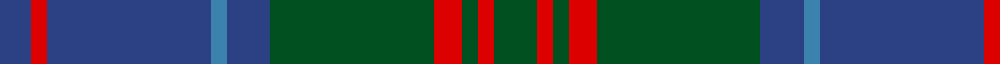

In pattern [BRBBBGRGRG](/patterns/brbbbgrgrg/).

This was sourced from register-of-tartans.  It is a [10 stripes tartan](/stripes/stripes10/).

Original link https://www.tartanregister.gov.uk/tartanDetails.aspx?ref=4012

## Thread count
B/8 R4 B41 Ba4 B11 G41 R7 G4 R4 G/11

## Palette
Each colour and its ΔE from the base-6 reference it is a variant of.

| Colour | Shade | Base | ΔE (OKLab) |
|---|---|---|---|
| B | <code style="background-color:#2C4084;">#2C4084</code> `#2C4084` | B <code style="background-color:#2A418A;">#2A418A</code> | 0.01 |
| Ba | <code style="background-color:#3C82AF;">#3C82AF</code> `#3C82AF` | B <code style="background-color:#2A418A;">#2A418A</code> | 0.19 |
| G | <code style="background-color:#005020;">#005020</code> `#005020` | G <code style="background-color:#006100;">#006100</code> | 0.07 |
| R | <code style="background-color:#DC0000;">#DC0000</code> `#DC0000` | R <code style="background-color:#CC0000;">#CC0000</code> | 0.03 |

## Nearest tartans

The nearest existing variants by ΔTartan distance.

1. [Stuart/Stewart of Appin](/setts/s10/g16r6g6r10g52b14ba6b56r6b12-b2c4084-ba3c82af-g005020-rdc0000/) — ΔT 0.24
1. [Scottish Monuments (Corporate)](/setts/s9/b6r4b4r6b40ba16k4ba12k6-b14283c-ba5c5c5c-k101010-r888888/) — ΔT 0.86
1. [Gammell Family Tartan Tartan Number: 597. Earliest known date: 1965 Designed (probably by David Thomas and Arthur Mackie of Strathmore Woollen Co) for the Hill family of Angus as a personal tartan. Tommy Gemmell (6.3.05) said "The tartan was designed using the largest Government sett by Mrs Hill's mother - a Mrs Gammell - who was a handweaver." See products available Copyright © Blair Urquhart, Comrie, 2015](/setts/s8/b64ba6b6ba6b6ba20g48r6-b202060-ba441800-g006818-r901c38/) — ΔT 0.88
1. [Stewart of Appin Htg (error)](/setts/s10/g16r6g6r10g52b14ba6b56r6b12-b2c2c80-ba5c8ca8-g006818-rc80000/) — ΔT 0.93
1. [MacHarg, Iain](/setts/s9/g40k4g4k4g4k16b48ba6b6-b2c2c80-ba780078-g006818-k101010/) — ΔT 1.01
1. [Shaw](/setts/s10/g48k4b6k4b16r4b16k4b6k4-b2c2c80-g006818-k101010-rc80000/) — ΔT 1.02
1. [St. Andrews New Golf Club](/setts/s9/b8ba36r4ba4r4ba18g40ba6g8-b780078-ba003c64-g006818-r880000/) — ΔT 1.07
1. [Dama Classic](/setts/s8/g60y6g6y6g24b60k6b10-b2e2e2e-g615e57-k181818-ye2d1a3/) — ΔT 1.07
1. [Antrim, County](/setts/s10/g10b4g36y4b10y4r10b34g4y8-b14283c-g406054-rc04c08-ybc8c00/) — ΔT 1.08
1. [Cork Irish County Tartan Tartan Number: 2253. Earliest known date: 1996 One of a series of Irish District tartans designed by Polly Wittering of the House of Edgar, with colours reminiscent of the Country with soft warm colours dominating. See products available Copyright © Blair Urquhart, Comrie, 2015](/setts/s9/g56r24g8b40y4b6y4b6g14-b141c50-g3c6838-r8c0020-yc48800/) — ΔT 1.10

## Neighbour map

Every grey dot is one of 15726 variants placed by the first two principal components of the ΔTartan feature space (44% of its variance). Red is this tartan; blue dots are its nearest — click one to open its page.

<svg viewBox="0 0 640 380" role="img" style="max-width:100%;height:auto;border:1px solid #e0e0e0;border-radius:4px;display:block" xmlns="http://www.w3.org/2000/svg"><image href="/nn/cloud.v1.png" width="640" height="380"/><a href="/setts/s10/g16r6g6r10g52b14ba6b56r6b12-b2c4084-ba3c82af-g005020-rdc0000/"><circle cx="290.1" cy="204.7" r="4" fill="#3465a4"><title>Stuart/Stewart of Appin</title></circle></a><a href="/setts/s9/b6r4b4r6b40ba16k4ba12k6-b14283c-ba5c5c5c-k101010-r888888/"><circle cx="324.9" cy="212.0" r="4" fill="#3465a4"><title>Scottish Monuments (Corporate)</title></circle></a><a href="/setts/s8/b64ba6b6ba6b6ba20g48r6-b202060-ba441800-g006818-r901c38/"><circle cx="311.4" cy="209.7" r="4" fill="#3465a4"><title>Gammell Family Tartan Tartan Number: 597. Earliest known date: 1965 Designed (probably by David Thomas and Arthur Mackie of Strathmore Woollen Co) for the Hill family of Angus as a personal tartan. Tommy Gemmell (6.3.05) said &quot;The tartan was designed using the largest Government sett by Mrs Hill's mother - a Mrs Gammell - who was a handweaver.&quot; See products available Copyright © Blair Urquhart, Comrie, 2015</title></circle></a><a href="/setts/s10/g16r6g6r10g52b14ba6b56r6b12-b2c2c80-ba5c8ca8-g006818-rc80000/"><circle cx="267.7" cy="194.1" r="4" fill="#3465a4"><title>Stewart of Appin Htg (error)</title></circle></a><a href="/setts/s9/g40k4g4k4g4k16b48ba6b6-b2c2c80-ba780078-g006818-k101010/"><circle cx="268.5" cy="189.6" r="4" fill="#3465a4"><title>MacHarg, Iain</title></circle></a><a href="/setts/s10/g48k4b6k4b16r4b16k4b6k4-b2c2c80-g006818-k101010-rc80000/"><circle cx="279.9" cy="179.2" r="4" fill="#3465a4"><title>Shaw</title></circle></a><a href="/setts/s9/b8ba36r4ba4r4ba18g40ba6g8-b780078-ba003c64-g006818-r880000/"><circle cx="337.3" cy="224.9" r="4" fill="#3465a4"><title>St. Andrews New Golf Club</title></circle></a><a href="/setts/s8/g60y6g6y6g24b60k6b10-b2e2e2e-g615e57-k181818-ye2d1a3/"><circle cx="333.3" cy="207.1" r="4" fill="#3465a4"><title>Dama Classic</title></circle></a><a href="/setts/s10/g10b4g36y4b10y4r10b34g4y8-b14283c-g406054-rc04c08-ybc8c00/"><circle cx="245.7" cy="201.3" r="4" fill="#3465a4"><title>Antrim, County</title></circle></a><a href="/setts/s9/g56r24g8b40y4b6y4b6g14-b141c50-g3c6838-r8c0020-yc48800/"><circle cx="300.4" cy="187.9" r="4" fill="#3465a4"><title>Cork Irish County Tartan Tartan Number: 2253. Earliest known date: 1996 One of a series of Irish District tartans designed by Polly Wittering of the House of Edgar, with colours reminiscent of the Country with soft warm colours dominating. See products available Copyright © Blair Urquhart, Comrie, 2015</title></circle></a><circle cx="301.5" cy="199.7" r="5" fill="#c00000"/></svg>

ID: /setts/s10/g11r4g4r7g41b11ba4b41r4b8-b2c4084-ba3c82af-g005020-rdc0000/
