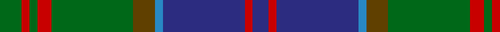

In pattern [BRBBGGRGRG](/stripes/brbbggrgrg/).

This was sourced from house-of-tartan.  It is a [10 stripe tartan](/stripes/stripes10/).

Original link http://www.house-of-tartan.scotland.net/house/TartanViewjs.asp?colr=Def&tnam=430

## Thread count
G/11 R4 G4 R7 G41 T11 B4 DB41 R4 DB/8

## Palette
Each colour and its ΔE from the base-6 reference it is a variant of.

| Colour | Shade | Base | ΔE (OKLab) |
|---|---|---|---|
| B | <code style="background-color:#2888C4;">#2888C4</code> `#2888C4` | B <code style="background-color:#2A418A;">#2A418A</code> | 0.21 |
| DB | <code style="background-color:#2C2C80;">#2C2C80</code> `#2C2C80` | B <code style="background-color:#2A418A;">#2A418A</code> | 0.06 |
| G | <code style="background-color:#006818;">#006818</code> `#006818` | G <code style="background-color:#006100;">#006100</code> | 0.02 |
| R | <code style="background-color:#C80000;">#C80000</code> `#C80000` | R <code style="background-color:#CC0000;">#CC0000</code> | 0.01 |
| T | <code style="background-color:#604000;">#604000</code> `#604000` | G <code style="background-color:#006100;">#006100</code> | 0.14 |

## Nearest tartans

The nearest existing variants by ΔTartan distance.

1. [Stewart of Appin Htg (Clan)](/setts/s10/g8r3g3r5g26dy7t3db28r3db6~x2/) — ΔT 0.42
1. [Stewart of Appin, Ancient hunting](/setts/s10/g11r4g4r7g41o11t4db41r4db8/) — ΔT 0.65
1. [Scottish Power (Corporate)](/setts/s8/dg5g32dp5k10dg8r3dg8dp3~x2/) — ΔT 0.78
1. [Jones Htg (Name)](/setts/s10/dp4t2dp2t8k3dp8g3dp4g24g2~x2/) — ΔT 0.79
1. [Scott #2](/setts/s10/dg8w1dg1r1dg4k4db8k1db1k1~x2/) — ΔT 0.81
1. [Scottish Chamber Orchestra, The](/setts/s9/lt3dt20k3dt2k5dt2k3y15r2~x2/) — ΔT 0.84
1. [Womens Rural Institute](/setts/s8/dg4g24dp4k6dg4r3dg4dp3~x2/) — ΔT 0.84
1. [Tennessee](/setts/s10/r2db10w1m1dg1r1dg6m1dg10w1~x2/) — ΔT 0.88
1. [Dunbartonshire](/setts/s9/g11k2g1r4db1r4db13t2db1~x4/) — ΔT 0.89
1. [Skene (Maclan)](/setts/s12/k4db24k4r3k4dg24k4r3k4dg24r3k4~x2/) — ΔT 0.89

## Neighbour map

Every grey dot is one of 14299 variants placed by the first two principal components of the ΔTartan feature space (44% of its variance). Red is this tartan; blue dots are its nearest — click one to open its page.

<svg viewBox="0 0 640 380" role="img" style="max-width:100%;height:auto;border:1px solid #e0e0e0;border-radius:4px;display:block" xmlns="http://www.w3.org/2000/svg"><image href="/nn/cloud.v1.png" width="640" height="380"/><a href="/setts/s10/g8r3g3r5g26dy7t3db28r3db6~x2/"><circle cx="221.8" cy="182.6" r="4" fill="#3465a4"><title>Stewart of Appin Htg (Clan)</title></circle></a><a href="/setts/s10/g11r4g4r7g41o11t4db41r4db8/"><circle cx="235.8" cy="176.6" r="4" fill="#3465a4"><title>Stewart of Appin, Ancient hunting</title></circle></a><a href="/setts/s8/dg5g32dp5k10dg8r3dg8dp3~x2/"><circle cx="243.4" cy="196.9" r="4" fill="#3465a4"><title>Scottish Power (Corporate)</title></circle></a><a href="/setts/s10/dp4t2dp2t8k3dp8g3dp4g24g2~x2/"><circle cx="238.4" cy="159.7" r="4" fill="#3465a4"><title>Jones Htg (Name)</title></circle></a><a href="/setts/s10/dg8w1dg1r1dg4k4db8k1db1k1~x2/"><circle cx="221.3" cy="198.9" r="4" fill="#3465a4"><title>Scott #2</title></circle></a><a href="/setts/s9/lt3dt20k3dt2k5dt2k3y15r2~x2/"><circle cx="221.5" cy="177.9" r="4" fill="#3465a4"><title>Scottish Chamber Orchestra, The</title></circle></a><a href="/setts/s8/dg4g24dp4k6dg4r3dg4dp3~x2/"><circle cx="234.6" cy="195.3" r="4" fill="#3465a4"><title>Womens Rural Institute</title></circle></a><a href="/setts/s10/r2db10w1m1dg1r1dg6m1dg10w1~x2/"><circle cx="262.2" cy="170.6" r="4" fill="#3465a4"><title>Tennessee</title></circle></a><a href="/setts/s9/g11k2g1r4db1r4db13t2db1~x4/"><circle cx="228.4" cy="177.6" r="4" fill="#3465a4"><title>Dunbartonshire</title></circle></a><a href="/setts/s12/k4db24k4r3k4dg24k4r3k4dg24r3k4~x2/"><circle cx="239.9" cy="187.5" r="4" fill="#3465a4"><title>Skene (Maclan)</title></circle></a><circle cx="238.5" cy="178.4" r="5" fill="#c00000"/></svg>

ID: /setts/s10/g11r4g4r7g41dy11t4db41r4db8/
