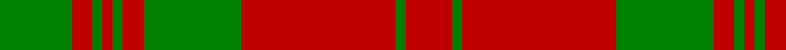

In pattern [GRGRGRGRGR](/patterns/grgrgrgrgr/).

This was sourced from weddslist.  It is a [10 stripes tartan](/stripes/stripes10/).

Original link http://www.weddslist.com/cgi-bin/tartans/pg.pl?source=sts

## Thread count
G/28 R8 G4 R4 G4 R8 G38 R60 G4 R/18

## Palette
Each colour and its ΔE from the base-6 reference it is a variant of.

| Colour | Shade | Base | ΔE (OKLab) |
|---|---|---|---|
| G | <code style="background-color:#008000;">#008000</code> `#008000` | G <code style="background-color:#006100;">#006100</code> | 0.10 |
| R | <code style="background-color:#C00000;">#C00000</code> `#C00000` | R <code style="background-color:#CC0000;">#CC0000</code> | 0.03 |

## Nearest tartans

The nearest existing variants by ΔTartan distance.

1. [Donachie](/setts/s10/r24g2r2g40r25g2r2g2r2g20~g008440-rc80000~x2/) — ΔT 0.81
1. [Livingstone](/setts/s10/g14r4g2r2g2r4g19r30g2r9~g005020-rdc0000~x2/) — ΔT 0.94
1. [Livingstone #2](/setts/s10/g12r4k1r2k1r4g16r20g2r8~g006818-k101010-rc80000~x2/) — ΔT 1.13
1. [Yellow Pencil (Corporate)](/setts/s8/g48y9g6y9g12y4g2y16~g604000-ydc943c~x2/) — ΔT 1.15
1. [MacMillan](/setts/s9/r3y1r12y2r3y8r2y8r1~raa0000-yaaaa00~x2/) — ΔT 1.15
1. [MacMillan](/setts/s9/r3y1r12y2r3y8r2y8r1~raa0000-yaaaa00/) — ΔT 1.15
1. [Livingstone](/setts/s10/g12r4k1r2k1r4g16r20g2r8~g008000-k000000-rc00000~x2/) — ΔT 1.15
1. [MacQuarrie #5](/setts/s6/r16g1r1g1r4g12~g006818-rc80000~x4/) — ΔT 1.29
1. [Robertson - 1746 (Artefact)](/setts/s14/g15r1g1r1g1r18g24r1g1r18g1r1g1r3~g006818-rc80000~x2/) — ΔT 1.32
1. [MacRea / MacRae](/setts/s11/g22r4g22r22g2r3g2r3g2r3y2~g005020-rdc0000-ye8c000~x2/) — ΔT 1.34

## Neighbour map

Every grey dot is one of 15726 variants placed by the first two principal components of the ΔTartan feature space (44% of its variance). Red is this tartan; blue dots are its nearest — click one to open its page.

<svg viewBox="0 0 640 380" role="img" style="max-width:100%;height:auto;border:1px solid #e0e0e0;border-radius:4px;display:block" xmlns="http://www.w3.org/2000/svg"><image href="/nn/cloud.v1.png" width="640" height="380"/><a href="/setts/s10/r24g2r2g40r25g2r2g2r2g20~g008440-rc80000~x2/"><circle cx="424.0" cy="185.1" r="4" fill="#3465a4"><title>Donachie</title></circle></a><a href="/setts/s10/g14r4g2r2g2r4g19r30g2r9~g005020-rdc0000~x2/"><circle cx="409.2" cy="191.9" r="4" fill="#3465a4"><title>Livingstone</title></circle></a><a href="/setts/s10/g12r4k1r2k1r4g16r20g2r8~g006818-k101010-rc80000~x2/"><circle cx="387.9" cy="178.0" r="4" fill="#3465a4"><title>Livingstone #2</title></circle></a><a href="/setts/s8/g48y9g6y9g12y4g2y16~g604000-ydc943c~x2/"><circle cx="476.6" cy="192.4" r="4" fill="#3465a4"><title>Yellow Pencil (Corporate)</title></circle></a><a href="/setts/s9/r3y1r12y2r3y8r2y8r1~raa0000-yaaaa00~x2/"><circle cx="376.7" cy="214.5" r="4" fill="#3465a4"><title>MacMillan</title></circle></a><a href="/setts/s9/r3y1r12y2r3y8r2y8r1~raa0000-yaaaa00/"><circle cx="376.7" cy="214.5" r="4" fill="#3465a4"><title>MacMillan</title></circle></a><a href="/setts/s10/g12r4k1r2k1r4g16r20g2r8~g008000-k000000-rc00000~x2/"><circle cx="372.4" cy="173.0" r="4" fill="#3465a4"><title>Livingstone</title></circle></a><a href="/setts/s6/r16g1r1g1r4g12~g006818-rc80000~x4/"><circle cx="457.2" cy="218.6" r="4" fill="#3465a4"><title>MacQuarrie #5</title></circle></a><a href="/setts/s14/g15r1g1r1g1r18g24r1g1r18g1r1g1r3~g006818-rc80000~x2/"><circle cx="427.1" cy="152.6" r="4" fill="#3465a4"><title>Robertson - 1746 (Artefact)</title></circle></a><a href="/setts/s11/g22r4g22r22g2r3g2r3g2r3y2~g005020-rdc0000-ye8c000~x2/"><circle cx="374.2" cy="181.9" r="4" fill="#3465a4"><title>MacRea / MacRae</title></circle></a><circle cx="415.0" cy="197.3" r="5" fill="#c00000"/></svg>

ID: /setts/s10/g14r4g2r2g2r4g19r30g2r9~g008000-rc00000~x2/
