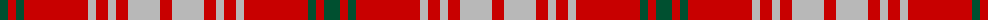

In pattern [GRGRYRYRYR](/patterns/grgryryryr/).

This was sourced from tartans-authority.  It is a [10 stripes tartan](/stripes/stripes10/).

Original link http://www.tartansauthority.com/tartan-ferret/display/972/

## Thread count
G/16 R8 G8 R64 N8 R12 N8 R12 N32 R/12

## Palette
Each colour and its ΔE from the base-6 reference it is a variant of.

| Colour | Shade | Base | ΔE (OKLab) |
|---|---|---|---|
| G | <code style="background-color:#005030;">#005030</code> `#005030` | G <code style="background-color:#006400;">#006400</code> | 0.09 |
| N | <code style="background-color:#B8B8B8;">#B8B8B8</code> `#B8B8B8` | Y <code style="background-color:#E8C000;">#E8C000</code> | 0.17 |
| R | <code style="background-color:#C80000;">#C80000</code> `#C80000` | R <code style="background-color:#C80000;">#C80000</code> | 0.00 |

ID: /setts/s10/g16r8g8r64y8r12y8r12y32r12-g005030-rc80000-yb8b8b8/
