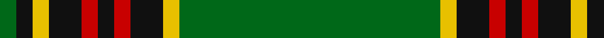

In pattern [GKYKRKRKYG](/patterns/gkykrkrkyg/).

This was sourced from house-of-tartan.  It is a [10 stripes tartan](/stripes/stripes10/).

Original link http://www.house-of-tartan.scotland.net/house/TartanViewjs.asp?colr=Def&tnam=829

## Thread count
G/4 K4 Y4 K8 R4 K4 R4 K8 Y4 G/64

## Palette
Each colour and its ΔE from the base-6 reference it is a variant of.

| Colour | Shade | Base | ΔE (OKLab) |
|---|---|---|---|
| G | <code style="background-color:#006818;">#006818</code> `#006818` | G <code style="background-color:#006100;">#006100</code> | 0.02 |
| K | <code style="background-color:#101010;">#101010</code> `#101010` | K <code style="background-color:#000000;">#000000</code> | 0.17 |
| R | <code style="background-color:#C80000;">#C80000</code> `#C80000` | R <code style="background-color:#CC0000;">#CC0000</code> | 0.01 |
| Y | <code style="background-color:#E8C000;">#E8C000</code> `#E8C000` | Y <code style="background-color:#F2BF00;">#F2BF00</code> | 0.02 |

## Nearest tartans

The nearest existing variants by ΔTartan distance.

1. [Forde](/setts/s10/g30y2k3r2k2r2k3y2k2g4~g006818-k101010-rc80000-ye8c000~x2/) — ΔT 0.32
1. [University of Alberta (Corporate)](/setts/s10/k3g32k2g4y4g2y4g4k6w3~g005010-k101010-we0e0e0-ye8c000~x2/) — ΔT 0.81
1. [Forde](/setts/s10/g16ga1k2r1k1r1k2ga1k1g1~g008000-ga908000-k000000-rc00000~x4/) — ΔT 0.97
1. [Walterström (2014)](/setts/s8/g78b13y6r3y5g6b9y6~b003c64-g003c14-ra00000-yfccc00~x2/) — ΔT 1.22
1. [Walterstrm (2014))](/setts/s8/g78b13y6r3y5g6b9y6~b2c2c80-g006818-rc80000-yfccc00~x2/) — ΔT 1.22
1. [Dryfe](/setts/s11/g42k10y2k2r2k2g10r6k2r3g2~g004c00-k000000-r780028-yfc9898~x2/) — ΔT 1.28
1. [Arnold Palmer Corporate Tartan Tartan Number: 6482. Earliest known date: 2004 Proprietary tartan design for use on Mr. Palmer's products. The Arnold Palmer logo colors are red, yellow, white, green and black. See products available Copyright © Blair Urquhart, Comrie, 2015](/setts/s10/g40r5k2w2k2y3k2g10r3k3~g285800-k101010-rc80000-we0e0e0-ye8c000~x2/) — ΔT 1.29
1. [Birmingham Irish Pipes & Drums](/setts/s8/g48y3k6w4g3k15y3g4~g285800-k000000-wf8f8f8-yc88c00~x2/) — ΔT 1.32
1. [Scotts Valley](/setts/s9/g20r1y1r1w1g1r1w1b5~b00008c-g004c00-r8c0000-wc8c8c8-yc89800~x4/) — ΔT 1.32
1. [MacCandlish Hunting Green](/setts/s11/w3k1g12k1g1k2g1k6g12k1y1~g006818-k101010-wa8ace8-yd09800~x4/) — ΔT 1.33

## Neighbour map

Every grey dot is one of 15726 variants placed by the first two principal components of the ΔTartan feature space (44% of its variance). Red is this tartan; blue dots are its nearest — click one to open its page.

<svg viewBox="0 0 640 380" role="img" style="max-width:100%;height:auto;border:1px solid #e0e0e0;border-radius:4px;display:block" xmlns="http://www.w3.org/2000/svg"><image href="/nn/cloud.v1.png" width="640" height="380"/><a href="/setts/s10/g30y2k3r2k2r2k3y2k2g4~g006818-k101010-rc80000-ye8c000~x2/"><circle cx="398.9" cy="142.9" r="4" fill="#3465a4"><title>Forde</title></circle></a><a href="/setts/s10/k3g32k2g4y4g2y4g4k6w3~g005010-k101010-we0e0e0-ye8c000~x2/"><circle cx="375.1" cy="147.4" r="4" fill="#3465a4"><title>University of Alberta (Corporate)</title></circle></a><a href="/setts/s10/g16ga1k2r1k1r1k2ga1k1g1~g008000-ga908000-k000000-rc00000~x4/"><circle cx="360.5" cy="129.6" r="4" fill="#3465a4"><title>Forde</title></circle></a><a href="/setts/s8/g78b13y6r3y5g6b9y6~b003c64-g003c14-ra00000-yfccc00~x2/"><circle cx="424.9" cy="137.9" r="4" fill="#3465a4"><title>Walterström (2014)</title></circle></a><a href="/setts/s8/g78b13y6r3y5g6b9y6~b2c2c80-g006818-rc80000-yfccc00~x2/"><circle cx="422.4" cy="134.3" r="4" fill="#3465a4"><title>Walterstrm (2014))</title></circle></a><a href="/setts/s11/g42k10y2k2r2k2g10r6k2r3g2~g004c00-k000000-r780028-yfc9898~x2/"><circle cx="413.7" cy="137.8" r="4" fill="#3465a4"><title>Dryfe</title></circle></a><a href="/setts/s10/g40r5k2w2k2y3k2g10r3k3~g285800-k101010-rc80000-we0e0e0-ye8c000~x2/"><circle cx="428.2" cy="121.4" r="4" fill="#3465a4"><title>Arnold Palmer Corporate Tartan Tartan Number: 6482. Earliest known date: 2004 Proprietary tartan design for use on Mr. Palmer's products. The Arnold Palmer logo colors are red, yellow, white, green and black. See products available Copyright © Blair Urquhart, Comrie, 2015</title></circle></a><a href="/setts/s8/g48y3k6w4g3k15y3g4~g285800-k000000-wf8f8f8-yc88c00~x2/"><circle cx="364.9" cy="153.8" r="4" fill="#3465a4"><title>Birmingham Irish Pipes &amp; Drums</title></circle></a><a href="/setts/s9/g20r1y1r1w1g1r1w1b5~b00008c-g004c00-r8c0000-wc8c8c8-yc89800~x4/"><circle cx="400.5" cy="122.0" r="4" fill="#3465a4"><title>Scotts Valley</title></circle></a><a href="/setts/s11/w3k1g12k1g1k2g1k6g12k1y1~g006818-k101010-wa8ace8-yd09800~x4/"><circle cx="360.5" cy="175.2" r="4" fill="#3465a4"><title>MacCandlish Hunting Green</title></circle></a><circle cx="387.0" cy="137.1" r="5" fill="#c00000"/></svg>

ID: /setts/s10/g16y1k2r1k1r1k2y1k1g1~g006818-k101010-rc80000-ye8c000~x4/
