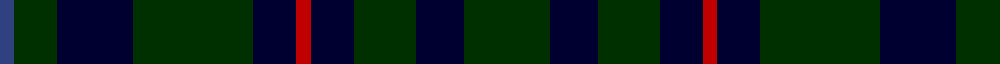

In pattern [BGKGKRKGKG](/patterns/bgkgkrkgkg/).

This was sourced from weddslist.  It is a [10 stripes tartan](/stripes/stripes10/).

Original link http://www.weddslist.com/cgi-bin/tartans/pg.pl?source=sts

## Thread count
B/6 DG18 DB32 DG50 DB18 R6 DB18 DG26 DB20 DG/36

## Palette
Each colour and its ΔE from the base-6 reference it is a variant of.

| Colour | Shade | Base | ΔE (OKLab) |
|---|---|---|---|
| B | <code style="background-color:#304080;">#304080</code> `#304080` | B <code style="background-color:#2A418A;">#2A418A</code> | 0.02 |
| DB | <code style="background-color:#000030;">#000030</code> `#000030` | K <code style="background-color:#000000;">#000000</code> | 0.17 |
| DG | <code style="background-color:#003000;">#003000</code> `#003000` | G <code style="background-color:#006100;">#006100</code> | 0.17 |
| R | <code style="background-color:#C00000;">#C00000</code> `#C00000` | R <code style="background-color:#CC0000;">#CC0000</code> | 0.03 |

## Nearest tartans

The nearest existing variants by ΔTartan distance.

1. [Klappert Name Tartan Tartan Number: 10468. Earliest known date: 2011 This tartan was designed to celebrate the advent of the third generation of Klapperts in Denmark. The Klappert family name is currently only shared by four people in Denmark, all closely related. The family has visited Scotland frequently and has embraced the Scottish culture. This tartan represents the family's love of Scotland. The colours reflect the family's heritage and enviroment: black symbolises the dark Nordic winter and the dark grey is the cold sea which embraces the vast Danish coastline. The dark red symbolises this family's foundation in Denmark. The brown is a reference to the longships which carried the Vikings to Scotland. See products available Copyright © Blair Urquhart, Comrie, 2015](/setts/s9/b16k13b7g3r2g3b7k13b16~b3c4440-g5c381c-k000410-rb42430~x2/) — ΔT 1.21
1. [Klappert, Denmark (Personal)](/setts/s9/b16k13b7g3r2g3b7k13b16~b3f4441-g5c391d-k010512-rb62531~x2/) — ΔT 1.21
1. [London Community Gospel Choir, The](/setts/s7/k25y5k5g25k25b3k10~b2c4084-g003c14-k101010-yc89600~x2/) — ΔT 1.54
1. [Unidentified #10](/setts/s13/r3k2b10k10g12k8g12k10g2k10b2k2b2~b2c4084-g005020-k101010-rdc0000/) — ΔT 1.72
1. [Black Watch (variation)](/setts/s6/k5g23k18b21k33b3~b202060-g006818-k101010~x2/) — ΔT 1.75
1. [Guildry of Stirling](/setts/s10/g18k3g3k3g3k21ga2k21g21k4~g005014-ga3c6838-k101010~x2/) — ΔT 1.75
1. [Dewar, Robert Alexander](/setts/s9/g15b8k5b8g15y3g15b8k5~b003c64-g003820-k101010-ye8c000~x2/) — ΔT 1.81
1. [Dalmeny - 1965 (Fashion)](/setts/s10/b8k1b8k2g6r1g6k2b8w1~b202060-g003820-k101010-rc80000-wc0c0c0~x2/) — ΔT 1.94
1. [de Vere-Austin (Clan)](/setts/s11/g14k8g21k2y5k2g21k11b18k2r5~b202060-g003820-k101010-r880000-ybc8c00~x2/) — ΔT 1.95
1. [Bruce of Crionaich (Personal)](/setts/s11/r1g8b2g2b6g1b6g2b2g8y1~b00004d-g264026-rcc1100-yf9e210~x4/) — ΔT 1.96

## Neighbour map

Every grey dot is one of 15726 variants placed by the first two principal components of the ΔTartan feature space (44% of its variance). Red is this tartan; blue dots are its nearest — click one to open its page.

<svg viewBox="0 0 640 380" role="img" style="max-width:100%;height:auto;border:1px solid #e0e0e0;border-radius:4px;display:block" xmlns="http://www.w3.org/2000/svg"><image href="/nn/cloud.v1.png" width="640" height="380"/><a href="/setts/s9/b16k13b7g3r2g3b7k13b16~b3c4440-g5c381c-k000410-rb42430~x2/"><circle cx="336.4" cy="259.8" r="4" fill="#3465a4"><title>Klappert Name Tartan Tartan Number: 10468. Earliest known date: 2011 This tartan was designed to celebrate the advent of the third generation of Klapperts in Denmark. The Klappert family name is currently only shared by four people in Denmark, all closely related. The family has visited Scotland frequently and has embraced the Scottish culture. This tartan represents the family's love of Scotland. The colours reflect the family's heritage and enviroment: black symbolises the dark Nordic winter and the dark grey is the cold sea which embraces the vast Danish coastline. The dark red symbolises this family's foundation in Denmark. The brown is a reference to the longships which carried the Vikings to Scotland. See products available Copyright © Blair Urquhart, Comrie, 2015</title></circle></a><a href="/setts/s9/b16k13b7g3r2g3b7k13b16~b3f4441-g5c391d-k010512-rb62531~x2/"><circle cx="340.7" cy="260.9" r="4" fill="#3465a4"><title>Klappert, Denmark (Personal)</title></circle></a><a href="/setts/s7/k25y5k5g25k25b3k10~b2c4084-g003c14-k101010-yc89600~x2/"><circle cx="406.8" cy="268.0" r="4" fill="#3465a4"><title>London Community Gospel Choir, The</title></circle></a><a href="/setts/s13/r3k2b10k10g12k8g12k10g2k10b2k2b2~b2c4084-g005020-k101010-rdc0000/"><circle cx="257.9" cy="246.1" r="4" fill="#3465a4"><title>Unidentified #10</title></circle></a><a href="/setts/s6/k5g23k18b21k33b3~b202060-g006818-k101010~x2/"><circle cx="344.2" cy="283.1" r="4" fill="#3465a4"><title>Black Watch (variation)</title></circle></a><a href="/setts/s10/g18k3g3k3g3k21ga2k21g21k4~g005014-ga3c6838-k101010~x2/"><circle cx="399.8" cy="251.2" r="4" fill="#3465a4"><title>Guildry of Stirling</title></circle></a><a href="/setts/s9/g15b8k5b8g15y3g15b8k5~b003c64-g003820-k101010-ye8c000~x2/"><circle cx="304.6" cy="305.4" r="4" fill="#3465a4"><title>Dewar, Robert Alexander</title></circle></a><a href="/setts/s10/b8k1b8k2g6r1g6k2b8w1~b202060-g003820-k101010-rc80000-wc0c0c0~x2/"><circle cx="328.6" cy="240.6" r="4" fill="#3465a4"><title>Dalmeny - 1965 (Fashion)</title></circle></a><a href="/setts/s11/g14k8g21k2y5k2g21k11b18k2r5~b202060-g003820-k101010-r880000-ybc8c00~x2/"><circle cx="300.9" cy="221.1" r="4" fill="#3465a4"><title>de Vere-Austin (Clan)</title></circle></a><a href="/setts/s11/r1g8b2g2b6g1b6g2b2g8y1~b00004d-g264026-rcc1100-yf9e210~x4/"><circle cx="312.0" cy="227.9" r="4" fill="#3465a4"><title>Bruce of Crionaich (Personal)</title></circle></a><circle cx="352.0" cy="274.8" r="5" fill="#c00000"/></svg>

ID: /setts/s10/g18k10g13k9r3k9g25k16g9b3~b304080-g003000-k000030-rc00000~x2/
