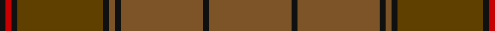

In pattern [GKGKGKGKRK](/patterns/gkgkgkgkrk/).

This was sourced from tartans-authority.  It is a [10 stripes tartan](/stripes/stripes10/).

Original link http://www.tartansauthority.com/tartan-ferret/display/1196/

## Attestations

This cloth appears in 2 source records; the oldest owns this page.

- 1590-1650 — Ulster (Peat) (District (tartans-authority, [record](http://www.tartansauthority.com/tartan-ferret/display/1196/))
- 01/01/1600 — Ulster (Peat) (register-of-tartans, [record](https://www.tartanregister.gov.uk/tartanDetails.aspx?ref=4196))

## Thread count
K/4 R4 K4 T58 K4 Ta4 K4 Ta56 K4 Ta/56

## Palette
Each colour and its ΔE from the base-6 reference it is a variant of.

| Colour | Shade | Base | ΔE (OKLab) |
|---|---|---|---|
| K | <code style="background-color:#101010;">#101010</code> `#101010` | K <code style="background-color:#000000;">#000000</code> | 0.17 |
| R | <code style="background-color:#C80000;">#C80000</code> `#C80000` | R <code style="background-color:#CC0000;">#CC0000</code> | 0.01 |
| T | <code style="background-color:#604000;">#604000</code> `#604000` | G <code style="background-color:#006100;">#006100</code> | 0.14 |
| Ta | <code style="background-color:#7C5428;">#7C5428</code> `#7C5428` | G <code style="background-color:#006100;">#006100</code> | 0.16 |

## Nearest tartans

The nearest existing variants by ΔTartan distance.

1. [Historic Scotland Corporate Tartan Tartan Number: 2122. Earliest known date: 1988 Custodians at Historic Scotland properties throughout Scotland, including Edinburgh Castle, wear this distinctive tartan. See products available Copyright © Blair Urquhart, Comrie, 2015](/setts/s9/g2r1g1r2g21ga9k1ga7k2x2~g604000-ga5c6428-k101010-r888888/) — ΔT 1.09
1. [Williams (Fashion)](/setts/s11/g50b6r3b3ga3b3ba10g8b3g6ga3x2~b441800-ba14283c-g604000-ga8c7038-r98481c/) — ΔT 1.42
1. [Glen Clova #2 (Fashion)](/setts/s12/b39g4ba6y2ba2w2ba2g12b6ba2b6y2x2~b603030-ba480800-g604000-we0e0e0-ya08858/) — ΔT 1.57
1. [Huntsman](/setts/s8/g3ga3g4k4gb14k3g41gc2x2~g5c6428-ga604000-gb603800-gc408060-k101010/) — ΔT 1.77
1. [Wicklow, County (District)](/setts/s10/b1ba2g6ba1b3bb1ba12b1ba1g1x4~b4c3428-ba5c5c5c-bb5c8ca8-g006818/) — ΔT 1.79
1. [Tricor (Corporate)](/setts/s7/g23r4ga6gb6g4w1g4x4~g8c7038-ga604000-gb00643c-r98481c-wc0c0c0/) — ΔT 1.91
1. [MacAlister of Glenbarr Clan Tartan Tartan Number: 910. Earliest known date: pre 1984 This version of the MacAlister of Glenbarr tartan is the same as the MacGillivray hunting tartan. This sample was taken from a piece woven by Lochcarron Weavers around 1984. See products available Copyright © Blair Urquhart, Comrie, 2015](/setts/s14/g4ga2g2ga2g2ga3b1ga1g4ga1b1ga12b2ga3x2~b2c2c80-g006818-ga604000/) — ΔT 1.91
1. [Isaia (Fashion)](/setts/s7/r80ra8r4g4y4g45b8~b5c5c5c-g604000-rac6c64-ra904c40-ya0a0a0/) — ΔT 1.95
1. [MacAlister of Glenbarr Hunting](/setts/s14/g20ga3g6ga6g6ga8b2ga2g20ga2b2ga46b3ga8x2~b2c2c80-g006818-ga603800/) — ΔT 1.98
1. [Redwoods](/setts/s9/g4r18ga2r2ga5k2ga15r1g4x2~g746450-ga604000-k101010-r880000/) — ΔT 1.99

## Neighbour map

Every grey dot is one of 15726 variants placed by the first two principal components of the ΔTartan feature space (44% of its variance). Red is this tartan; blue dots are its nearest — click one to open its page.

<svg viewBox="0 0 640 380" role="img" style="max-width:100%;height:auto;border:1px solid #e0e0e0;border-radius:4px;display:block" xmlns="http://www.w3.org/2000/svg"><image href="/nn/cloud.v1.png" width="640" height="380"/><a href="/setts/s9/g2r1g1r2g21ga9k1ga7k2x2~g604000-ga5c6428-k101010-r888888/"><circle cx="457.3" cy="197.6" r="4" fill="#3465a4"><title>Historic Scotland Corporate Tartan Tartan Number: 2122. Earliest known date: 1988 Custodians at Historic Scotland properties throughout Scotland, including Edinburgh Castle, wear this distinctive tartan. See products available Copyright © Blair Urquhart, Comrie, 2015</title></circle></a><a href="/setts/s11/g50b6r3b3ga3b3ba10g8b3g6ga3x2~b441800-ba14283c-g604000-ga8c7038-r98481c/"><circle cx="528.4" cy="177.5" r="4" fill="#3465a4"><title>Williams (Fashion)</title></circle></a><a href="/setts/s12/b39g4ba6y2ba2w2ba2g12b6ba2b6y2x2~b603030-ba480800-g604000-we0e0e0-ya08858/"><circle cx="463.8" cy="153.7" r="4" fill="#3465a4"><title>Glen Clova #2 (Fashion)</title></circle></a><a href="/setts/s8/g3ga3g4k4gb14k3g41gc2x2~g5c6428-ga604000-gb603800-gc408060-k101010/"><circle cx="499.8" cy="179.7" r="4" fill="#3465a4"><title>Huntsman</title></circle></a><a href="/setts/s10/b1ba2g6ba1b3bb1ba12b1ba1g1x4~b4c3428-ba5c5c5c-bb5c8ca8-g006818/"><circle cx="455.2" cy="226.5" r="4" fill="#3465a4"><title>Wicklow, County (District)</title></circle></a><a href="/setts/s7/g23r4ga6gb6g4w1g4x4~g8c7038-ga604000-gb00643c-r98481c-wc0c0c0/"><circle cx="507.6" cy="206.5" r="4" fill="#3465a4"><title>Tricor (Corporate)</title></circle></a><a href="/setts/s14/g4ga2g2ga2g2ga3b1ga1g4ga1b1ga12b2ga3x2~b2c2c80-g006818-ga604000/"><circle cx="467.5" cy="234.2" r="4" fill="#3465a4"><title>MacAlister of Glenbarr Clan Tartan Tartan Number: 910. Earliest known date: pre 1984 This version of the MacAlister of Glenbarr tartan is the same as the MacGillivray hunting tartan. This sample was taken from a piece woven by Lochcarron Weavers around 1984. See products available Copyright © Blair Urquhart, Comrie, 2015</title></circle></a><a href="/setts/s7/r80ra8r4g4y4g45b8~b5c5c5c-g604000-rac6c64-ra904c40-ya0a0a0/"><circle cx="443.0" cy="173.4" r="4" fill="#3465a4"><title>Isaia (Fashion)</title></circle></a><a href="/setts/s14/g20ga3g6ga6g6ga8b2ga2g20ga2b2ga46b3ga8x2~b2c2c80-g006818-ga603800/"><circle cx="498.3" cy="194.5" r="4" fill="#3465a4"><title>MacAlister of Glenbarr Hunting</title></circle></a><a href="/setts/s9/g4r18ga2r2ga5k2ga15r1g4x2~g746450-ga604000-k101010-r880000/"><circle cx="413.1" cy="216.4" r="4" fill="#3465a4"><title>Redwoods</title></circle></a><circle cx="481.6" cy="205.8" r="5" fill="#c00000"/></svg>

ID: /setts/s10/g28k2g28k2g2k2ga29k2r2k2x2~g7c5428-ga604000-k101010-rc80000/
