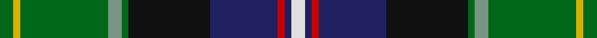

**Bands:** [GYGGGKBRBW](/stripes/gygggkbrbw/) · **Stripes:** [G LY G Y G K DB R DB W](/stripes/stripes10/) G LY G Y G K DB R DB W

This was sourced from tartans-authority.  It is a [10 band tartan](/bands/bands10/).

Original link http://www.tartansauthority.com/tartan-ferret/display/3763/

## Attestations

This cloth appears in 2 source records; the oldest owns this page.

- 1993 — Bullman (Name) (tartans-authority, [record](http://www.tartansauthority.com/tartan-ferret/display/3763/))
- undated — Bullman (register-of-tartans, [record](https://www.tartanregister.gov.uk/tartanDetails.aspx?ref=4855))

## Register references

External register numbers recorded for this tartan.

- Scottish Register of Tartans: [4855](https://www.tartanregister.gov.uk/tartanDetails.aspx?ref=4855)
- Scottish Tartans Authority (ITI): 3763

## Thread count
G/4 Y2 G26 LG4 G2 K24 DB20 R2 DB2 LN/4

## Palette
Each colour and its ΔE from the base-6 reference it is a variant of.

| Colour | Shade | Base | ΔE (OKLab) |
|---|---|---|---|
| DB | <code style="background-color:#202060;">#202060</code> `#202060` | B <code style="background-color:#2A418A;">#2A418A</code> | 0.11 |
| G | <code style="background-color:#006818;">#006818</code> `#006818` | G <code style="background-color:#006100;">#006100</code> | 0.02 |
| K | <code style="background-color:#101010;">#101010</code> `#101010` | K <code style="background-color:#000000;">#000000</code> | 0.17 |
| LG | <code style="background-color:#789484;">#789484</code> `#789484` | G <code style="background-color:#006100;">#006100</code> | 0.24 |
| LN | <code style="background-color:#E0E0E0;">#E0E0E0</code> `#E0E0E0` | W <code style="background-color:#F7F7F7;">#F7F7F7</code> | 0.07 |
| R | <code style="background-color:#C80000;">#C80000</code> `#C80000` | R <code style="background-color:#CC0000;">#CC0000</code> | 0.01 |
| Y | <code style="background-color:#D8B000;">#D8B000</code> `#D8B000` | Y <code style="background-color:#F2BF00;">#F2BF00</code> | 0.06 |

## Nearest tartans

The nearest existing variants by ΔTartan distance.

1. [Carnegie of Skibo Corporate Tartan Tartan Number: 8314. Earliest known date: December 2001 Only available from Robert Mathieson, The Kilt Centre, 1 Campbell Lane, Hamilton. ML3 6DB. Scotland. Tel: +44 (0)1698 200 234. e-mail: kiltcentre@btconnect.com Lochcarron swatch. A corporate tartan for use in kilt hire. The name was chosen to imbue the tartan with some relevant provenance - Andrew Carnegie's retirement residence. See products available Copyright © Blair Urquhart, Comrie, 2015](/setts/s11/w3db5lt2db9dp10k2dp5k5dg9g31w2~x2/) — ΔT 0.73
1. [Carnegie of Skibo (Corporate)](/setts/s11/w3db5t2db9dp10k2dp5k2dg8g29w2~x2/) — ΔT 0.77
1. [Loch Freuchie (District)](/setts/s10/r3dt3k2dt18ly2k25g20r2g3lb3~x2/) — ΔT 0.92
1. [Colorado (District)](/setts/s9/dg32lb3p3lb3dg2k20db17r3ly4~x2/) — ΔT 1.05
1. [Young](/setts/s8/k3db3g15db15dp5o3y2dp1~x2/) — ΔT 1.06
1. [Loch Awe](/setts/s9/ly3k2r3db20k24g20r3k2lb3~x2/) — ΔT 1.07
1. [Young Family Tartan Tartan Number: 2048. Earliest known date: 1991 Based on the Christina Young blanket dating from 1726 and preserved at the Scottish Tartans Society museum in Keith, Banffshire. The design retains the unusual purple - yellow - orange box check of the original blanket and changes only the ground colour to the greens and blues of the Douglas tartan. There are 7 colours. Black is normally replaced by dark blue in commercial weaving. See products available Copyright © Blair Urquhart, Comrie, 2015](/setts/s8/k3db3g15db15m5lo3ly2m1~x2/) — ΔT 1.08
1. [Ayrton (1979) (Personal)](/setts/s11/r4k2g25k2t10k2g4k2db25k2ly4~x2/) — ΔT 1.10
1. [Colorado](/setts/s9/g32lb3dp3lb3g2k20t17r3lo4~x2/) — ΔT 1.12
1. [Allison (MacGregor-Hastie)](/setts/s14/db2k2db16k15ly2g16k2g16w2k17db4r6k3ly2~x2/) — ΔT 1.16

## Neighbour map

Every grey dot is one of 14299 variants placed by the first two principal components of the ΔTartan feature space (44% of its variance). Red is this tartan; blue dots are its nearest — click one to open its page.

<svg viewBox="0 0 640 380" role="img" style="max-width:100%;height:auto;border:1px solid #e0e0e0;border-radius:4px;display:block" xmlns="http://www.w3.org/2000/svg"><image href="/nn/cloud.v1.png" width="640" height="380"/><a href="/setts/s11/w3db5lt2db9dp10k2dp5k5dg9g31w2~x2/"><circle cx="134.2" cy="108.7" r="4" fill="#3465a4"><title>Carnegie of Skibo Corporate Tartan Tartan Number: 8314. Earliest known date: December 2001 Only available from Robert Mathieson, The Kilt Centre, 1 Campbell Lane, Hamilton. ML3 6DB. Scotland. Tel: +44 (0)1698 200 234. e-mail: kiltcentre@btconnect.com Lochcarron swatch. A corporate tartan for use in kilt hire. The name was chosen to imbue the tartan with some relevant provenance - Andrew Carnegie's retirement residence. See products available Copyright © Blair Urquhart, Comrie, 2015</title></circle></a><a href="/setts/s11/w3db5t2db9dp10k2dp5k2dg8g29w2~x2/"><circle cx="141.4" cy="111.5" r="4" fill="#3465a4"><title>Carnegie of Skibo (Corporate)</title></circle></a><a href="/setts/s10/r3dt3k2dt18ly2k25g20r2g3lb3~x2/"><circle cx="155.9" cy="143.2" r="4" fill="#3465a4"><title>Loch Freuchie (District)</title></circle></a><a href="/setts/s9/dg32lb3p3lb3dg2k20db17r3ly4~x2/"><circle cx="135.3" cy="107.8" r="4" fill="#3465a4"><title>Colorado (District)</title></circle></a><a href="/setts/s8/k3db3g15db15dp5o3y2dp1~x2/"><circle cx="102.5" cy="127.3" r="4" fill="#3465a4"><title>Young</title></circle></a><a href="/setts/s9/ly3k2r3db20k24g20r3k2lb3~x2/"><circle cx="145.2" cy="144.4" r="4" fill="#3465a4"><title>Loch Awe</title></circle></a><a href="/setts/s8/k3db3g15db15m5lo3ly2m1~x2/"><circle cx="118.6" cy="132.1" r="4" fill="#3465a4"><title>Young Family Tartan Tartan Number: 2048. Earliest known date: 1991 Based on the Christina Young blanket dating from 1726 and preserved at the Scottish Tartans Society museum in Keith, Banffshire. The design retains the unusual purple - yellow - orange box check of the original blanket and changes only the ground colour to the greens and blues of the Douglas tartan. There are 7 colours. Black is normally replaced by dark blue in commercial weaving. See products available Copyright © Blair Urquhart, Comrie, 2015</title></circle></a><a href="/setts/s11/r4k2g25k2t10k2g4k2db25k2ly4~x2/"><circle cx="158.9" cy="129.8" r="4" fill="#3465a4"><title>Ayrton (1979) (Personal)</title></circle></a><a href="/setts/s9/g32lb3dp3lb3g2k20t17r3lo4~x2/"><circle cx="127.7" cy="103.0" r="4" fill="#3465a4"><title>Colorado</title></circle></a><a href="/setts/s14/db2k2db16k15ly2g16k2g16w2k17db4r6k3ly2~x2/"><circle cx="108.7" cy="137.3" r="4" fill="#3465a4"><title>Allison (MacGregor-Hastie)</title></circle></a><circle cx="137.7" cy="122.4" r="5" fill="#c00000"/></svg>

ID: /setts/s10/g2ly1g13y2g1k12db10r1db1w2~x2/
