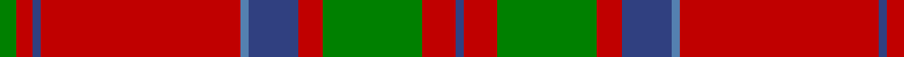

This page is one **sett** — a single exact thread-count. It belongs to the [tartan](/tartans/g2r2db1r24t1db6r3g12r4db1/)
(the same proportion at any scale), whose colour order is pattern [BRGRBBRBRG](/stripes/brgrbbrbrg/).

Sourced from weddslist.  It is a [10 stripe tartan](/stripes/stripes10/).

Original link http://www.weddslist.com/cgi-bin/tartans/pg.pl?source=sts

2 attestations — the source records this cloth was collapsed from (oldest owns this page)

<ul>
<li>undated — MacDonell of Keppoch (weddslist, <a href="http://www.weddslist.com/cgi-bin/tartans/pg.pl?source=sts">record</a>)</li>
<li>undated — MacDonell of Keppoch Clan Tartan Tartan Number: 511. Earliest known date: 1906 MacDonells of Keppoch are an independant branch of Clan Donald. See products available Copyright © Blair Urquhart, Comrie, 2015 (house-of-tartan, <a href="http://www.house-of-tartan.scotland.net/house/TartanViewjs.asp?colr=Def&tnam=511">record</a>)</li>
</ul>

## Thread count
G/4 R4 B2 R48 Ba2 B12 R6 G24 R8 B/2

## Palette

Palette: <strong>custom</strong>
<table><thead><tr><th>Colour</th><th>Threads</th><th>Shade</th><th>Base</th><th>OKLCh</th></tr></thead><tbody><tr><td>G/</td><td style="text-align:right;font-variant-numeric:tabular-nums">4</td><td><code style="background-color:#008000;">#008000</code> <small style="color:#888">#008000</small></td><td>G <code style="background-color:#006100;">#006100</code></td><td><small style="color:#888">oklch(52.0% 0.177 142.5)</small></td></tr><tr><td>R</td><td style="text-align:right;font-variant-numeric:tabular-nums">4</td><td><code style="background-color:#C00000;">#C00000</code> <small style="color:#888">#C00000</small></td><td>R <code style="background-color:#CC0000;">#CC0000</code></td><td><small style="color:#888">oklch(50.7% 0.208 29.2)</small></td></tr><tr><td>B</td><td style="text-align:right;font-variant-numeric:tabular-nums">2</td><td><code style="background-color:#304080;">#304080</code> <small style="color:#888">#304080</small></td><td>B <code style="background-color:#2A418A;">#2A418A</code></td><td><small style="color:#888">oklch(39.4% 0.109 270.2)</small></td></tr><tr><td>R</td><td style="text-align:right;font-variant-numeric:tabular-nums">48</td><td><code style="background-color:#C00000;">#C00000</code> <small style="color:#888">#C00000</small></td><td>R <code style="background-color:#CC0000;">#CC0000</code></td><td><small style="color:#888">oklch(50.7% 0.208 29.2)</small></td></tr><tr><td>Ba</td><td style="text-align:right;font-variant-numeric:tabular-nums">2</td><td><code style="background-color:#5480B0;">#5480B0</code> <small style="color:#888">#5480B0</small></td><td>B <code style="background-color:#2A418A;">#2A418A</code></td><td><small style="color:#888">oklch(58.8% 0.089 251.5)</small></td></tr><tr><td>B</td><td style="text-align:right;font-variant-numeric:tabular-nums">12</td><td><code style="background-color:#304080;">#304080</code> <small style="color:#888">#304080</small></td><td>B <code style="background-color:#2A418A;">#2A418A</code></td><td><small style="color:#888">oklch(39.4% 0.109 270.2)</small></td></tr><tr><td>R</td><td style="text-align:right;font-variant-numeric:tabular-nums">6</td><td><code style="background-color:#C00000;">#C00000</code> <small style="color:#888">#C00000</small></td><td>R <code style="background-color:#CC0000;">#CC0000</code></td><td><small style="color:#888">oklch(50.7% 0.208 29.2)</small></td></tr><tr><td>G</td><td style="text-align:right;font-variant-numeric:tabular-nums">24</td><td><code style="background-color:#008000;">#008000</code> <small style="color:#888">#008000</small></td><td>G <code style="background-color:#006100;">#006100</code></td><td><small style="color:#888">oklch(52.0% 0.177 142.5)</small></td></tr><tr><td>R</td><td style="text-align:right;font-variant-numeric:tabular-nums">8</td><td><code style="background-color:#C00000;">#C00000</code> <small style="color:#888">#C00000</small></td><td>R <code style="background-color:#CC0000;">#CC0000</code></td><td><small style="color:#888">oklch(50.7% 0.208 29.2)</small></td></tr><tr><td>B/</td><td style="text-align:right;font-variant-numeric:tabular-nums">2</td><td><code style="background-color:#304080;">#304080</code> <small style="color:#888">#304080</small></td><td>B <code style="background-color:#2A418A;">#2A418A</code></td><td><small style="color:#888">oklch(39.4% 0.109 270.2)</small></td></tr></tbody></table>

## Nearest tartans

The nearest existing variants by ΔTartan distance, with this tartan at the top so the swatches line up against it.

ΔTartan

Tartan

Sett

—

<a href="/ttd/edit/#slug=g2r2db1r24t1db6r3g12r4db1~x2">MacDonell of Keppoch</a> <a class="nn-out" href="/setts/s10/g2r2db1r24t1db6r3g12r4db1~x2/" title="open its dictionary page">↗</a>

0.48

<a href="/ttd/edit/#slug=dg2r2db1r24t1db6r3dg12r4db1~x2">MacDonell of Keppoch</a> <a class="nn-out" href="/setts/s10/dg2r2db1r24t1db6r3dg12r4db1~x2/" title="open its dictionary page">↗</a>

0.52

<a href="/ttd/edit/#slug=r7w2r36db6g3db3g3db3g12r4~x2">Chisholm of Strathglass</a> <a class="nn-out" href="/setts/s10/r7w2r36db6g3db3g3db3g12r4~x2/" title="open its dictionary page">↗</a>

0.54

<a href="/ttd/edit/#slug=r12w2r37db6g3db3r4db3g21r4~x2">Chisholm, The</a> <a class="nn-out" href="/setts/s10/r12w2r37db6g3db3r4db3g21r4~x2/" title="open its dictionary page">↗</a>

0.58

<a href="/ttd/edit/#slug=r6w1r24db6g2db1g2db1g12r1~x2">Chisholm</a> <a class="nn-out" href="/setts/s10/r6w1r24db6g2db1g2db1g12r1~x2/" title="open its dictionary page">↗</a>

0.58

<a href="/ttd/edit/#slug=r12w2r37b6g3b3r4b3g21r4~x2">Chisholm, The (MacGregor-Hastie)</a> <a class="nn-out" href="/setts/s10/r12w2r37b6g3b3r4b3g21r4~x2/" title="open its dictionary page">↗</a>

0.61

<a href="/ttd/edit/#slug=r6lb1r24dp6dg2dp1dg2dp1dg12r1">Chisholm D</a> <a class="nn-out" href="/setts/s10/r6lb1r24dp6dg2dp1dg2dp1dg12r1/" title="open its dictionary page">↗</a>

0.65

<a href="/ttd/edit/#slug=r7w2r36b6g3b3g3b3g12r4~x2">Chisholm of Strathglass (Clan)</a> <a class="nn-out" href="/setts/s10/r7w2r36b6g3b3g3b3g12r4~x2/" title="open its dictionary page">↗</a>

0.78

<a href="/setts/s12/r60db2g24r8db2t3db2/">Unidentified Cant #12</a>

0.83

<a href="/ttd/edit/#slug=r4t1db1r32t2r2db12r2g16r4t1r4db2~x2">MacGillivray</a> <a class="nn-out" href="/setts/s13/r4t1db1r32t2r2db12r2g16r4t1r4db2~x2/" title="open its dictionary page">↗</a>

0.84

<a href="/ttd/edit/#slug=r6db1r1dg28r4db8w1r32dg1r4dg2~x2">MacDonell of Keppoch (artefact)</a> <a class="nn-out" href="/setts/s11/r6db1r1dg28r4db8w1r32dg1r4dg2~x2/" title="open its dictionary page">↗</a>

## Neighbour map

Every grey dot is one of 14359 variants placed by the first two principal components of the ΔTartan feature space (44% of its variance). Red is this tartan; blue dots are its nearest — click one to open its page.

<svg viewBox="0 0 640 380" role="img" style="max-width:100%;height:auto;border:1px solid #e0e0e0;border-radius:4px;display:block" xmlns="http://www.w3.org/2000/svg"><image href="/nn/cloud.v1.png" width="640" height="380"/><a href="/setts/s10/dg2r2db1r24t1db6r3dg12r4db1~x2/"><circle cx="399.3" cy="130.7" r="4" fill="#3465a4"><title>MacDonell of Keppoch</title></circle></a><a href="/setts/s10/r7w2r36db6g3db3g3db3g12r4~x2/"><circle cx="378.4" cy="135.5" r="4" fill="#3465a4"><title>Chisholm of Strathglass</title></circle></a><a href="/setts/s10/r12w2r37db6g3db3r4db3g21r4~x2/"><circle cx="379.8" cy="142.0" r="4" fill="#3465a4"><title>Chisholm, The</title></circle></a><a href="/setts/s10/r6w1r24db6g2db1g2db1g12r1~x2/"><circle cx="363.6" cy="123.3" r="4" fill="#3465a4"><title>Chisholm</title></circle></a><a href="/setts/s10/r12w2r37b6g3b3r4b3g21r4~x2/"><circle cx="378.2" cy="140.6" r="4" fill="#3465a4"><title>Chisholm, The (MacGregor-Hastie)</title></circle></a><a href="/setts/s10/r6lb1r24dp6dg2dp1dg2dp1dg12r1/"><circle cx="372.0" cy="125.8" r="4" fill="#3465a4"><title>Chisholm D</title></circle></a><a href="/setts/s10/r7w2r36b6g3b3g3b3g12r4~x2/"><circle cx="379.3" cy="135.3" r="4" fill="#3465a4"><title>Chisholm of Strathglass (Clan)</title></circle></a><a href="/setts/s12/r60db2g24r8db2t3db2/"><circle cx="385.4" cy="105.4" r="4" fill="#3465a4"><title>Unidentified Cant #12</title></circle></a><a href="/setts/s13/r4t1db1r32t2r2db12r2g16r4t1r4db2~x2/"><circle cx="394.4" cy="103.1" r="4" fill="#3465a4"><title>MacGillivray</title></circle></a><a href="/setts/s11/r6db1r1dg28r4db8w1r32dg1r4dg2~x2/"><circle cx="373.8" cy="104.4" r="4" fill="#3465a4"><title>MacDonell of Keppoch (artefact)</title></circle></a><circle cx="394.5" cy="130.4" r="5" fill="#c00000"/></svg>

ID: /setts/s10/g2r2db1r24t1db6r3g12r4db1~x2/
