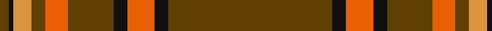

In pattern [GKRKGRGYKG](/patterns/gkrkgrgykg/).

This was sourced from tartans-authority.  It is a [10 stripes tartan](/stripes/stripes10/).

Original link http://www.tartansauthority.com/tartan-ferret/display/10760/

## Thread count
T/4 K2 O8 T6 Oa10 T20 K6 Oa12 K6 T/72

## Palette
Each colour and its ΔE from the base-6 reference it is a variant of.

| Colour | Shade | Base | ΔE (OKLab) |
|---|---|---|---|
| K | <code style="background-color:#101010;">#101010</code> `#101010` | K <code style="background-color:#000000;">#000000</code> | 0.17 |
| O | <code style="background-color:#DC943C;">#DC943C</code> `#DC943C` | Y <code style="background-color:#F2BF00;">#F2BF00</code> | 0.12 |
| Oa | <code style="background-color:#E86000;">#E86000</code> `#E86000` | R <code style="background-color:#CC0000;">#CC0000</code> | 0.14 |
| T | <code style="background-color:#604000;">#604000</code> `#604000` | G <code style="background-color:#006100;">#006100</code> | 0.14 |

## Nearest tartans

The nearest existing variants by ΔTartan distance.

1. [KIltwalk, The (Corporate)](/setts/s9/g2w2y4g5y5g46y7g1wa2x2~g604000-w98c8e8-wafcfcfc-ya08858/) — ΔT 1.11
1. [Oakhall (Corporate)](/setts/s8/k3r48g6r6g12y3g2k3x2~g006818-k101010-r901c38-ye8c000/) — ΔT 1.36
1. [Oakhall](/setts/s14/r48g6r6g12y3g2k3g2y3g12r6g6r48k3x2~g006818-k101010-r901c38-ye8c000/) — ΔT 1.37
1. [Strang (Personal)](/setts/s8/r36g18r4g6k1w2k1g2x2~g146400-k000000-rb00000-wc8c8c8/) — ΔT 1.45
1. [MacFie](/setts/s9/y2r12g2r1g32r1g2r12ya2x2~g11450d-raa0000-yaaaa00-yaaaaaaa/) — ΔT 1.46
1. [Scott](/setts/s10/g4r3k1r28g14r4g4y3g4r4x2~g11450d-k000000-raa0000-yaaaaaa/) — ΔT 1.50
1. [Scott](/setts/s10/g4r3k1r28g14r4g4y3g4r4~g11450d-k000000-raa0000-yaaaaaa/) — ΔT 1.50
1. [Vemma (Corporate) XXXXXXXXX](/setts/s10/r24w2r7w3k2b4k2w1r4w1x2~b5c5c5c-k101010-rb84c00-wc0c0c0/) — ΔT 1.52
1. [Galway Irish County Tartan Tartan Number: 2254. Earliest known date: 1995 One of a series of Irish District tartans designed by Polly Wittering of the House of Edgar, with colours reminiscent of the Country with soft warm colours dominating. See products available Copyright © Blair Urquhart, Comrie, 2015](/setts/s10/r4g13r3b4r3b3r40b3r2y4x2~b141c50-g446844-rb84820-yc48800/) — ΔT 1.56
1. [MacGregor](/setts/s6/r36g18r4g6k1y2x2~g11450d-k000000-raa0000-yaaaaaa/) — ΔT 1.65

## Neighbour map

Every grey dot is one of 15726 variants placed by the first two principal components of the ΔTartan feature space (44% of its variance). Red is this tartan; blue dots are its nearest — click one to open its page.

<svg viewBox="0 0 640 380" role="img" style="max-width:100%;height:auto;border:1px solid #e0e0e0;border-radius:4px;display:block" xmlns="http://www.w3.org/2000/svg"><image href="/nn/cloud.v1.png" width="640" height="380"/><a href="/setts/s9/g2w2y4g5y5g46y7g1wa2x2~g604000-w98c8e8-wafcfcfc-ya08858/"><circle cx="551.1" cy="114.2" r="4" fill="#3465a4"><title>KIltwalk, The (Corporate)</title></circle></a><a href="/setts/s8/k3r48g6r6g12y3g2k3x2~g006818-k101010-r901c38-ye8c000/"><circle cx="458.7" cy="142.7" r="4" fill="#3465a4"><title>Oakhall (Corporate)</title></circle></a><a href="/setts/s14/r48g6r6g12y3g2k3g2y3g12r6g6r48k3x2~g006818-k101010-r901c38-ye8c000/"><circle cx="469.6" cy="124.7" r="4" fill="#3465a4"><title>Oakhall</title></circle></a><a href="/setts/s8/r36g18r4g6k1w2k1g2x2~g146400-k000000-rb00000-wc8c8c8/"><circle cx="422.9" cy="124.9" r="4" fill="#3465a4"><title>Strang (Personal)</title></circle></a><a href="/setts/s9/y2r12g2r1g32r1g2r12ya2x2~g11450d-raa0000-yaaaa00-yaaaaaaa/"><circle cx="412.3" cy="135.0" r="4" fill="#3465a4"><title>MacFie</title></circle></a><a href="/setts/s10/g4r3k1r28g14r4g4y3g4r4x2~g11450d-k000000-raa0000-yaaaaaa/"><circle cx="408.5" cy="141.2" r="4" fill="#3465a4"><title>Scott</title></circle></a><a href="/setts/s10/g4r3k1r28g14r4g4y3g4r4~g11450d-k000000-raa0000-yaaaaaa/"><circle cx="408.5" cy="141.2" r="4" fill="#3465a4"><title>Scott</title></circle></a><a href="/setts/s10/r24w2r7w3k2b4k2w1r4w1x2~b5c5c5c-k101010-rb84c00-wc0c0c0/"><circle cx="470.2" cy="128.3" r="4" fill="#3465a4"><title>Vemma (Corporate) XXXXXXXXX</title></circle></a><a href="/setts/s10/r4g13r3b4r3b3r40b3r2y4x2~b141c50-g446844-rb84820-yc48800/"><circle cx="463.4" cy="141.4" r="4" fill="#3465a4"><title>Galway Irish County Tartan Tartan Number: 2254. Earliest known date: 1995 One of a series of Irish District tartans designed by Polly Wittering of the House of Edgar, with colours reminiscent of the Country with soft warm colours dominating. See products available Copyright © Blair Urquhart, Comrie, 2015</title></circle></a><a href="/setts/s6/r36g18r4g6k1y2x2~g11450d-k000000-raa0000-yaaaaaa/"><circle cx="451.4" cy="157.2" r="4" fill="#3465a4"><title>MacGregor</title></circle></a><circle cx="498.0" cy="127.8" r="5" fill="#c00000"/></svg>

ID: /setts/s10/g36k3r6k3g10r5g3y4k1g2x2~g604000-k101010-re86000-ydc943c/
