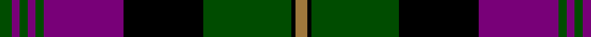

In pattern [GBGBGBKGKR](/patterns/gbgbgbkgkr/).

This was sourced from tartans-authority.  It is a [10 stripes tartan](/stripes/stripes10/).

Original link http://www.tartansauthority.com/tartan-ferret/display/4362/

## Thread count
G/12 P8 G8 P8 G8 P80 K80 G88 K4 LT/12

## Palette
Each colour and its ΔE from the base-6 reference it is a variant of.

| Colour | Shade | Base | ΔE (OKLab) |
|---|---|---|---|
| G | <code style="background-color:#004C00;">#004C00</code> `#004C00` | G <code style="background-color:#006100;">#006100</code> | 0.07 |
| K | <code style="background-color:#000000;">#000000</code> `#000000` | K <code style="background-color:#000000;">#000000</code> | 0.00 |
| LT | <code style="background-color:#A0783C;">#A0783C</code> `#A0783C` | R <code style="background-color:#CC0000;">#CC0000</code> | 0.18 |
| P | <code style="background-color:#780078;">#780078</code> `#780078` | B <code style="background-color:#2A418A;">#2A418A</code> | 0.17 |

## Nearest tartans

The nearest existing variants by ΔTartan distance.

1. [Rennie (Personal)](/setts/s10/w6k1g28k24b25g3b3g3b3g4~b440044-g5c6428-k101010-we0e0e0~x2/) — ΔT 0.94
1. [Greater St Louis Area Firefighters Highland Guard](/setts/s9/b3r3k38b25y3b6r7b3y2~b2f4f4f-k101010-rff0000-yffe600~x2/) — ΔT 1.02
1. [Rennie Family Tartan Tartan Number: 716. Earliest known date: 1981. For Robin Rennie. The accreditation list gives the author and weaver, James Scarlett, as the designer in 1980. The tartan register records the designer as Peter MacDonald who worked as a weaver for the Scottish Tartans Society in 1981. Rennies, Rainys and Rainnies (from 'Ranald') are listed as a sept of MacDonell of Keppoch. See products available Copyright © Blair Urquhart, Comrie, 2015](/setts/s10/w6k1g29k23b27g3b3g3b3g4~b780078-g006818-k101010-we0e0e0~x2/) — ΔT 1.06
1. [Greater St Louis Firefighters Corporate Tartan Tartan Number: 10336. Earliest known date: 2011 This tartan will be worn by members of the Greater St Louis Firefighters Highland Guard in memory of Firefighter-Paramedic Ryan Hummert of the Maplewood Missouri Fire Department. Firefighter-Paramedic Ryan Hummert was killed in the line of duty on the 21st July 2008 when a lone gunman ambushed emergency responders by setting a vehicle on fire and opening fire on firefighters and police officers when they arrived at the scene. Many of the band members were also involved in this call and the subsequent funeral and memorial services honouring Ryan. The Guard is honoured to design and wear this tartan in Ryan's memory. The tartan uses traditional fire department colours; red, black and gold. Charcoal grey is symbolic of smoke. See products available Copyright © Blair Urquhart, Comrie, 2015](/setts/s9/b3r3k38b25y3b6r7b3y2~b4f4f4f-k101010-rc80000-yfccc3c~x2/) — ΔT 1.11
1. [Brown](/setts/s8/b6r1b2r1b2k18r8g2~b304080-g008000-k000000-rc00000~x2/) — ΔT 1.13
1. [Southdown Tartan Tartan Number: 1194. Earliest known date: pre 2003 Designed for the Glasgow conference in 2002 See products available Copyright © Blair Urquhart, Comrie, 2015](/setts/s9/k8r1k3w5k5w3k5b23r3~b480800-k101010-rc80000-we0e0e0~x2/) — ΔT 1.20
1. [Urbino](/setts/s18/g3b2g2b2g2b20k20g22k1r3k1g22k20b20g2b2g2b2~b780078-g004c00-k000000-ra0783c~x4/) — ΔT 1.21
1. [Carson Red (Personal)](/setts/s8/b19r2b3r2b3k43r22g3~b446c84-g006818-k101010-rc80000~x2/) — ΔT 1.21
1. [Common Kilt](/setts/s8/r3k2b25k28g25k2r1b2~b304080-g008000-k000000-rc00000~x2/) — ΔT 1.22
1. [Rangers F.C.](/setts/s11/r3g14k12b40k12g2k2g2k2g7r3~b304080-g30a010-k000000-rc00020~x2/) — ΔT 1.23

## Neighbour map

Every grey dot is one of 15726 variants placed by the first two principal components of the ΔTartan feature space (44% of its variance). Red is this tartan; blue dots are its nearest — click one to open its page.

<svg viewBox="0 0 640 380" role="img" style="max-width:100%;height:auto;border:1px solid #e0e0e0;border-radius:4px;display:block" xmlns="http://www.w3.org/2000/svg"><image href="/nn/cloud.v1.png" width="640" height="380"/><a href="/setts/s10/w6k1g28k24b25g3b3g3b3g4~b440044-g5c6428-k101010-we0e0e0~x2/"><circle cx="248.4" cy="138.0" r="4" fill="#3465a4"><title>Rennie (Personal)</title></circle></a><a href="/setts/s9/b3r3k38b25y3b6r7b3y2~b2f4f4f-k101010-rff0000-yffe600~x2/"><circle cx="268.4" cy="144.9" r="4" fill="#3465a4"><title>Greater St Louis Area Firefighters Highland Guard</title></circle></a><a href="/setts/s10/w6k1g29k23b27g3b3g3b3g4~b780078-g006818-k101010-we0e0e0~x2/"><circle cx="240.5" cy="131.8" r="4" fill="#3465a4"><title>Rennie Family Tartan Tartan Number: 716. Earliest known date: 1981. For Robin Rennie. The accreditation list gives the author and weaver, James Scarlett, as the designer in 1980. The tartan register records the designer as Peter MacDonald who worked as a weaver for the Scottish Tartans Society in 1981. Rennies, Rainys and Rainnies (from 'Ranald') are listed as a sept of MacDonell of Keppoch. See products available Copyright © Blair Urquhart, Comrie, 2015</title></circle></a><a href="/setts/s9/b3r3k38b25y3b6r7b3y2~b4f4f4f-k101010-rc80000-yfccc3c~x2/"><circle cx="284.1" cy="149.2" r="4" fill="#3465a4"><title>Greater St Louis Firefighters Corporate Tartan Tartan Number: 10336. Earliest known date: 2011 This tartan will be worn by members of the Greater St Louis Firefighters Highland Guard in memory of Firefighter-Paramedic Ryan Hummert of the Maplewood Missouri Fire Department. Firefighter-Paramedic Ryan Hummert was killed in the line of duty on the 21st July 2008 when a lone gunman ambushed emergency responders by setting a vehicle on fire and opening fire on firefighters and police officers when they arrived at the scene. Many of the band members were also involved in this call and the subsequent funeral and memorial services honouring Ryan. The Guard is honoured to design and wear this tartan in Ryan's memory. The tartan uses traditional fire department colours; red, black and gold. Charcoal grey is symbolic of smoke. See products available Copyright © Blair Urquhart, Comrie, 2015</title></circle></a><a href="/setts/s8/b6r1b2r1b2k18r8g2~b304080-g008000-k000000-rc00000~x2/"><circle cx="252.2" cy="154.9" r="4" fill="#3465a4"><title>Brown</title></circle></a><a href="/setts/s9/k8r1k3w5k5w3k5b23r3~b480800-k101010-rc80000-we0e0e0~x2/"><circle cx="245.8" cy="143.5" r="4" fill="#3465a4"><title>Southdown Tartan Tartan Number: 1194. Earliest known date: pre 2003 Designed for the Glasgow conference in 2002 See products available Copyright © Blair Urquhart, Comrie, 2015</title></circle></a><a href="/setts/s18/g3b2g2b2g2b20k20g22k1r3k1g22k20b20g2b2g2b2~b780078-g004c00-k000000-ra0783c~x4/"><circle cx="225.6" cy="120.4" r="4" fill="#3465a4"><title>Urbino</title></circle></a><a href="/setts/s8/b19r2b3r2b3k43r22g3~b446c84-g006818-k101010-rc80000~x2/"><circle cx="282.8" cy="147.8" r="4" fill="#3465a4"><title>Carson Red (Personal)</title></circle></a><a href="/setts/s8/r3k2b25k28g25k2r1b2~b304080-g008000-k000000-rc00000~x2/"><circle cx="220.9" cy="145.6" r="4" fill="#3465a4"><title>Common Kilt</title></circle></a><a href="/setts/s11/r3g14k12b40k12g2k2g2k2g7r3~b304080-g30a010-k000000-rc00020~x2/"><circle cx="217.9" cy="130.3" r="4" fill="#3465a4"><title>Rangers F.C.</title></circle></a><circle cx="236.5" cy="142.6" r="5" fill="#c00000"/></svg>

ID: /setts/s10/g3b2g2b2g2b20k20g22k1r3~b780078-g004c00-k000000-ra0783c~x4/
