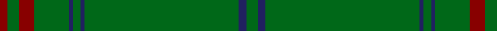

In pattern [GBGBGBGRGR](/patterns/gbgbgbgrgr/).

This was sourced from tartans-authority.  It is a [10 stripes tartan](/stripes/stripes10/).

Original link http://www.tartansauthority.com/tartan-ferret/display/2237/

## Attestations

This cloth appears in 3 source records; the oldest owns this page.

- Oct. 1995? — Braveheart Htg (Fashion) (tartans-authority, [record](http://www.tartansauthority.com/tartan-ferret/display/2237/))
- 01/01/2002 — Braveheart Warrior (Hunting) (register-of-tartans, [record](https://www.tartanregister.gov.uk/tartanDetails.aspx?ref=342))
- undated — Braveheart -Warrior (hunting) Universal Tartan Tartan Number: 2237. Earliest known date: pre 2002 After the success of the Braveheart film Michael King is said to have produced a Hunting and a Dress version of his originial 1993 Braveheart Warrior. May have been woven by D C Dalgleish. See products available Copyright © Blair Urquhart, Comrie, 2015 (house-of-tartan, [record](http://www.house-of-tartan.scotland.net/house/TartanViewjs.asp?colr=Def&tnam=2237))

## Thread count
DR/8 G12 DR16 G36 DB4 G8 DB4 G160 DB8 G/12

## Palette
Each colour and its ΔE from the base-6 reference it is a variant of.

| Colour | Shade | Base | ΔE (OKLab) |
|---|---|---|---|
| DB | <code style="background-color:#202060;">#202060</code> `#202060` | B <code style="background-color:#2A418A;">#2A418A</code> | 0.11 |
| DR | <code style="background-color:#880000;">#880000</code> `#880000` | R <code style="background-color:#CC0000;">#CC0000</code> | 0.15 |
| G | <code style="background-color:#006818;">#006818</code> `#006818` | G <code style="background-color:#006100;">#006100</code> | 0.02 |

## Nearest tartans

The nearest existing variants by ΔTartan distance.

1. [Coeur D'Alene Firefighters (Corporat](/setts/s13/g61g1g1b2g1g1g16g1b4g2b6g1b4~b1c1c50-g006818~x2/) — ΔT 1.55
1. [MacFie](/setts/s7/y1r12g162r1g2r12ya1~g11450d-raa0000-yaaaa00-yaaaaaaa~x2/) — ΔT 1.64
1. [Walters (Personal)](/setts/s10/b2g20g2g2ga1g2g2g20b2g2~b6c0070-g006818-ga289c18~x4/) — ΔT 1.74
1. [Walters (Personal)](/setts/s6/g2b2g20g2g2b1~b6c0070-g006818~x4/) — ΔT 1.84
1. [Stewart from Cairnie](/setts/s8/g83k6g3k9r2k5g2y2~g005020-k101010-rdc0000-ye8c000~x2/) — ΔT 1.88
1. [Lagrande](/setts/s5/g100y4g2ya3yb6~g285800-ya08858-yabc8c00-ybc4bc68~x2/) — ΔT 1.90
1. [Unidentified #12](/setts/s11/b2k1g36k1r2k1r2k1g36k1y2~b3c82af-g005020-k101010-rdc0000-ye8c000~x2/) — ΔT 2.13
1. [Unidentified Plaid 11](/setts/s10/g32r2g2r2g2r12g22w1g1w3~g008000-r806050-we0e0e0~x2/) — ΔT 2.17
1. [Crane of Cluny (Personal)](/setts/s8/g82k6g3k9r2k5g2y2~g006818-k101010-rc8002c-ye8c000~x2/) — ΔT 2.20
1. [Bannockbane, hunting](/setts/s8/g2r2g15r1w1g15r2g2~g008000-r806050-we0e0e0~x2/) — ΔT 2.35

## Neighbour map

Every grey dot is one of 15726 variants placed by the first two principal components of the ΔTartan feature space (44% of its variance). Red is this tartan; blue dots are its nearest — click one to open its page.

<svg viewBox="0 0 640 380" role="img" style="max-width:100%;height:auto;border:1px solid #e0e0e0;border-radius:4px;display:block" xmlns="http://www.w3.org/2000/svg"><image href="/nn/cloud.v1.png" width="640" height="380"/><a href="/setts/s13/g61g1g1b2g1g1g16g1b4g2b6g1b4~b1c1c50-g006818~x2/"><circle cx="626.0" cy="121.6" r="4" fill="#3465a4"><title>Coeur D'Alene Firefighters (Corporat</title></circle></a><a href="/setts/s7/y1r12g162r1g2r12ya1~g11450d-raa0000-yaaaa00-yaaaaaaa~x2/"><circle cx="626.0" cy="146.3" r="4" fill="#3465a4"><title>MacFie</title></circle></a><a href="/setts/s10/b2g20g2g2ga1g2g2g20b2g2~b6c0070-g006818-ga289c18~x4/"><circle cx="626.0" cy="215.7" r="4" fill="#3465a4"><title>Walters (Personal)</title></circle></a><a href="/setts/s6/g2b2g20g2g2b1~b6c0070-g006818~x4/"><circle cx="626.0" cy="225.1" r="4" fill="#3465a4"><title>Walters (Personal)</title></circle></a><a href="/setts/s8/g83k6g3k9r2k5g2y2~g005020-k101010-rdc0000-ye8c000~x2/"><circle cx="621.2" cy="144.5" r="4" fill="#3465a4"><title>Stewart from Cairnie</title></circle></a><a href="/setts/s5/g100y4g2ya3yb6~g285800-ya08858-yabc8c00-ybc4bc68~x2/"><circle cx="626.0" cy="169.7" r="4" fill="#3465a4"><title>Lagrande</title></circle></a><a href="/setts/s11/b2k1g36k1r2k1r2k1g36k1y2~b3c82af-g005020-k101010-rdc0000-ye8c000~x2/"><circle cx="624.7" cy="122.0" r="4" fill="#3465a4"><title>Unidentified #12</title></circle></a><a href="/setts/s10/g32r2g2r2g2r12g22w1g1w3~g008000-r806050-we0e0e0~x2/"><circle cx="566.7" cy="176.6" r="4" fill="#3465a4"><title>Unidentified Plaid 11</title></circle></a><a href="/setts/s8/g82k6g3k9r2k5g2y2~g006818-k101010-rc8002c-ye8c000~x2/"><circle cx="587.9" cy="132.1" r="4" fill="#3465a4"><title>Crane of Cluny (Personal)</title></circle></a><a href="/setts/s8/g2r2g15r1w1g15r2g2~g008000-r806050-we0e0e0~x2/"><circle cx="626.0" cy="242.8" r="4" fill="#3465a4"><title>Bannockbane, hunting</title></circle></a><circle cx="626.0" cy="167.2" r="5" fill="#c00000"/></svg>

ID: /setts/s10/g3b2g40b1g2b1g9r4g3r2~b202060-g006818-r880000~x4/
