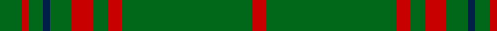

In pattern [GRGBGRGRGR](/stripes/grgbgrgrgr/).

This was sourced from tartans-authority.  It is a [10 stripe tartan](/stripes/stripes10/).

Original link http://www.tartansauthority.com/tartan-ferret/display/5750/

## Thread count
G/6 Ra2 G4 DBa2 G6 R6 G4 R4 G36 Ra/4

## Palette
Each colour and its ΔE from the base-6 reference it is a variant of.

| Colour | Shade | Base | ΔE (OKLab) |
|---|---|---|---|
| DB | <code style="background-color:#003C64;">#003C64</code> `#003C64` | B <code style="background-color:#2A418A;">#2A418A</code> | 0.08 |
| DBa | <code style="background-color:#002048;">#002048</code> `#002048` | B <code style="background-color:#2A418A;">#2A418A</code> | 0.16 |
| G | <code style="background-color:#006818;">#006818</code> `#006818` | G <code style="background-color:#006100;">#006100</code> | 0.02 |
| R | <code style="background-color:#C80000;">#C80000</code> `#C80000` | R <code style="background-color:#CC0000;">#CC0000</code> | 0.01 |
| Ra | <code style="background-color:#C80000;">#C80000</code> `#C80000` | R <code style="background-color:#CC0000;">#CC0000</code> | 0.01 |

## Nearest tartans

The nearest existing variants by ΔTartan distance.

1. [Connell (Dalgliesh) (Personal)](/setts/s10/r3g12r1g2r2g2r1g12r3k1~x4/) — ΔT 1.33
1. [Delta Lambda Phi (Corporate)](/setts/s12/lo5k1lo6g20w1g3w1g3w1g30k1lo2~x2/) — ΔT 1.39
1. [Ross Hunting Clan Tartan Tartan Number: 756. Earliest known date: 1850 The threadcount is based on a sample from the MacGregor-Hastie collection of the Scottish Tartans Society. This version originally showed the light green overcheck having six stripes. BU noted irregularities in the threadcount, and suggests that 4 light green stripes would produce a more plausible kilting fabric. BU created the original transcription. Earliest historical reference. Other sources give Smith Museum, Stirling as the source. See products available Copyright © Blair Urquhart, Comrie, 2015](/setts/s12/g6g3g3g4g4k5g3k5g28r2g4r2~x2/) — ΔT 1.40
1. [Welsh Assembly (Fashion)](/setts/s8/g5o9g4w5g30r2g4r2~x2/) — ΔT 1.45
1. [Highland Hospice (Fashion)](/setts/s10/g51dp3g5lo3g5dp5g5dp5g5lo3~x2/) — ΔT 1.45
1. [St. Christopher (Corporate)](/setts/s8/dg5r3dg3lo2dg1ly8dg24lo2~x2/) — ΔT 1.50
1. [Inman (2016)](/setts/s7/r2dg24k2dg12lo6k1r2~x2/) — ΔT 1.53
1. [Owen Welsh Name Tartan Tartan Number: 5750. Earliest known date: 2002 The tartan for this Welsh surname and its variations, Bowen, Ifan, is actually woven in Wales at the Cambrian Woollen Mill, weaving on the same site since 1830. This tartan differs from many traditional patterns in that the warp and weft differ, giving the finished worsted wool cloth more of a predominant stripe, vertically noticeable in the finished Kilt, or Cilt in Wales. See products available Copyright © Blair Urquhart, Comrie, 2015](/setts/s10/g3dt1g2r1g3db3g2db2g18dt2~x2/) — ΔT 1.53
1. [McCall, F W (Personal)](/setts/s9/dg6do2m1dg15m3do1dg15g6m1~x2/) — ΔT 1.56
1. [Welsh Assembly](/setts/s14/o9g4w5g30r2g4r2g4r2g30w5g4o9g5~x2/) — ΔT 1.59

## Neighbour map

Every grey dot is one of 14299 variants placed by the first two principal components of the ΔTartan feature space (44% of its variance). Red is this tartan; blue dots are its nearest — click one to open its page.

<svg viewBox="0 0 640 380" role="img" style="max-width:100%;height:auto;border:1px solid #e0e0e0;border-radius:4px;display:block" xmlns="http://www.w3.org/2000/svg"><image href="/nn/cloud.v1.png" width="640" height="380"/><a href="/setts/s10/r3g12r1g2r2g2r1g12r3k1~x4/"><circle cx="475.1" cy="206.4" r="4" fill="#3465a4"><title>Connell (Dalgliesh) (Personal)</title></circle></a><a href="/setts/s12/lo5k1lo6g20w1g3w1g3w1g30k1lo2~x2/"><circle cx="514.6" cy="131.6" r="4" fill="#3465a4"><title>Delta Lambda Phi (Corporate)</title></circle></a><a href="/setts/s12/g6g3g3g4g4k5g3k5g28r2g4r2~x2/"><circle cx="435.9" cy="179.8" r="4" fill="#3465a4"><title>Ross Hunting Clan Tartan Tartan Number: 756. Earliest known date: 1850 The threadcount is based on a sample from the MacGregor-Hastie collection of the Scottish Tartans Society. This version originally showed the light green overcheck having six stripes. BU noted irregularities in the threadcount, and suggests that 4 light green stripes would produce a more plausible kilting fabric. BU created the original transcription. Earliest historical reference. Other sources give Smith Museum, Stirling as the source. See products available Copyright © Blair Urquhart, Comrie, 2015</title></circle></a><a href="/setts/s8/g5o9g4w5g30r2g4r2~x2/"><circle cx="434.0" cy="181.9" r="4" fill="#3465a4"><title>Welsh Assembly (Fashion)</title></circle></a><a href="/setts/s10/g51dp3g5lo3g5dp5g5dp5g5lo3~x2/"><circle cx="559.5" cy="179.0" r="4" fill="#3465a4"><title>Highland Hospice (Fashion)</title></circle></a><a href="/setts/s8/dg5r3dg3lo2dg1ly8dg24lo2~x2/"><circle cx="442.4" cy="158.4" r="4" fill="#3465a4"><title>St. Christopher (Corporate)</title></circle></a><a href="/setts/s7/r2dg24k2dg12lo6k1r2~x2/"><circle cx="472.7" cy="171.7" r="4" fill="#3465a4"><title>Inman (2016)</title></circle></a><a href="/setts/s10/g3dt1g2r1g3db3g2db2g18dt2~x2/"><circle cx="536.7" cy="193.3" r="4" fill="#3465a4"><title>Owen Welsh Name Tartan Tartan Number: 5750. Earliest known date: 2002 The tartan for this Welsh surname and its variations, Bowen, Ifan, is actually woven in Wales at the Cambrian Woollen Mill, weaving on the same site since 1830. This tartan differs from many traditional patterns in that the warp and weft differ, giving the finished worsted wool cloth more of a predominant stripe, vertically noticeable in the finished Kilt, or Cilt in Wales. See products available Copyright © Blair Urquhart, Comrie, 2015</title></circle></a><a href="/setts/s9/dg6do2m1dg15m3do1dg15g6m1~x2/"><circle cx="453.2" cy="205.8" r="4" fill="#3465a4"><title>McCall, F W (Personal)</title></circle></a><a href="/setts/s14/o9g4w5g30r2g4r2g4r2g30w5g4o9g5~x2/"><circle cx="420.6" cy="160.7" r="4" fill="#3465a4"><title>Welsh Assembly</title></circle></a><circle cx="514.3" cy="170.0" r="5" fill="#c00000"/></svg>

ID: /setts/s10/g3r1g2db1g3r3g2r2g18r2~x2/
