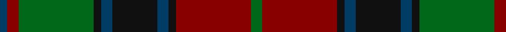

In pattern [BRGKBKBKRG](/patterns/brgkbkbkrg/).

This was sourced from tartans-authority.  It is a [10 stripes tartan](/stripes/stripes10/).

Original link http://www.tartansauthority.com/tartan-ferret/display/2397/

## Thread count
DB/4 DR6 G40 K4 DB6 K24 DB6 K4 DR40 G/6

## Palette
Each colour and its ΔE from the base-6 reference it is a variant of.

| Colour | Shade | Base | ΔE (OKLab) |
|---|---|---|---|
| DB | <code style="background-color:#003C64;">#003C64</code> `#003C64` | B <code style="background-color:#2A418A;">#2A418A</code> | 0.08 |
| DR | <code style="background-color:#880000;">#880000</code> `#880000` | R <code style="background-color:#CC0000;">#CC0000</code> | 0.15 |
| G | <code style="background-color:#006818;">#006818</code> `#006818` | G <code style="background-color:#006100;">#006100</code> | 0.02 |
| K | <code style="background-color:#101010;">#101010</code> `#101010` | K <code style="background-color:#000000;">#000000</code> | 0.17 |

## Nearest tartans

The nearest existing variants by ΔTartan distance.

1. [Bonnie Brae (School)](/setts/s11/r6b3ra3r24b20g24ra3g3ra3g3ra6~b000060-g004800-r70000c-rab07430/) — ΔT 0.88
1. [Bonnie Brae School](/setts/s11/r6b3ra3r24b20g24ra3g3ra3g3ra6~b000060-g004800-r880000-rab07430/) — ΔT 0.95
1. [Fitzsimmons](/setts/s10/g3k2ga18k4g15k4r6k4g2y3~g886c34-ga003820-k101010-r8c5818-ybcac6c~x2/) — ΔT 1.16
1. [Matthew Gloag Corporate Tartan Tartan Number: 2397. Earliest known date: 1996 Designed by Gillian Kirkwood of House of Edgar in 1996 for Matthew Gloag & Son Ltd who were established in 1800 as a whisky blenders and makers of the Famous Grouse Whisky. The company is based in Perth, Scotland and now (2002) has a major new visitor attraction at Crieff, 17 miles west of Perth. See products available Copyright © Blair Urquhart, Comrie, 2015](/setts/s18/r3g20k2b3k12b3k2r20g3r20k2b3k12b3k2g20r3b2~b003c64-g006818-k101010-r880000~x2/) — ΔT 1.21
1. [Antrim, County](/setts/s10/g5b2g18y2b5y2r5b17g2y4~b14283c-g406054-rc04c08-ybc8c00~x2/) — ΔT 1.22
1. [MacDonald #5](/setts/s12/b12r2b2r5b26r2k29g27r5g2r2g12~b2c4084-g005020-k101010-rdc0000~x2/) — ΔT 1.25
1. [McInery (Personal)](/setts/s8/r8g2r12k6r3b3g24k2~b1c0070-g006818-k101010-r880000~x2/) — ΔT 1.29
1. [Markson (Personal)](/setts/s11/r16g1ga2g1r4g5b1g5ga14g1b2~b2888c4-g003820-ga007470-r780028~x2/) — ΔT 1.34
1. [MacDonald #3](/setts/s12/b16r2b2r5b29r2k31g29r5g2r2g16~b2c4084-g005020-k101010-rdc0000~x2/) — ΔT 1.35
1. [Cavan, County](/setts/s10/g3k2ga26k4gb9g3gb9k4r9k3~g8c7038-ga006818-gb604000-k101010-rc80000~x2/) — ΔT 1.35

## Neighbour map

Every grey dot is one of 15726 variants placed by the first two principal components of the ΔTartan feature space (44% of its variance). Red is this tartan; blue dots are its nearest — click one to open its page.

<svg viewBox="0 0 640 380" role="img" style="max-width:100%;height:auto;border:1px solid #e0e0e0;border-radius:4px;display:block" xmlns="http://www.w3.org/2000/svg"><image href="/nn/cloud.v1.png" width="640" height="380"/><a href="/setts/s11/r6b3ra3r24b20g24ra3g3ra3g3ra6~b000060-g004800-r70000c-rab07430/"><circle cx="174.0" cy="188.8" r="4" fill="#3465a4"><title>Bonnie Brae (School)</title></circle></a><a href="/setts/s11/r6b3ra3r24b20g24ra3g3ra3g3ra6~b000060-g004800-r880000-rab07430/"><circle cx="170.3" cy="185.6" r="4" fill="#3465a4"><title>Bonnie Brae School</title></circle></a><a href="/setts/s10/g3k2ga18k4g15k4r6k4g2y3~g886c34-ga003820-k101010-r8c5818-ybcac6c~x2/"><circle cx="161.0" cy="180.7" r="4" fill="#3465a4"><title>Fitzsimmons</title></circle></a><a href="/setts/s18/r3g20k2b3k12b3k2r20g3r20k2b3k12b3k2g20r3b2~b003c64-g006818-k101010-r880000~x2/"><circle cx="206.2" cy="166.0" r="4" fill="#3465a4"><title>Matthew Gloag Corporate Tartan Tartan Number: 2397. Earliest known date: 1996 Designed by Gillian Kirkwood of House of Edgar in 1996 for Matthew Gloag &amp; Son Ltd who were established in 1800 as a whisky blenders and makers of the Famous Grouse Whisky. The company is based in Perth, Scotland and now (2002) has a major new visitor attraction at Crieff, 17 miles west of Perth. See products available Copyright © Blair Urquhart, Comrie, 2015</title></circle></a><a href="/setts/s10/g5b2g18y2b5y2r5b17g2y4~b14283c-g406054-rc04c08-ybc8c00~x2/"><circle cx="246.9" cy="200.4" r="4" fill="#3465a4"><title>Antrim, County</title></circle></a><a href="/setts/s12/b12r2b2r5b26r2k29g27r5g2r2g12~b2c4084-g005020-k101010-rdc0000~x2/"><circle cx="210.2" cy="168.9" r="4" fill="#3465a4"><title>MacDonald #5</title></circle></a><a href="/setts/s8/r8g2r12k6r3b3g24k2~b1c0070-g006818-k101010-r880000~x2/"><circle cx="279.7" cy="197.6" r="4" fill="#3465a4"><title>McInery (Personal)</title></circle></a><a href="/setts/s11/r16g1ga2g1r4g5b1g5ga14g1b2~b2888c4-g003820-ga007470-r780028~x2/"><circle cx="275.2" cy="169.0" r="4" fill="#3465a4"><title>Markson (Personal)</title></circle></a><a href="/setts/s12/b16r2b2r5b29r2k31g29r5g2r2g16~b2c4084-g005020-k101010-rdc0000~x2/"><circle cx="220.5" cy="169.7" r="4" fill="#3465a4"><title>MacDonald #3</title></circle></a><a href="/setts/s10/g3k2ga26k4gb9g3gb9k4r9k3~g8c7038-ga006818-gb604000-k101010-rc80000~x2/"><circle cx="204.6" cy="168.6" r="4" fill="#3465a4"><title>Cavan, County</title></circle></a><circle cx="215.7" cy="188.7" r="5" fill="#c00000"/></svg>

ID: /setts/s10/g3r20k2b3k12b3k2g20r3b2~b003c64-g006818-k101010-r880000~x2/
