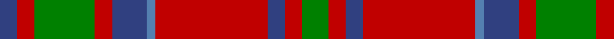

In pattern [BRGRBBRBRG](/patterns/brgrbbrbrg/).

This was sourced from weddslist.  It is a [10 stripes tartan](/stripes/stripes10/).

Original link http://www.weddslist.com/cgi-bin/tartans/pg.pl?source=sts

## Thread count
B/4 R4 G14 R4 B8 Ba2 R26 B4 R4 G/6

## Palette
Each colour and its ΔE from the base-6 reference it is a variant of.

| Colour | Shade | Base | ΔE (OKLab) |
|---|---|---|---|
| B | <code style="background-color:#304080;">#304080</code> `#304080` | B <code style="background-color:#2A418A;">#2A418A</code> | 0.02 |
| Ba | <code style="background-color:#5480B0;">#5480B0</code> `#5480B0` | B <code style="background-color:#2A418A;">#2A418A</code> | 0.19 |
| G | <code style="background-color:#008000;">#008000</code> `#008000` | G <code style="background-color:#006100;">#006100</code> | 0.10 |
| R | <code style="background-color:#C00000;">#C00000</code> `#C00000` | R <code style="background-color:#CC0000;">#CC0000</code> | 0.03 |

## Nearest tartans

The nearest existing variants by ΔTartan distance.

1. [MacKillop Clan Tartan Tartan Number: 512. Earliest known date: pre 2003 The MacKillops are a Sept of MacDonald of Keppoch, whose tartan this sett closely resembles. See products available Copyright © Blair Urquhart, Comrie, 2015](/setts/s10/g3r2b2r13ba1b4r2g7r2b2x2~b2c2c80-ba5c8ca8-g006818-rc80000/) — ΔT 0.40
1. [Glenfinnan (Clan?)](/setts/s10/b28r26w2b5w2r26y28r5w2r5x2~b506880-r880000-wfcfcfc-y78a064/) — ΔT 0.48
1. [Glenaladale, Plaid](/setts/s10/b28r26w2b5w2r26g28r5w2r5x2~b304080-g008000-rc00000-we0e0e0/) — ΔT 0.56
1. [MacKillop (Clan)](/setts/s10/g3r2b2r14ba1b4r2g12r2b2x8~b2c2c80-ba2474e8-g006818-rc80000/) — ΔT 0.56
1. [Harkness](/setts/s10/b10r2w2r16g6r1g2r1g3r6x2~b304080-g008000-rc00000-we0e0e0/) — ΔT 0.62
1. [Harkness Dress (Name)](/setts/s10/b10r2w2r16g6r1g2r1g3r6x4~b1474b4-g006818-rc80000-wfcfcfc/) — ΔT 0.74
1. [Leitrim](/setts/s10/g3b18g4b3g4r13g3g18b2y3x2~b401000-g808080-rc00000-yff8500/) — ΔT 0.79
1. [Annan](/setts/s10/r15g1r2ra2r2g1r3k8g10r3x4~g808080-k101010-rbe7832-rafa4b00/) — ΔT 0.81
1. [Convention of the Baronage (Corp)](/setts/s9/g3r9b1g9r1g1r9ba9r1x4~b2888c4-ba2c2c80-g006818-rc80000/) — ΔT 0.84
1. [Wilson's No.213](/setts/s12/r3g14r3y1r3b8r3y1r3g14r3y1x4~b440044-g285800-rc80000-yd8b000/) — ΔT 0.85

## Neighbour map

Every grey dot is one of 15726 variants placed by the first two principal components of the ΔTartan feature space (44% of its variance). Red is this tartan; blue dots are its nearest — click one to open its page.

<svg viewBox="0 0 640 380" role="img" style="max-width:100%;height:auto;border:1px solid #e0e0e0;border-radius:4px;display:block" xmlns="http://www.w3.org/2000/svg"><image href="/nn/cloud.v1.png" width="640" height="380"/><a href="/setts/s10/g3r2b2r13ba1b4r2g7r2b2x2~b2c2c80-ba5c8ca8-g006818-rc80000/"><circle cx="289.5" cy="170.3" r="4" fill="#3465a4"><title>MacKillop Clan Tartan Tartan Number: 512. Earliest known date: pre 2003 The MacKillops are a Sept of MacDonald of Keppoch, whose tartan this sett closely resembles. See products available Copyright © Blair Urquhart, Comrie, 2015</title></circle></a><a href="/setts/s10/b28r26w2b5w2r26y28r5w2r5x2~b506880-r880000-wfcfcfc-y78a064/"><circle cx="272.8" cy="167.2" r="4" fill="#3465a4"><title>Glenfinnan (Clan?)</title></circle></a><a href="/setts/s10/b28r26w2b5w2r26g28r5w2r5x2~b304080-g008000-rc00000-we0e0e0/"><circle cx="266.9" cy="163.4" r="4" fill="#3465a4"><title>Glenaladale, Plaid</title></circle></a><a href="/setts/s10/g3r2b2r14ba1b4r2g12r2b2x8~b2c2c80-ba2474e8-g006818-rc80000/"><circle cx="277.4" cy="162.2" r="4" fill="#3465a4"><title>MacKillop (Clan)</title></circle></a><a href="/setts/s10/b10r2w2r16g6r1g2r1g3r6x2~b304080-g008000-rc00000-we0e0e0/"><circle cx="306.1" cy="157.0" r="4" fill="#3465a4"><title>Harkness</title></circle></a><a href="/setts/s10/b10r2w2r16g6r1g2r1g3r6x4~b1474b4-g006818-rc80000-wfcfcfc/"><circle cx="301.5" cy="154.8" r="4" fill="#3465a4"><title>Harkness Dress (Name)</title></circle></a><a href="/setts/s10/g3b18g4b3g4r13g3g18b2y3x2~b401000-g808080-rc00000-yff8500/"><circle cx="246.8" cy="185.1" r="4" fill="#3465a4"><title>Leitrim</title></circle></a><a href="/setts/s10/r15g1r2ra2r2g1r3k8g10r3x4~g808080-k101010-rbe7832-rafa4b00/"><circle cx="308.1" cy="162.1" r="4" fill="#3465a4"><title>Annan</title></circle></a><a href="/setts/s9/g3r9b1g9r1g1r9ba9r1x4~b2888c4-ba2c2c80-g006818-rc80000/"><circle cx="250.9" cy="197.0" r="4" fill="#3465a4"><title>Convention of the Baronage (Corp)</title></circle></a><a href="/setts/s12/r3g14r3y1r3b8r3y1r3g14r3y1x4~b440044-g285800-rc80000-yd8b000/"><circle cx="285.4" cy="161.5" r="4" fill="#3465a4"><title>Wilson's No.213</title></circle></a><circle cx="291.5" cy="171.9" r="5" fill="#c00000"/></svg>

ID: /setts/s10/g3r2b2r13ba1b4r2g7r2b2x2~b304080-ba5480b0-g008000-rc00000/
