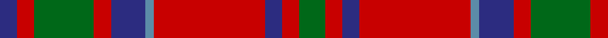

In pattern [BRGRBBRBRG](/patterns/brgrbbrbrg/).

This was sourced from house-of-tartan.  It is a [10 stripes tartan](/stripes/stripes10/).

Original link http://www.house-of-tartan.scotland.net/house/TartanViewjs.asp?colr=Def&tnam=512

## Thread count
DB/4 R4 G14 R4 DB8 B2 R26 DB4 R4 G/6

## Palette
Each colour and its ΔE from the base-6 reference it is a variant of.

| Colour | Shade | Base | ΔE (OKLab) |
|---|---|---|---|
| B | <code style="background-color:#5C8CA8;">#5C8CA8</code> `#5C8CA8` | B <code style="background-color:#2A418A;">#2A418A</code> | 0.23 |
| DB | <code style="background-color:#2C2C80;">#2C2C80</code> `#2C2C80` | B <code style="background-color:#2A418A;">#2A418A</code> | 0.06 |
| G | <code style="background-color:#006818;">#006818</code> `#006818` | G <code style="background-color:#006100;">#006100</code> | 0.02 |
| R | <code style="background-color:#C80000;">#C80000</code> `#C80000` | R <code style="background-color:#CC0000;">#CC0000</code> | 0.01 |

## Nearest tartans

The nearest existing variants by ΔTartan distance.

1. [MacKillop](/setts/s10/g3r2b2r13ba1b4r2g7r2b2~b304080-ba5480b0-g008000-rc00000~x2/) — ΔT 0.40
1. [Glenaladale, Plaid](/setts/s10/b28r26w2b5w2r26g28r5w2r5~b304080-g008000-rc00000-we0e0e0~x2/) — ΔT 0.50
1. [Glenfinnan (Clan?)](/setts/s10/b28r26w2b5w2r26y28r5w2r5~b506880-r880000-wfcfcfc-y78a064~x2/) — ΔT 0.59
1. [Glenaladale](/setts/s10/b28r26w2b5w2r26g28r5w2r5~b2c2c80-g006818-rc80000-we0e0e0~x2/) — ΔT 0.59
1. [Harkness](/setts/s10/b10r2w2r16g6r1g2r1g3r6~b304080-g008000-rc00000-we0e0e0~x2/) — ΔT 0.60
1. [MacKillop (Clan)](/setts/s10/g3r2b2r14ba1b4r2g12r2b2~b2c2c80-ba2474e8-g006818-rc80000~x8/) — ΔT 0.60
1. [Harkness Family Tartan Tartan Number: 580. Earliest known date: 1982 Based on the Nithsdale District tartan. See products available Copyright © Blair Urquhart, Comrie, 2015](/setts/s10/b10r2w2r16g6r1g2r1g3r6~b2c2c80-g006818-rc80000-we0e0e0~x2/) — ΔT 0.62
1. [Fraser Gathering Trade Tartan Tartan Number: 2361. Earliest known date: 1997 Unknown until House of Edgar published their own Old and Rare. See products available Copyright © Blair Urquhart, Comrie, 2015](/setts/s9/r2b12r2g11r4b5g2r24w2~b202060-g006818-rc80000-we0e0e0~x2/) — ΔT 0.64
1. [Glenaladale Plaid](/setts/s10/b28r26w2b5w2r26g28r5w2r5~b2c4084-g005020-rdc0000-we0e0e0~x2/) — ΔT 0.66
1. [Fraser Gathering, Red (1997)](/setts/s9/r2b12r2g11r4b5g2r24w2~b202060-g006818-rc80000-wfcfcfc~x2/) — ΔT 0.73

## Neighbour map

Every grey dot is one of 15726 variants placed by the first two principal components of the ΔTartan feature space (44% of its variance). Red is this tartan; blue dots are its nearest — click one to open its page.

<svg viewBox="0 0 640 380" role="img" style="max-width:100%;height:auto;border:1px solid #e0e0e0;border-radius:4px;display:block" xmlns="http://www.w3.org/2000/svg"><image href="/nn/cloud.v1.png" width="640" height="380"/><a href="/setts/s10/g3r2b2r13ba1b4r2g7r2b2~b304080-ba5480b0-g008000-rc00000~x2/"><circle cx="291.5" cy="171.9" r="4" fill="#3465a4"><title>MacKillop</title></circle></a><a href="/setts/s10/b28r26w2b5w2r26g28r5w2r5~b304080-g008000-rc00000-we0e0e0~x2/"><circle cx="266.9" cy="163.4" r="4" fill="#3465a4"><title>Glenaladale, Plaid</title></circle></a><a href="/setts/s10/b28r26w2b5w2r26y28r5w2r5~b506880-r880000-wfcfcfc-y78a064~x2/"><circle cx="272.8" cy="167.2" r="4" fill="#3465a4"><title>Glenfinnan (Clan?)</title></circle></a><a href="/setts/s10/b28r26w2b5w2r26g28r5w2r5~b2c2c80-g006818-rc80000-we0e0e0~x2/"><circle cx="263.8" cy="161.5" r="4" fill="#3465a4"><title>Glenaladale</title></circle></a><a href="/setts/s10/b10r2w2r16g6r1g2r1g3r6~b304080-g008000-rc00000-we0e0e0~x2/"><circle cx="306.1" cy="157.0" r="4" fill="#3465a4"><title>Harkness</title></circle></a><a href="/setts/s10/g3r2b2r14ba1b4r2g12r2b2~b2c2c80-ba2474e8-g006818-rc80000~x8/"><circle cx="277.4" cy="162.2" r="4" fill="#3465a4"><title>MacKillop (Clan)</title></circle></a><a href="/setts/s10/b10r2w2r16g6r1g2r1g3r6~b2c2c80-g006818-rc80000-we0e0e0~x2/"><circle cx="303.6" cy="155.2" r="4" fill="#3465a4"><title>Harkness Family Tartan Tartan Number: 580. Earliest known date: 1982 Based on the Nithsdale District tartan. See products available Copyright © Blair Urquhart, Comrie, 2015</title></circle></a><a href="/setts/s9/r2b12r2g11r4b5g2r24w2~b202060-g006818-rc80000-we0e0e0~x2/"><circle cx="280.8" cy="166.2" r="4" fill="#3465a4"><title>Fraser Gathering Trade Tartan Tartan Number: 2361. Earliest known date: 1997 Unknown until House of Edgar published their own Old and Rare. See products available Copyright © Blair Urquhart, Comrie, 2015</title></circle></a><a href="/setts/s10/b28r26w2b5w2r26g28r5w2r5~b2c4084-g005020-rdc0000-we0e0e0~x2/"><circle cx="263.9" cy="159.7" r="4" fill="#3465a4"><title>Glenaladale Plaid</title></circle></a><a href="/setts/s9/r2b12r2g11r4b5g2r24w2~b202060-g006818-rc80000-wfcfcfc~x2/"><circle cx="277.3" cy="164.7" r="4" fill="#3465a4"><title>Fraser Gathering, Red (1997)</title></circle></a><circle cx="289.5" cy="170.3" r="5" fill="#c00000"/></svg>

ID: /setts/s10/g3r2b2r13ba1b4r2g7r2b2~b2c2c80-ba5c8ca8-g006818-rc80000~x2/
