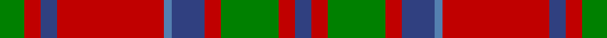

In pattern [BRGRBBRBRG](/stripes/brgrbbrbrg/).

This was sourced from weddslist.  It is a [10 stripe tartan](/stripes/stripes10/).

Original link http://www.weddslist.com/cgi-bin/tartans/pg.pl?source=sts

## Attestations

This cloth appears in 2 source records; the oldest owns this page.

- undated — MacKillop (weddslist, [record](http://www.weddslist.com/cgi-bin/tartans/pg.pl?source=sts))
- undated — MacKillop Clan Tartan Tartan Number: 512. Earliest known date: pre 2003 The MacKillops are a Sept of MacDonald of Keppoch, whose tartan this sett closely resembles. See products available Copyright © Blair Urquhart, Comrie, 2015 (house-of-tartan, [record](http://www.house-of-tartan.scotland.net/house/TartanViewjs.asp?colr=Def&tnam=512))

## Thread count
G/6 R4 B4 R26 Ba2 B8 R4 G14 R4 B/4

## Palette
Each colour and the base-6 reference it is a variant of.

| Colour | Shade | Base |
|---|---|---|
| B | <code style="background-color:#304080;">#304080</code> `oklch(39.4% 0.109 270.2)` <small>#304080</small> | B <code style="background-color:#2A418A;">#2A418A</code> |
| Ba | <code style="background-color:#5480B0;">#5480B0</code> `oklch(58.8% 0.089 251.5)` <small>#5480B0</small> | B <code style="background-color:#2A418A;">#2A418A</code> |
| G | <code style="background-color:#008000;">#008000</code> `oklch(52.0% 0.177 142.5)` <small>#008000</small> | G <code style="background-color:#006100;">#006100</code> |
| R | <code style="background-color:#C00000;">#C00000</code> `oklch(50.7% 0.208 29.2)` <small>#C00000</small> | R <code style="background-color:#CC0000;">#CC0000</code> |

## Nearest tartans

The nearest existing variants by ΔTartan distance.

1. [Glenfinnan (Clan?)](/setts/s10/n28r26w2n5w2r26lg28r5w2r5~x2/) — ΔT 0.48
1. [MacKillop (Clan)](/setts/s10/g3r2db2r14b1db4r2g12r2db2~x8/) — ΔT 0.56
1. [Harkness](/setts/s10/db10r2w2r16g6r1g2r1g3r6~x2/) — ΔT 0.62
1. [Harkness Dress (Name)](/setts/s10/b10r2w2r16g6r1g2r1g3r6~x4/) — ΔT 0.73
1. [Leitrim](/setts/s10/y3dr18y4dr3y4r13y3y18dr2lo3~x2/) — ΔT 0.79
1. [Annan](/setts/s10/o15y1o2r2o2y1o3k8y10o3~x4/) — ΔT 0.81
1. [Convention of the Baronage (Corp)](/setts/s9/g3r9t1g9r1g1r9db9r1~x4/) — ΔT 0.84
1. [Wilson's No.213](/setts/s12/r3dg14r3ly1r3dp8r3ly1r3dg14r3ly1~x4/) — ΔT 0.85
1. [Glenaladale](/setts/s10/db28r26w2db5w2r26g28r5w2r5~x2/) — ΔT 0.87
1. [Chisholm, The](/setts/s8/r12db2w1db2r3g8r3db1~x2/) — ΔT 0.92

## Neighbour map

Every grey dot is one of 14299 variants placed by the first two principal components of the ΔTartan feature space (44% of its variance). Red is this tartan; blue dots are its nearest — click one to open its page.

<svg viewBox="0 0 640 380" role="img" style="max-width:100%;height:auto;border:1px solid #e0e0e0;border-radius:4px;display:block" xmlns="http://www.w3.org/2000/svg"><image href="/nn/cloud.v1.png" width="640" height="380"/><a href="/setts/s10/n28r26w2n5w2r26lg28r5w2r5~x2/"><circle cx="273.7" cy="167.7" r="4" fill="#3465a4"><title>Glenfinnan (Clan?)</title></circle></a><a href="/setts/s10/g3r2db2r14b1db4r2g12r2db2~x8/"><circle cx="278.5" cy="162.6" r="4" fill="#3465a4"><title>MacKillop (Clan)</title></circle></a><a href="/setts/s10/db10r2w2r16g6r1g2r1g3r6~x2/"><circle cx="306.5" cy="155.6" r="4" fill="#3465a4"><title>Harkness</title></circle></a><a href="/setts/s10/b10r2w2r16g6r1g2r1g3r6~x4/"><circle cx="302.0" cy="153.1" r="4" fill="#3465a4"><title>Harkness Dress (Name)</title></circle></a><a href="/setts/s10/y3dr18y4dr3y4r13y3y18dr2lo3~x2/"><circle cx="247.8" cy="185.5" r="4" fill="#3465a4"><title>Leitrim</title></circle></a><a href="/setts/s10/o15y1o2r2o2y1o3k8y10o3~x4/"><circle cx="308.7" cy="162.3" r="4" fill="#3465a4"><title>Annan</title></circle></a><a href="/setts/s9/g3r9t1g9r1g1r9db9r1~x4/"><circle cx="251.9" cy="197.2" r="4" fill="#3465a4"><title>Convention of the Baronage (Corp)</title></circle></a><a href="/setts/s12/r3dg14r3ly1r3dp8r3ly1r3dg14r3ly1~x4/"><circle cx="286.5" cy="162.4" r="4" fill="#3465a4"><title>Wilson's No.213</title></circle></a><a href="/setts/s10/db28r26w2db5w2r26g28r5w2r5~x2/"><circle cx="264.8" cy="160.1" r="4" fill="#3465a4"><title>Glenaladale</title></circle></a><a href="/setts/s8/r12db2w1db2r3g8r3db1~x2/"><circle cx="324.2" cy="178.1" r="4" fill="#3465a4"><title>Chisholm, The</title></circle></a><circle cx="292.2" cy="172.3" r="5" fill="#c00000"/></svg>

ID: /setts/s10/g3r2db2r13t1db4r2g7r2db2~x2/
