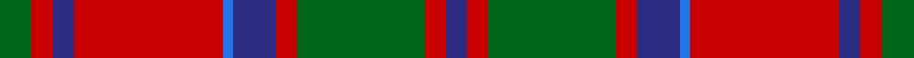

In pattern [BRGRBBRBRG](/stripes/brgrbbrbrg/).

This was sourced from tartans-authority.  It is a [10 stripe tartan](/stripes/stripes10/).

Original link http://www.tartansauthority.com/tartan-ferret/display/512/

## Attestations

This cloth appears in 2 source records; the oldest owns this page.

- pre 1952 — MacKillop (Clan) (tartans-authority, [record](http://www.tartansauthority.com/tartan-ferret/display/512/))
- 01/01/2002 — MacKillop (register-of-tartans, [record](https://www.tartanregister.gov.uk/tartanDetails.aspx?ref=2538))

## Register references

External register numbers recorded for this tartan.

- Scottish Register of Tartans: [2538](https://www.tartanregister.gov.uk/tartanDetails.aspx?ref=2538)
- Scottish Tartans Authority (ITI): 512
- Scottish Tartans World Register: 512

## Thread count
G/24 R16 DB16 R112 B8 DB32 R16 G96 R16 DB/16

## Palette
Each colour and the base-6 reference it is a variant of.

| Colour | Shade | Base |
|---|---|---|
| B | <code style="background-color:#2474E8;">#2474E8</code> `oklch(57.8% 0.192 258.7)` <small>#2474E8</small> | B <code style="background-color:#2A418A;">#2A418A</code> |
| DB | <code style="background-color:#2C2C80;">#2C2C80</code> `oklch(35.0% 0.138 276.6)` <small>#2C2C80</small> | B <code style="background-color:#2A418A;">#2A418A</code> |
| G | <code style="background-color:#006818;">#006818</code> `oklch(45.0% 0.142 145.0)` <small>#006818</small> | G <code style="background-color:#006100;">#006100</code> |
| R | <code style="background-color:#C80000;">#C80000</code> `oklch(52.3% 0.215 29.2)` <small>#C80000</small> | R <code style="background-color:#CC0000;">#CC0000</code> |

## Nearest tartans

The nearest existing variants by ΔTartan distance, with this tartan at the top so the swatches line up against it.

ΔTartan

Tartan

Sett

—

<a href="/ttd/edit/#slug=g3r2db2r14b1db4r2g12r2db2~x8">MacKillop (Clan)</a> <a class="nn-out" href="/setts/s10/g3r2db2r14b1db4r2g12r2db2~x8/" title="open its dictionary page">↗</a>

0.55

<a href="/ttd/edit/#slug=n28r26w2n5w2r26lg28r5w2r5~x2">Glenfinnan (Clan?)</a> <a class="nn-out" href="/setts/s10/n28r26w2n5w2r26lg28r5w2r5~x2/" title="open its dictionary page">↗</a>

0.56

<a href="/ttd/edit/#slug=g3r2db2r13t1db4r2g7r2db2~x2">MacKillop</a> <a class="nn-out" href="/setts/s10/g3r2db2r13t1db4r2g7r2db2~x2/" title="open its dictionary page">↗</a>

0.79

<a href="/ttd/edit/#slug=db28r26w2db5w2r26g28r5w2r5~x2">Glenaladale</a> <a class="nn-out" href="/setts/s10/db28r26w2db5w2r26g28r5w2r5~x2/" title="open its dictionary page">↗</a>

0.81

<a href="/ttd/edit/#slug=y3dr18y4dr3y4r13y3y18dr2lo3~x2">Leitrim</a> <a class="nn-out" href="/setts/s10/y3dr18y4dr3y4r13y3y18dr2lo3~x2/" title="open its dictionary page">↗</a>

0.83

<a href="/ttd/edit/#slug=r4t3r32db30r4dg32r3dg32r3dg3~x2">Unidentified Plaid #15</a> <a class="nn-out" href="/setts/s10/r4t3r32db30r4dg32r3dg32r3dg3~x2/" title="open its dictionary page">↗</a>

0.85

<a href="/ttd/edit/#slug=w1dg1r1dg14r1db6r11dg1r1w1~x4">Unidentified Specimen #2</a> <a class="nn-out" href="/setts/s10/w1dg1r1dg14r1db6r11dg1r1w1~x4/" title="open its dictionary page">↗</a>

0.86

<a href="/ttd/edit/#slug=r3dg14r3ly1r3dp8r3ly1r3dg14r3ly1~x4">Wilson's No.213</a> <a class="nn-out" href="/setts/s12/r3dg14r3ly1r3dp8r3ly1r3dg14r3ly1~x4/" title="open its dictionary page">↗</a>

0.87

<a href="/ttd/edit/#slug=db10r2w2r16g6r1g2r1g3r6~x2">Harkness</a> <a class="nn-out" href="/setts/s10/db10r2w2r16g6r1g2r1g3r6~x2/" title="open its dictionary page">↗</a>

0.87

<a href="/ttd/edit/#slug=dg12k1dg1k1dg1r5r10k1r2~x2">Lindsay #3</a> <a class="nn-out" href="/setts/s9/dg12k1dg1k1dg1r5r10k1r2~x2/" title="open its dictionary page">↗</a>

0.89

<a href="/ttd/edit/#slug=k6r3k3r24t4g10r2g4r2g24r6t2~x2">Leach (1999)</a> <a class="nn-out" href="/setts/s12/k6r3k3r24t4g10r2g4r2g24r6t2~x2/" title="open its dictionary page">↗</a>

## Neighbour map

Every grey dot is one of 14299 variants placed by the first two principal components of the ΔTartan feature space (44% of its variance). Red is this tartan; blue dots are its nearest — click one to open its page.

<svg viewBox="0 0 640 380" role="img" style="max-width:100%;height:auto;border:1px solid #e0e0e0;border-radius:4px;display:block" xmlns="http://www.w3.org/2000/svg"><image href="/nn/cloud.v1.png" width="640" height="380"/><a href="/setts/s10/n28r26w2n5w2r26lg28r5w2r5~x2/"><circle cx="273.7" cy="167.7" r="4" fill="#3465a4"><title>Glenfinnan (Clan?)</title></circle></a><a href="/setts/s10/g3r2db2r13t1db4r2g7r2db2~x2/"><circle cx="292.2" cy="172.3" r="4" fill="#3465a4"><title>MacKillop</title></circle></a><a href="/setts/s10/db28r26w2db5w2r26g28r5w2r5~x2/"><circle cx="264.8" cy="160.1" r="4" fill="#3465a4"><title>Glenaladale</title></circle></a><a href="/setts/s10/y3dr18y4dr3y4r13y3y18dr2lo3~x2/"><circle cx="247.8" cy="185.5" r="4" fill="#3465a4"><title>Leitrim</title></circle></a><a href="/setts/s10/r4t3r32db30r4dg32r3dg32r3dg3~x2/"><circle cx="266.1" cy="183.6" r="4" fill="#3465a4"><title>Unidentified Plaid #15</title></circle></a><a href="/setts/s10/w1dg1r1dg14r1db6r11dg1r1w1~x4/"><circle cx="260.0" cy="141.9" r="4" fill="#3465a4"><title>Unidentified Specimen #2</title></circle></a><a href="/setts/s12/r3dg14r3ly1r3dp8r3ly1r3dg14r3ly1~x4/"><circle cx="286.5" cy="162.4" r="4" fill="#3465a4"><title>Wilson's No.213</title></circle></a><a href="/setts/s10/db10r2w2r16g6r1g2r1g3r6~x2/"><circle cx="306.5" cy="155.6" r="4" fill="#3465a4"><title>Harkness</title></circle></a><a href="/setts/s9/dg12k1dg1k1dg1r5r10k1r2~x2/"><circle cx="259.2" cy="167.1" r="4" fill="#3465a4"><title>Lindsay #3</title></circle></a><a href="/setts/s12/k6r3k3r24t4g10r2g4r2g24r6t2~x2/"><circle cx="256.2" cy="158.7" r="4" fill="#3465a4"><title>Leach (1999)</title></circle></a><circle cx="278.5" cy="162.6" r="5" fill="#c00000"/></svg>

ID: /setts/s10/g3r2db2r14b1db4r2g12r2db2~x8/
