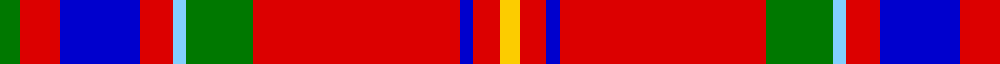

In pattern [GRBRWGRBRY](/patterns/grbrwgrbry/).

This was sourced from register-of-tartans.  It is a [10 stripes tartan](/stripes/stripes10/).

Original link https://www.tartanregister.gov.uk/tartanDetails.aspx?ref=11611

## Thread count
G/6 R12 B24 R10 LB4 G20 R62 B4 R8 Y/6

## Palette
Each colour and its ΔE from the base-6 reference it is a variant of.

| Colour | Shade | Base | ΔE (OKLab) |
|---|---|---|---|
| B | <code style="background-color:#0000CD;">#0000CD</code> `#0000CD` | B <code style="background-color:#2A418A;">#2A418A</code> | 0.14 |
| G | <code style="background-color:#007800;">#007800</code> `#007800` | G <code style="background-color:#006100;">#006100</code> | 0.07 |
| LB | <code style="background-color:#82CFFD;">#82CFFD</code> `#82CFFD` | W <code style="background-color:#F7F7F7;">#F7F7F7</code> | 0.18 |
| R | <code style="background-color:#DC0000;">#DC0000</code> `#DC0000` | R <code style="background-color:#CC0000;">#CC0000</code> | 0.03 |
| Y | <code style="background-color:#FCCC00;">#FCCC00</code> `#FCCC00` | Y <code style="background-color:#F2BF00;">#F2BF00</code> | 0.04 |

## Nearest tartans

The nearest existing variants by ΔTartan distance.

1. [Hart (Texas) (Personal)](/setts/s11/y4k3w2b7r7k4r5b4r30w2b3~b2c2c80-k101010-rc80000-wfcfcfc-ye8c000~x2/) — ΔT 0.70
1. [Loch Creran](/setts/s11/r5g9y2g9r5b9r28g3w2r4b2~b0000ff-g006400-rdc143c-w87cefa-yffe600~x2/) — ΔT 0.74
1. [Loch Lochy](/setts/s8/r6g14r6b11r31w2r4y3~b002699-g03522b-rd91828-wc0c0c0-ye8c000~x2/) — ΔT 0.88
1. [1745 Trading (Corporate)](/setts/s12/r4w2r3g6r2g2r2b16r2wa2r32w2~b202060-g285800-rc80000-wfcfcfc-wa98c8e8~x2/) — ΔT 1.00
1. [Bro-Zol](/setts/s10/b3w5r25b1g3b1r8k2w9k3~b2c2c80-g006818-k101010-r880000-we0e0e0~x2/) — ΔT 1.07
1. [Loch Creran (District)](/setts/s11/r6g8y2g8r6b8r29g3w2r5b3~b003c64-g003820-rc80000-w98c8e8-ye8c000~x2/) — ΔT 1.11
1. [Hoben (Personal)](/setts/s11/k3w1r20b4r4g10r4b4r20k1w3~b2c2c80-g006818-k101010-rc80000-wffffff~x2/) — ΔT 1.12
1. [Hoben (Personal)](/setts/s11/k3w1r20b4r4g10r4b4r20k1w3~b2c2c80-g006818-k101010-rc80000-wfcfcfc~x2/) — ΔT 1.13
1. [Hepburn (Clan)](/setts/s12/r21b4k5y2k2y2k2r7g4r2b3y2~b240094-g00841c-k101010-re43418-ye8c000~x4/) — ΔT 1.14
1. [Loch Lochy (District)](/setts/s8/r6g14r6b12r31w2r4y3~b2c2c80-g006818-rc80000-wc0c0c0-yfccc00~x2/) — ΔT 1.15

## Neighbour map

Every grey dot is one of 15726 variants placed by the first two principal components of the ΔTartan feature space (44% of its variance). Red is this tartan; blue dots are its nearest — click one to open its page.

<svg viewBox="0 0 640 380" role="img" style="max-width:100%;height:auto;border:1px solid #e0e0e0;border-radius:4px;display:block" xmlns="http://www.w3.org/2000/svg"><image href="/nn/cloud.v1.png" width="640" height="380"/><a href="/setts/s11/y4k3w2b7r7k4r5b4r30w2b3~b2c2c80-k101010-rc80000-wfcfcfc-ye8c000~x2/"><circle cx="314.5" cy="111.1" r="4" fill="#3465a4"><title>Hart (Texas) (Personal)</title></circle></a><a href="/setts/s11/r5g9y2g9r5b9r28g3w2r4b2~b0000ff-g006400-rdc143c-w87cefa-yffe600~x2/"><circle cx="268.3" cy="125.9" r="4" fill="#3465a4"><title>Loch Creran</title></circle></a><a href="/setts/s8/r6g14r6b11r31w2r4y3~b002699-g03522b-rd91828-wc0c0c0-ye8c000~x2/"><circle cx="332.7" cy="147.3" r="4" fill="#3465a4"><title>Loch Lochy</title></circle></a><a href="/setts/s12/r4w2r3g6r2g2r2b16r2wa2r32w2~b202060-g285800-rc80000-wfcfcfc-wa98c8e8~x2/"><circle cx="341.2" cy="98.7" r="4" fill="#3465a4"><title>1745 Trading (Corporate)</title></circle></a><a href="/setts/s10/b3w5r25b1g3b1r8k2w9k3~b2c2c80-g006818-k101010-r880000-we0e0e0~x2/"><circle cx="291.9" cy="99.1" r="4" fill="#3465a4"><title>Bro-Zol</title></circle></a><a href="/setts/s11/r6g8y2g8r6b8r29g3w2r5b3~b003c64-g003820-rc80000-w98c8e8-ye8c000~x2/"><circle cx="317.1" cy="137.8" r="4" fill="#3465a4"><title>Loch Creran (District)</title></circle></a><a href="/setts/s11/k3w1r20b4r4g10r4b4r20k1w3~b2c2c80-g006818-k101010-rc80000-wffffff~x2/"><circle cx="361.9" cy="120.4" r="4" fill="#3465a4"><title>Hoben (Personal)</title></circle></a><a href="/setts/s11/k3w1r20b4r4g10r4b4r20k1w3~b2c2c80-g006818-k101010-rc80000-wfcfcfc~x2/"><circle cx="362.6" cy="120.7" r="4" fill="#3465a4"><title>Hoben (Personal)</title></circle></a><a href="/setts/s12/r21b4k5y2k2y2k2r7g4r2b3y2~b240094-g00841c-k101010-re43418-ye8c000~x4/"><circle cx="244.4" cy="120.1" r="4" fill="#3465a4"><title>Hepburn (Clan)</title></circle></a><a href="/setts/s8/r6g14r6b12r31w2r4y3~b2c2c80-g006818-rc80000-wc0c0c0-yfccc00~x2/"><circle cx="335.2" cy="152.0" r="4" fill="#3465a4"><title>Loch Lochy (District)</title></circle></a><circle cx="307.3" cy="121.1" r="5" fill="#c00000"/></svg>

ID: /setts/s10/g3r6b12r5w2g10r31b2r4y3~b0000cd-g007800-rdc0000-w82cffd-yfccc00~x2/
