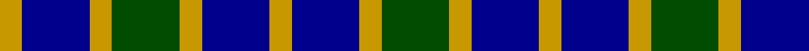

In pattern [GYBYBYGYBY](/patterns/gybybygyby/).

This was sourced from register-of-tartans.  It is a [10 stripes tartan](/stripes/stripes10/).

Original link https://www.tartanregister.gov.uk/tartanDetails.aspx?ref=4360

## Thread count
DY/4 DB12 DY4 G12 DY4 DB12 DY4 DB12 DY4 G/12

## Palette
Each colour and its ΔE from the base-6 reference it is a variant of.

| Colour | Shade | Base | ΔE (OKLab) |
|---|---|---|---|
| DB | <code style="background-color:#00008C;">#00008C</code> `#00008C` | B <code style="background-color:#2A418A;">#2A418A</code> | 0.13 |
| DY | <code style="background-color:#C89800;">#C89800</code> `#C89800` | Y <code style="background-color:#F2BF00;">#F2BF00</code> | 0.12 |
| G | <code style="background-color:#004C00;">#004C00</code> `#004C00` | G <code style="background-color:#006100;">#006100</code> | 0.07 |

## Nearest tartans

The nearest existing variants by ΔTartan distance.

1. [Keith Clan](/setts/s8/g9b4k4b3k4b4g9k2~b2474e8-g408060-k101010~x4/) — ΔT 1.13
1. [Wilson's No.166](/setts/s10/g12k14b11k3b3k3b11k14g12b3~b5c8ca8-g006818-k101010~x2/) — ΔT 1.26
1. [Gordon, Miniature](/setts/s10/b10k2b4k4g7y2g7k4b10k2~b304080-g008000-k000000-yf0c000/) — ΔT 1.35
1. [Cummins (Personal)](/setts/s11/k9b5w5k9b14k5w5k9w5k5b8~b3850c8-k101010-wfcfcfc~x2/) — ΔT 1.44
1. [Cummins Royal Blue, B (Personal)](/setts/s11/k9b5w5k9b14k5w5k9w5k5b8~b4161ec-k1c1714-wf9f5ef~x2/) — ΔT 1.53
1. [Clark](/setts/s11/b4w4b19k19w4k19w4b7w4b11w4~b2c4084-k101010-we0e0e0~x2/) — ΔT 1.54
1. [Clark](/setts/s11/b4ba10b4ba7b4k15b4k15ba14b4k4~b5480b0-ba304080-k000000~x2/) — ΔT 1.59
1. [Norwich No.063](/setts/s12/b4k3g4k1g4k3g4k1g4k3b4k1~b2c2c80-g006818-k000000~x2/) — ΔT 1.60
1. [City of Pointe-Claire (District)](/setts/s10/b4w1g1k2b4g2w1g1w1g1~b2c2c80-g604000-k101010-we0e0e0~x4/) — ΔT 1.63
1. [Clark Family Tartan Tartan Number: 1221. Earliest known date: 1819 This tartan is shown, with slight variations, in the works of Logan, the Smith brothers and the pattern books of Wilson's of Bannockburn. It is called Clark, Clerk, Clerke, Clergy and Priest even within the same publication, all of which date around 1850. It is possible that a sample on sale today might be very different. See products available Copyright © Blair Urquhart, Comrie, 2015](/setts/s11/k4w4b19k19w4k19w4b7w4b11w4~b2c2c80-k101010-we0e0e0~x2/) — ΔT 1.66

## Neighbour map

Every grey dot is one of 15726 variants placed by the first two principal components of the ΔTartan feature space (44% of its variance). Red is this tartan; blue dots are its nearest — click one to open its page.

<svg viewBox="0 0 640 380" role="img" style="max-width:100%;height:auto;border:1px solid #e0e0e0;border-radius:4px;display:block" xmlns="http://www.w3.org/2000/svg"><image href="/nn/cloud.v1.png" width="640" height="380"/><a href="/setts/s8/g9b4k4b3k4b4g9k2~b2474e8-g408060-k101010~x4/"><circle cx="187.2" cy="281.3" r="4" fill="#3465a4"><title>Keith Clan</title></circle></a><a href="/setts/s10/g12k14b11k3b3k3b11k14g12b3~b5c8ca8-g006818-k101010~x2/"><circle cx="160.7" cy="265.7" r="4" fill="#3465a4"><title>Wilson's No.166</title></circle></a><a href="/setts/s10/b10k2b4k4g7y2g7k4b10k2~b304080-g008000-k000000-yf0c000/"><circle cx="153.9" cy="239.8" r="4" fill="#3465a4"><title>Gordon, Miniature</title></circle></a><a href="/setts/s11/k9b5w5k9b14k5w5k9w5k5b8~b3850c8-k101010-wfcfcfc~x2/"><circle cx="121.2" cy="282.4" r="4" fill="#3465a4"><title>Cummins (Personal)</title></circle></a><a href="/setts/s11/k9b5w5k9b14k5w5k9w5k5b8~b4161ec-k1c1714-wf9f5ef~x2/"><circle cx="121.6" cy="280.7" r="4" fill="#3465a4"><title>Cummins Royal Blue, B (Personal)</title></circle></a><a href="/setts/s11/b4w4b19k19w4k19w4b7w4b11w4~b2c4084-k101010-we0e0e0~x2/"><circle cx="167.3" cy="228.9" r="4" fill="#3465a4"><title>Clark</title></circle></a><a href="/setts/s11/b4ba10b4ba7b4k15b4k15ba14b4k4~b5480b0-ba304080-k000000~x2/"><circle cx="149.6" cy="260.4" r="4" fill="#3465a4"><title>Clark</title></circle></a><a href="/setts/s12/b4k3g4k1g4k3g4k1g4k3b4k1~b2c2c80-g006818-k000000~x2/"><circle cx="148.9" cy="284.3" r="4" fill="#3465a4"><title>Norwich No.063</title></circle></a><a href="/setts/s10/b4w1g1k2b4g2w1g1w1g1~b2c2c80-g604000-k101010-we0e0e0~x4/"><circle cx="145.7" cy="230.0" r="4" fill="#3465a4"><title>City of Pointe-Claire (District)</title></circle></a><a href="/setts/s11/k4w4b19k19w4k19w4b7w4b11w4~b2c2c80-k101010-we0e0e0~x2/"><circle cx="171.2" cy="229.3" r="4" fill="#3465a4"><title>Clark Family Tartan Tartan Number: 1221. Earliest known date: 1819 This tartan is shown, with slight variations, in the works of Logan, the Smith brothers and the pattern books of Wilson's of Bannockburn. It is called Clark, Clerk, Clerke, Clergy and Priest even within the same publication, all of which date around 1850. It is possible that a sample on sale today might be very different. See products available Copyright © Blair Urquhart, Comrie, 2015</title></circle></a><circle cx="146.2" cy="280.2" r="5" fill="#c00000"/></svg>

ID: /setts/s10/g3y1b3y1b3y1g3y1b3y1~b00008c-g004c00-yc89800~x4/
