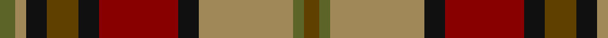

In pattern [GGYKRKGKYG](/patterns/ggykrkgkyg/).

This was sourced from tartans-authority.  It is a [10 stripes tartan](/stripes/stripes10/).

Original link http://www.tartansauthority.com/tartan-ferret/display/6808/

## Attestations

This cloth appears in 2 source records; the oldest owns this page.

- pre 2005 — Fitzsimmons Red (Name) (tartans-authority, [record](http://www.tartansauthority.com/tartan-ferret/display/6808/))
- 01/08/2007 — Fitzsimmons Red (register-of-tartans, [record](https://www.tartanregister.gov.uk/tartanDetails.aspx?ref=1202))

## Thread count
G/6 LT4 K8 T12 K8 DR30 K8 LT36 G4 T/6

## Palette
Each colour and its ΔE from the base-6 reference it is a variant of.

| Colour | Shade | Base | ΔE (OKLab) |
|---|---|---|---|
| DR | <code style="background-color:#880000;">#880000</code> `#880000` | R <code style="background-color:#CC0000;">#CC0000</code> | 0.15 |
| G | <code style="background-color:#5C6428;">#5C6428</code> `#5C6428` | G <code style="background-color:#006100;">#006100</code> | 0.10 |
| K | <code style="background-color:#101010;">#101010</code> `#101010` | K <code style="background-color:#000000;">#000000</code> | 0.17 |
| LT | <code style="background-color:#A08858;">#A08858</code> `#A08858` | Y <code style="background-color:#F2BF00;">#F2BF00</code> | 0.21 |
| T | <code style="background-color:#604000;">#604000</code> `#604000` | G <code style="background-color:#006100;">#006100</code> | 0.14 |

## Nearest tartans

The nearest existing variants by ΔTartan distance.

1. [Dryburgh](/setts/s11/r2ra2r2ra16b10k3b2k2b2k10y2x2~b6c5454-k101010-r907c80-rabc4c10-ydcc010/) — ΔT 0.78
1. [Brittany National Walking](/setts/s9/b4g27y8k4y8k4y8r11ya3x2~b2888c4-g604000-k101010-rb03000-ya08858-yae8c000/) — ΔT 1.08
1. [Roscommon, County](/setts/s10/r5y3r19b6y5b6g12ba5g12ba3x2~b441800-ba303070-g003820-rb03000-yd8b000/) — ΔT 1.10
1. [Dorcas](/setts/s12/g4y2g2y3g20k6b4k2b2k2b16r3x2~b4c3428-g8c7038-k101010-re86000-yb8b8b8/) — ΔT 1.13
1. [Sikh (Corporate)](/setts/s8/r30k4r3k4r3g20b20y4x2~b14283c-g006818-k101010-rb84c00-ye8c000/) — ΔT 1.15
1. [Sikh](/setts/s8/r56k12r7k12r7g50b50y10~b2c2c80-g006818-k101010-rb84c00-ye8c000/) — ΔT 1.17
1. [MacPherson #9](/setts/s15/r13y4r13g28y3ga26y10ga2gb2ga2y10r14y4ga4r4x2~g005020-ga503c14-gb2a2303-r960028-yb0b0b0/) — ΔT 1.17
1. [Fitzsimmons](/setts/s10/g3k2ga18k4g15k4r6k4g2y3x2~g886c34-ga003820-k101010-r8c5818-ybcac6c/) — ΔT 1.18
1. [Bruce of Kinnaird (Vivienne Westwood Design)](/setts/s10/g22ga22b2w6b2y2b16gb5g8w2x2~b501400-g604000-ga8c7038-gb0098a0-wc0c0c0-yd09800/) — ΔT 1.18
1. [Callum, Brown (Fashion)](/setts/s12/r3g16b2g2b2g3b6ra20y3ra2y2ra3x2~b000060-g604000-r880000-rab07430-yacacac/) — ΔT 1.18

## Neighbour map

Every grey dot is one of 15726 variants placed by the first two principal components of the ΔTartan feature space (44% of its variance). Red is this tartan; blue dots are its nearest — click one to open its page.

<svg viewBox="0 0 640 380" role="img" style="max-width:100%;height:auto;border:1px solid #e0e0e0;border-radius:4px;display:block" xmlns="http://www.w3.org/2000/svg"><image href="/nn/cloud.v1.png" width="640" height="380"/><a href="/setts/s11/r2ra2r2ra16b10k3b2k2b2k10y2x2~b6c5454-k101010-r907c80-rabc4c10-ydcc010/"><circle cx="162.9" cy="160.0" r="4" fill="#3465a4"><title>Dryburgh</title></circle></a><a href="/setts/s9/b4g27y8k4y8k4y8r11ya3x2~b2888c4-g604000-k101010-rb03000-ya08858-yae8c000/"><circle cx="151.1" cy="164.8" r="4" fill="#3465a4"><title>Brittany National Walking</title></circle></a><a href="/setts/s10/r5y3r19b6y5b6g12ba5g12ba3x2~b441800-ba303070-g003820-rb03000-yd8b000/"><circle cx="115.1" cy="204.3" r="4" fill="#3465a4"><title>Roscommon, County</title></circle></a><a href="/setts/s12/g4y2g2y3g20k6b4k2b2k2b16r3x2~b4c3428-g8c7038-k101010-re86000-yb8b8b8/"><circle cx="206.8" cy="150.0" r="4" fill="#3465a4"><title>Dorcas</title></circle></a><a href="/setts/s8/r30k4r3k4r3g20b20y4x2~b14283c-g006818-k101010-rb84c00-ye8c000/"><circle cx="193.7" cy="173.2" r="4" fill="#3465a4"><title>Sikh (Corporate)</title></circle></a><a href="/setts/s8/r56k12r7k12r7g50b50y10~b2c2c80-g006818-k101010-rb84c00-ye8c000/"><circle cx="140.2" cy="186.1" r="4" fill="#3465a4"><title>Sikh</title></circle></a><a href="/setts/s15/r13y4r13g28y3ga26y10ga2gb2ga2y10r14y4ga4r4x2~g005020-ga503c14-gb2a2303-r960028-yb0b0b0/"><circle cx="161.0" cy="136.0" r="4" fill="#3465a4"><title>MacPherson #9</title></circle></a><a href="/setts/s10/g3k2ga18k4g15k4r6k4g2y3x2~g886c34-ga003820-k101010-r8c5818-ybcac6c/"><circle cx="161.0" cy="180.7" r="4" fill="#3465a4"><title>Fitzsimmons</title></circle></a><a href="/setts/s10/g22ga22b2w6b2y2b16gb5g8w2x2~b501400-g604000-ga8c7038-gb0098a0-wc0c0c0-yd09800/"><circle cx="168.8" cy="153.0" r="4" fill="#3465a4"><title>Bruce of Kinnaird (Vivienne Westwood Design)</title></circle></a><a href="/setts/s12/r3g16b2g2b2g3b6ra20y3ra2y2ra3x2~b000060-g604000-r880000-rab07430-yacacac/"><circle cx="202.8" cy="142.7" r="4" fill="#3465a4"><title>Callum, Brown (Fashion)</title></circle></a><circle cx="154.9" cy="170.3" r="5" fill="#c00000"/></svg>

ID: /setts/s10/g3y2k4ga6k4r15k4y18g2ga3x2~g5c6428-ga604000-k101010-r880000-ya08858/
