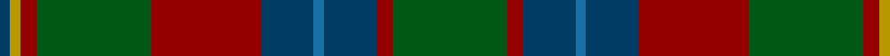

In pattern [BYRGRBBBRG](/patterns/byrgrbbbrg/).

This was sourced from register-of-tartans.  It is a [10 stripes tartan](/stripes/stripes10/).

Original link https://www.tartanregister.gov.uk/tartanDetails.aspx?ref=1354

## Attestations

This cloth appears in 2 source records; the oldest owns this page.

- 01/01/1995 — Glasgow Cathedral 2000 (register-of-tartans, [record](https://www.tartanregister.gov.uk/tartanDetails.aspx?ref=1354))
- 1995 — Glasgow Cathedral 2000 (Corporate) (tartans-authority, [record](http://www.tartansauthority.com/tartan-ferret/display/4082/))

## Thread count
DB/4 DY4 DR6 G44 DR42 DB20 B4 DB20 DR6 G/44

## Palette
Each colour and its ΔE from the base-6 reference it is a variant of.

| Colour | Shade | Base | ΔE (OKLab) |
|---|---|---|---|
| B | <code style="background-color:#1870A4;">#1870A4</code> `#1870A4` | B <code style="background-color:#2C4084;">#2C4084</code> | 0.14 |
| DB | <code style="background-color:#003C64;">#003C64</code> `#003C64` | B <code style="background-color:#2C4084;">#2C4084</code> | 0.07 |
| DR | <code style="background-color:#940000;">#940000</code> `#940000` | R <code style="background-color:#C80000;">#C80000</code> | 0.11 |
| DY | <code style="background-color:#B89800;">#B89800</code> `#B89800` | Y <code style="background-color:#E8C000;">#E8C000</code> | 0.13 |
| G | <code style="background-color:#005814;">#005814</code> `#005814` | G <code style="background-color:#006400;">#006400</code> | 0.04 |

## Nearest tartans

The nearest existing variants by ΔTartan distance.

1. [Fraser Hunting Clan Tartan Tartan Number: 1659. Earliest known date: 1906 (1855) In the Hunting Fraser, brown replaces the red of the Clan sett. The late Charles Ian Fraser of Reeling said, in his publication, "Clan Fraser", that this sett was designed by the Sobieski Stuart brothers at the request of Lord Lovat for use by the Inverness and Nairn militia. A letter to Lord Lovat from the War Office, c.1855, authorised the use of the Fraser tartan for the corps. The tartan is worn by the Boghall & Bathgate pipe bands. (Strathallan 1994) See products available Copyright © Blair Urquhart, Comrie, 2015](/setts/s11/r6g36ga20g4b20g4b20g4ga20g36w6-b2c2c80-g604000-ga006818-rc80000-we0e0e0/) — ΔT 0.79
1. [New South Wales Waratah](/setts/s10/g24b4r4b4ba52ga4g6ga6g48r8-b1c0070-ba14283c-g5c6428-ga003820-r880000/) — ΔT 0.98
1. [Bailies of Bennachie Corporate Tartan Tartan Number: 3628. Earliest known date: 2002 The Bailes of Bennachie were founded in 1973 as caretakers of the mountain in Aberdeenshire, with the aim of 'preserving the amenity of the hill'. The tartan was produced on the occasion of the 25th anniversary to help create funds to continue their task. The colours reflect the autumn shades on the hill. See products available Copyright © Blair Urquhart, Comrie, 2015](/setts/s7/g54b4g8r30ba52k4ba12-b680028-ba002450-g48581c-k101010-ra44c00/) — ΔT 1.12
1. [Fraser hunting](/setts/s11/r6ra36g20ra4b20ra4b20ra4g20ra36w6-b304080-g008000-rc00000-ra806050-we0e0e0/) — ΔT 1.13
1. [Chisholm Hunting #2](/setts/s10/g10w6g60b12ga6b6ga6b6ga30r6-b202060-g604000-ga006818-rc80000-wfcfcfc/) — ΔT 1.15
1. [Scottish Power (Corporate)](/setts/s8/g10ga64b10k20g16r6g16b6-b6c0070-g005448-ga408060-k101010-r880000/) — ΔT 1.17
1. [Jones (Arizona) (Name)](/setts/s10/g36k2r18k24r18k2g36k2b12g2-b5c5c5c-g005c34-k101010-r880000/) — ΔT 1.19
1. [Mica, Green (Fashion)](/setts/s8/g12r4g24k8b28k2g6y4-b3c3c64-g505028-k000000-r640000-yc89800/) — ΔT 1.19
1. [Wcwm 9275-1410](/setts/s7/g6ga64g8w6g36b36y6-b6c0070-g006818-ga604000-wc0c0c0-yd09800/) — ΔT 1.19
1. [Tupper. Sir Charles.. Family Tartan Tartan Number: 614. Earliest known date: 1983 From Canada. See products available Copyright © Blair Urquhart, Comrie, 2015](/setts/s10/b8g14y6g24ga30g10b40g10ga8g4-b2c2c80-g604000-ga006818-ye8c000/) — ΔT 1.20

## Neighbour map

Every grey dot is one of 15726 variants placed by the first two principal components of the ΔTartan feature space (44% of its variance). Red is this tartan; blue dots are its nearest — click one to open its page.

<svg viewBox="0 0 640 380" role="img" style="max-width:100%;height:auto;border:1px solid #e0e0e0;border-radius:4px;display:block" xmlns="http://www.w3.org/2000/svg"><image href="/nn/cloud.v1.png" width="640" height="380"/><a href="/setts/s11/r6g36ga20g4b20g4b20g4ga20g36w6-b2c2c80-g604000-ga006818-rc80000-we0e0e0/"><circle cx="243.1" cy="203.1" r="4" fill="#3465a4"><title>Fraser Hunting Clan Tartan Tartan Number: 1659. Earliest known date: 1906 (1855) In the Hunting Fraser, brown replaces the red of the Clan sett. The late Charles Ian Fraser of Reeling said, in his publication, &quot;Clan Fraser&quot;, that this sett was designed by the Sobieski Stuart brothers at the request of Lord Lovat for use by the Inverness and Nairn militia. A letter to Lord Lovat from the War Office, c.1855, authorised the use of the Fraser tartan for the corps. The tartan is worn by the Boghall &amp; Bathgate pipe bands. (Strathallan 1994) See products available Copyright © Blair Urquhart, Comrie, 2015</title></circle></a><a href="/setts/s10/g24b4r4b4ba52ga4g6ga6g48r8-b1c0070-ba14283c-g5c6428-ga003820-r880000/"><circle cx="319.3" cy="176.5" r="4" fill="#3465a4"><title>New South Wales Waratah</title></circle></a><a href="/setts/s7/g54b4g8r30ba52k4ba12-b680028-ba002450-g48581c-k101010-ra44c00/"><circle cx="257.3" cy="200.6" r="4" fill="#3465a4"><title>Bailies of Bennachie Corporate Tartan Tartan Number: 3628. Earliest known date: 2002 The Bailes of Bennachie were founded in 1973 as caretakers of the mountain in Aberdeenshire, with the aim of 'preserving the amenity of the hill'. The tartan was produced on the occasion of the 25th anniversary to help create funds to continue their task. The colours reflect the autumn shades on the hill. See products available Copyright © Blair Urquhart, Comrie, 2015</title></circle></a><a href="/setts/s11/r6ra36g20ra4b20ra4b20ra4g20ra36w6-b304080-g008000-rc00000-ra806050-we0e0e0/"><circle cx="246.5" cy="202.0" r="4" fill="#3465a4"><title>Fraser hunting</title></circle></a><a href="/setts/s10/g10w6g60b12ga6b6ga6b6ga30r6-b202060-g604000-ga006818-rc80000-wfcfcfc/"><circle cx="264.3" cy="167.9" r="4" fill="#3465a4"><title>Chisholm Hunting #2</title></circle></a><a href="/setts/s8/g10ga64b10k20g16r6g16b6-b6c0070-g005448-ga408060-k101010-r880000/"><circle cx="238.9" cy="190.8" r="4" fill="#3465a4"><title>Scottish Power (Corporate)</title></circle></a><a href="/setts/s10/g36k2r18k24r18k2g36k2b12g2-b5c5c5c-g005c34-k101010-r880000/"><circle cx="314.1" cy="194.5" r="4" fill="#3465a4"><title>Jones (Arizona) (Name)</title></circle></a><a href="/setts/s8/g12r4g24k8b28k2g6y4-b3c3c64-g505028-k000000-r640000-yc89800/"><circle cx="271.2" cy="189.8" r="4" fill="#3465a4"><title>Mica, Green (Fashion)</title></circle></a><a href="/setts/s7/g6ga64g8w6g36b36y6-b6c0070-g006818-ga604000-wc0c0c0-yd09800/"><circle cx="232.4" cy="194.5" r="4" fill="#3465a4"><title>Wcwm 9275-1410</title></circle></a><a href="/setts/s10/b8g14y6g24ga30g10b40g10ga8g4-b2c2c80-g604000-ga006818-ye8c000/"><circle cx="238.1" cy="220.0" r="4" fill="#3465a4"><title>Tupper. Sir Charles.. Family Tartan Tartan Number: 614. Earliest known date: 1983 From Canada. See products available Copyright © Blair Urquhart, Comrie, 2015</title></circle></a><circle cx="268.2" cy="194.6" r="5" fill="#c00000"/></svg>

ID: /setts/s10/g44r6b20ba4b20r42g44r6y4b4-b003c64-ba1870a4-g005814-r940000-yb89800/
