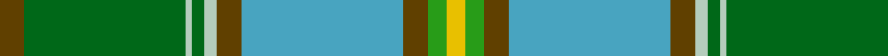

In pattern [GGWGWGYGGY](/patterns/ggwgwgyggy/).

This was sourced from tartans-authority.  It is a [10 stripes tartan](/stripes/stripes10/).

Original link http://www.tartansauthority.com/tartan-ferret/display/10259/

## Thread count
T/8 Ga52 N2 Ga4 N4 T8 B52 T8 G6 Y/6

## Palette
Each colour and its ΔE from the base-6 reference it is a variant of.

| Colour | Shade | Base | ΔE (OKLab) |
|---|---|---|---|
| B | <code style="background-color:#48A4C0;">#48A4C0</code> `#48A4C0` | Y <code style="background-color:#F2BF00;">#F2BF00</code> | 0.29 |
| G | <code style="background-color:#289C18;">#289C18</code> `#289C18` | G <code style="background-color:#006100;">#006100</code> | 0.19 |
| Ga | <code style="background-color:#006818;">#006818</code> `#006818` | G <code style="background-color:#006100;">#006100</code> | 0.02 |
| N | <code style="background-color:#B4CCBC;">#B4CCBC</code> `#B4CCBC` | W <code style="background-color:#F7F7F7;">#F7F7F7</code> | 0.16 |
| T | <code style="background-color:#604000;">#604000</code> `#604000` | G <code style="background-color:#006100;">#006100</code> | 0.14 |
| Y | <code style="background-color:#E8C000;">#E8C000</code> `#E8C000` | Y <code style="background-color:#F2BF00;">#F2BF00</code> | 0.02 |

## Nearest tartans

The nearest existing variants by ΔTartan distance.

1. [State Seal of Idaho (Fashion)](/setts/s12/w4k1b33w4y15g4y3b4y15ya2g30k2~b1474b4-g289c18-k101010-we8ccb8-ya08858-yabc8c00~x2/) — ΔT 1.01
1. [Carter (Savannah)](/setts/s10/b4g26y1g2y2b4ya26b4ga3yb3~b412719-g4a664c-ga6a8a67-yb6be8f-ya76a3b9-ybd9c341~x2/) — ΔT 1.07
1. [Currie](/setts/s11/b16w3b1y4g24r1g3r4g3r1ba8~b304080-ba5480b0-g008000-rc00000-we0e0e0-yf0c000~x2/) — ΔT 1.20
1. [Chisholm Colonial](/setts/s10/b6w1y24g6ba3g1ba3g1ba12r1~b003c64-ba0c585c-g006818-rc80000-we0e0e0-ya08858~x2/) — ΔT 1.25
1. [Sheffield, City of](/setts/s14/b5g5k4r31ga3r3ga62r3ga3r31k4g5b5ra3~b2888c4-g289c18-ga006818-k101010-r888888-rac80000~x2/) — ΔT 1.28
1. [Layton, Mervin](/setts/s8/g4r3g24k1w7k1ga24y3~g006633-ga008b45-k101010-rdb2929-wffffff-yffd700~x2/) — ΔT 1.31
1. [Stirling University (Corporate)](/setts/s8/g22r3w1g2r3b16k3y2~b5c8ca8-g006818-k101010-rc80000-wfcfcfc-ye8c000~x4/) — ΔT 1.37
1. [Iroquois Falls Centenary (Commem.)](/setts/s8/g18ga6gb3w1gb3w1b6ba6~b2888c4-ba202060-g006818-ga289c18-gb604000-we0e0e0~x2/) — ΔT 1.37
1. [Stirling, University of Corporate Univ Tartan Tartan Number: 2297. Earliest known date: 1994 This is the accepted University design. See products available Copyright © Blair Urquhart, Comrie, 2015](/setts/s8/g22r3k1g2r3b16ka3y2~b5c8ca8-g006818-k000000-ka101010-rc80000-ye8c000~x4/) — ΔT 1.43
1. [State Seal of Pennsylvania (Fashion)](/setts/s9/y4k1g28k6ga18w4b41k1w3~b1474b4-g006818-ga604000-k101010-we8ccb8-ybc8c00~x2/) — ΔT 1.43

## Neighbour map

Every grey dot is one of 15726 variants placed by the first two principal components of the ΔTartan feature space (44% of its variance). Red is this tartan; blue dots are its nearest — click one to open its page.

<svg viewBox="0 0 640 380" role="img" style="max-width:100%;height:auto;border:1px solid #e0e0e0;border-radius:4px;display:block" xmlns="http://www.w3.org/2000/svg"><image href="/nn/cloud.v1.png" width="640" height="380"/><a href="/setts/s12/w4k1b33w4y15g4y3b4y15ya2g30k2~b1474b4-g289c18-k101010-we8ccb8-ya08858-yabc8c00~x2/"><circle cx="203.2" cy="95.0" r="4" fill="#3465a4"><title>State Seal of Idaho (Fashion)</title></circle></a><a href="/setts/s10/b4g26y1g2y2b4ya26b4ga3yb3~b412719-g4a664c-ga6a8a67-yb6be8f-ya76a3b9-ybd9c341~x2/"><circle cx="233.8" cy="102.6" r="4" fill="#3465a4"><title>Carter (Savannah)</title></circle></a><a href="/setts/s11/b16w3b1y4g24r1g3r4g3r1ba8~b304080-ba5480b0-g008000-rc00000-we0e0e0-yf0c000~x2/"><circle cx="214.6" cy="99.7" r="4" fill="#3465a4"><title>Currie</title></circle></a><a href="/setts/s10/b6w1y24g6ba3g1ba3g1ba12r1~b003c64-ba0c585c-g006818-rc80000-we0e0e0-ya08858~x2/"><circle cx="263.0" cy="118.3" r="4" fill="#3465a4"><title>Chisholm Colonial</title></circle></a><a href="/setts/s14/b5g5k4r31ga3r3ga62r3ga3r31k4g5b5ra3~b2888c4-g289c18-ga006818-k101010-r888888-rac80000~x2/"><circle cx="271.8" cy="100.2" r="4" fill="#3465a4"><title>Sheffield, City of</title></circle></a><a href="/setts/s8/g4r3g24k1w7k1ga24y3~g006633-ga008b45-k101010-rdb2929-wffffff-yffd700~x2/"><circle cx="216.1" cy="116.9" r="4" fill="#3465a4"><title>Layton, Mervin</title></circle></a><a href="/setts/s8/g22r3w1g2r3b16k3y2~b5c8ca8-g006818-k101010-rc80000-wfcfcfc-ye8c000~x4/"><circle cx="248.0" cy="120.2" r="4" fill="#3465a4"><title>Stirling University (Corporate)</title></circle></a><a href="/setts/s8/g18ga6gb3w1gb3w1b6ba6~b2888c4-ba202060-g006818-ga289c18-gb604000-we0e0e0~x2/"><circle cx="186.2" cy="147.2" r="4" fill="#3465a4"><title>Iroquois Falls Centenary (Commem.)</title></circle></a><a href="/setts/s8/g22r3k1g2r3b16ka3y2~b5c8ca8-g006818-k000000-ka101010-rc80000-ye8c000~x4/"><circle cx="247.9" cy="121.0" r="4" fill="#3465a4"><title>Stirling, University of Corporate Univ Tartan Tartan Number: 2297. Earliest known date: 1994 This is the accepted University design. See products available Copyright © Blair Urquhart, Comrie, 2015</title></circle></a><a href="/setts/s9/y4k1g28k6ga18w4b41k1w3~b1474b4-g006818-ga604000-k101010-we8ccb8-ybc8c00~x2/"><circle cx="223.6" cy="95.2" r="4" fill="#3465a4"><title>State Seal of Pennsylvania (Fashion)</title></circle></a><circle cx="225.4" cy="105.1" r="5" fill="#c00000"/></svg>

ID: /setts/s10/g4ga26w1ga2w2g4y26g4gb3ya3~g604000-ga006818-gb289c18-wb4ccbc-y48a4c0-yae8c000~x2/
