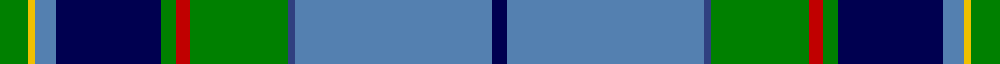

This page is one **sett** — a single exact thread-count. It belongs to the [tartan](/tartans/g4ly1t3db15g2r2g14db1t28db2/)
(the same proportion at any scale), whose colour order is pattern [BBBGRGBBYG](/stripes/bbbgrgbbyg/).

Sourced from weddslist.  It is a [10 stripe tartan](/stripes/stripes10/).

Original link http://www.weddslist.com/cgi-bin/tartans/pg.pl?source=sts

## Thread count
G/8 Y2 Ba6 DB30 G4 R4 G28 B2 Ba56 DB/4

## Palette

Palette: <strong>custom</strong>
<table><thead><tr><th>Colour</th><th>Threads</th><th>Shade</th><th>Base</th><th>OKLCh</th></tr></thead><tbody><tr><td>G/</td><td style="text-align:right;font-variant-numeric:tabular-nums">8</td><td><code style="background-color:#008000;">#008000</code> <small style="color:#888">#008000</small></td><td>G <code style="background-color:#006100;">#006100</code></td><td><small style="color:#888">oklch(52.0% 0.177 142.5)</small></td></tr><tr><td>Y</td><td style="text-align:right;font-variant-numeric:tabular-nums">2</td><td><code style="background-color:#F0C000;">#F0C000</code> <small style="color:#888">#F0C000</small></td><td>Y <code style="background-color:#F2BF00;">#F2BF00</code></td><td><small style="color:#888">oklch(82.7% 0.169 90.5)</small></td></tr><tr><td>Ba</td><td style="text-align:right;font-variant-numeric:tabular-nums">6</td><td><code style="background-color:#5480B0;">#5480B0</code> <small style="color:#888">#5480B0</small></td><td>B <code style="background-color:#2A418A;">#2A418A</code></td><td><small style="color:#888">oklch(58.8% 0.089 251.5)</small></td></tr><tr><td>DB</td><td style="text-align:right;font-variant-numeric:tabular-nums">30</td><td><code style="background-color:#000050;">#000050</code> <small style="color:#888">#000050</small></td><td>B <code style="background-color:#2A418A;">#2A418A</code></td><td><small style="color:#888">oklch(19.5% 0.135 264.1)</small></td></tr><tr><td>G</td><td style="text-align:right;font-variant-numeric:tabular-nums">4</td><td><code style="background-color:#008000;">#008000</code> <small style="color:#888">#008000</small></td><td>G <code style="background-color:#006100;">#006100</code></td><td><small style="color:#888">oklch(52.0% 0.177 142.5)</small></td></tr><tr><td>R</td><td style="text-align:right;font-variant-numeric:tabular-nums">4</td><td><code style="background-color:#C00000;">#C00000</code> <small style="color:#888">#C00000</small></td><td>R <code style="background-color:#CC0000;">#CC0000</code></td><td><small style="color:#888">oklch(50.7% 0.208 29.2)</small></td></tr><tr><td>G</td><td style="text-align:right;font-variant-numeric:tabular-nums">28</td><td><code style="background-color:#008000;">#008000</code> <small style="color:#888">#008000</small></td><td>G <code style="background-color:#006100;">#006100</code></td><td><small style="color:#888">oklch(52.0% 0.177 142.5)</small></td></tr><tr><td>B</td><td style="text-align:right;font-variant-numeric:tabular-nums">2</td><td><code style="background-color:#304080;">#304080</code> <small style="color:#888">#304080</small></td><td>B <code style="background-color:#2A418A;">#2A418A</code></td><td><small style="color:#888">oklch(39.4% 0.109 270.2)</small></td></tr><tr><td>Ba</td><td style="text-align:right;font-variant-numeric:tabular-nums">56</td><td><code style="background-color:#5480B0;">#5480B0</code> <small style="color:#888">#5480B0</small></td><td>B <code style="background-color:#2A418A;">#2A418A</code></td><td><small style="color:#888">oklch(58.8% 0.089 251.5)</small></td></tr><tr><td>DB/</td><td style="text-align:right;font-variant-numeric:tabular-nums">4</td><td><code style="background-color:#000050;">#000050</code> <small style="color:#888">#000050</small></td><td>B <code style="background-color:#2A418A;">#2A418A</code></td><td><small style="color:#888">oklch(19.5% 0.135 264.1)</small></td></tr></tbody></table>

## Nearest tartans

The nearest existing variants by ΔTartan distance, with this tartan at the top so the swatches line up against it.

ΔTartan

Tartan

Sett

—

<a href="/ttd/edit/#slug=g4ly1t3db15g2r2g14db1t28db2~x2">Heriot Watt University</a> <a class="nn-out" href="/setts/s10/g4ly1t3db15g2r2g14db1t28db2~x2/" title="open its dictionary page">↗</a>

0.69

<a href="/ttd/edit/#slug=ly2r2k2b27k6g13k1lb2~x2">German MacLeod</a> <a class="nn-out" href="/setts/s8/ly2r2k2b27k6g13k1lb2~x2/" title="open its dictionary page">↗</a>

0.74

<a href="/ttd/edit/#slug=w2db20g2g2g2g4g8ly2r1~x2">Nova Scotia (Province)</a> <a class="nn-out" href="/setts/s9/w2db20g2g2g2g4g8ly2r1~x2/" title="open its dictionary page">↗</a>

0.94

<a href="/ttd/edit/#slug=w2db20dg2g2dg2g4dg8ly2r1~x2">Nova Scotia</a> <a class="nn-out" href="/setts/s9/w2db20dg2g2dg2g4dg8ly2r1~x2/" title="open its dictionary page">↗</a>

0.96

<a href="/ttd/edit/#slug=db10g6o4r2o4k10db6k4db28g55w4">1314 (Corporate)</a> <a class="nn-out" href="/setts/s11/db10g6o4r2o4k10db6k4db28g55w4/" title="open its dictionary page">↗</a>

0.98

<a href="/ttd/edit/#slug=w2db20dg2dg2dg2dg5dg8ly2r1~x2">Unidentified (ex Tony Murray)</a> <a class="nn-out" href="/setts/s9/w2db20dg2dg2dg2dg5dg8ly2r1~x2/" title="open its dictionary page">↗</a>

1.07

<a href="/ttd/edit/#slug=g30dp4r6w6db6dp3k14w14db50g50w2">Brehat (Personal)</a> <a class="nn-out" href="/setts/s11/g30dp4r6w6db6dp3k14w14db50g50w2/" title="open its dictionary page">↗</a>

1.08

<a href="/ttd/edit/#slug=db66k2db10k15g15r4g15r4g30ly2w4">Mulcahy</a> <a class="nn-out" href="/setts/s11/db66k2db10k15g15r4g15r4g30ly2w4/" title="open its dictionary page">↗</a>

1.14

<a href="/ttd/edit/#slug=r2k1db30k6g12ly1db2ly1g12k3w1~x2">Hororata</a> <a class="nn-out" href="/setts/s11/r2k1db30k6g12ly1db2ly1g12k3w1~x2/" title="open its dictionary page">↗</a>

1.14

<a href="/ttd/edit/#slug=ly3db1k2g26db28w1db1r2~x2">Johnston, Diana Hunting (Personal)</a> <a class="nn-out" href="/setts/s8/ly3db1k2g26db28w1db1r2~x2/" title="open its dictionary page">↗</a>

1.16

<a href="/ttd/edit/#slug=b24w2b6g9r6b3r6g35k2ly2~x2">O'Donohue Personal)</a> <a class="nn-out" href="/setts/s10/b24w2b6g9r6b3r6g35k2ly2~x2/" title="open its dictionary page">↗</a>

## Neighbour map

Every grey dot is one of 14299 variants placed by the first two principal components of the ΔTartan feature space (44% of its variance). Red is this tartan; blue dots are its nearest — click one to open its page.

<svg viewBox="0 0 640 380" role="img" style="max-width:100%;height:auto;border:1px solid #e0e0e0;border-radius:4px;display:block" xmlns="http://www.w3.org/2000/svg"><image href="/nn/cloud.v1.png" width="640" height="380"/><a href="/setts/s8/ly2r2k2b27k6g13k1lb2~x2/"><circle cx="263.6" cy="112.4" r="4" fill="#3465a4"><title>German MacLeod</title></circle></a><a href="/setts/s9/w2db20g2g2g2g4g8ly2r1~x2/"><circle cx="230.9" cy="114.0" r="4" fill="#3465a4"><title>Nova Scotia (Province)</title></circle></a><a href="/setts/s9/w2db20dg2g2dg2g4dg8ly2r1~x2/"><circle cx="231.7" cy="115.2" r="4" fill="#3465a4"><title>Nova Scotia</title></circle></a><a href="/setts/s11/db10g6o4r2o4k10db6k4db28g55w4/"><circle cx="253.7" cy="100.0" r="4" fill="#3465a4"><title>1314 (Corporate)</title></circle></a><a href="/setts/s9/w2db20dg2dg2dg2dg5dg8ly2r1~x2/"><circle cx="237.6" cy="123.7" r="4" fill="#3465a4"><title>Unidentified (ex Tony Murray)</title></circle></a><a href="/setts/s11/g30dp4r6w6db6dp3k14w14db50g50w2/"><circle cx="193.3" cy="99.4" r="4" fill="#3465a4"><title>Brehat (Personal)</title></circle></a><a href="/setts/s11/db66k2db10k15g15r4g15r4g30ly2w4/"><circle cx="274.1" cy="102.4" r="4" fill="#3465a4"><title>Mulcahy</title></circle></a><a href="/setts/s11/r2k1db30k6g12ly1db2ly1g12k3w1~x2/"><circle cx="233.3" cy="84.5" r="4" fill="#3465a4"><title>Hororata</title></circle></a><a href="/setts/s8/ly3db1k2g26db28w1db1r2~x2/"><circle cx="293.5" cy="106.9" r="4" fill="#3465a4"><title>Johnston, Diana Hunting (Personal)</title></circle></a><a href="/setts/s10/b24w2b6g9r6b3r6g35k2ly2~x2/"><circle cx="241.6" cy="122.9" r="4" fill="#3465a4"><title>O'Donohue Personal)</title></circle></a><circle cx="231.0" cy="102.4" r="5" fill="#c00000"/></svg>

ID: /setts/s10/g4ly1t3db15g2r2g14db1t28db2~x2/
