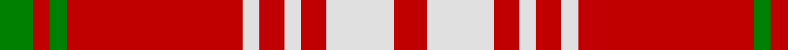

In pattern [GRGRWRWRWR](/patterns/grgrwrwrwr/).

This was sourced from weddslist.  It is a [10 stripes tartan](/stripes/stripes10/).

Original link http://www.weddslist.com/cgi-bin/tartans/pg.pl?source=sts

## Thread count
G/8 R4 G4 R42 LN4 R6 LN4 R6 LN16 R/8

## Palette
Each colour and its ΔE from the base-6 reference it is a variant of.

| Colour | Shade | Base | ΔE (OKLab) |
|---|---|---|---|
| G | <code style="background-color:#008000;">#008000</code> `#008000` | G <code style="background-color:#006100;">#006100</code> | 0.10 |
| LN | <code style="background-color:#E0E0E0;">#E0E0E0</code> `#E0E0E0` | W <code style="background-color:#F7F7F7;">#F7F7F7</code> | 0.07 |
| R | <code style="background-color:#C00000;">#C00000</code> `#C00000` | R <code style="background-color:#CC0000;">#CC0000</code> | 0.03 |

## Nearest tartans

The nearest existing variants by ΔTartan distance.

1. [Queen Alexandra Tartan Tartan Number: 972. Earliest known date: pre 2003 The Scottish Tartans Society received a sample from A.C.Lumsden which is slightly different. (The black and the dark blue are almost indistinguishable). The colours of the tartan are taken from the Provincial Coat of Arms. The tartan is not registered with Lord Lyon. See products available Copyright © Blair Urquhart, Comrie, 2015](/setts/s10/g4r2g2r21w2r3w2r3w8r4~g006818-rc80000-we0e0e0~x2/) — ΔT 0.14
1. [Queen Alexandra](/setts/s10/g4r2g2r16y2r3y2r3y8r3~g005030-rc80000-yb8b8b8~x2/) — ΔT 1.09
1. [Queen Alexandra (Fashion)](/setts/s10/g4r2g2r16y2r3y2r3y8r3~g005030-rc80000-yb8b8b8~x4/) — ΔT 1.09
1. [MacDonald of Belfinlay](/setts/s10/k8g4r4g3r32g3r4g3r4k4~g447c34-k101010-rc80000~x2/) — ΔT 1.37
1. [MacDonell of Keppach](/setts/s11/r9g4r6k2r4k2r8g14r24k2r4~g008000-k000000-rc00000~x2/) — ΔT 1.51
1. [MacDonell of Keppach](/setts/s11/r9g4r6k2r4k2r8g14r24k2r4~g005020-k101010-rdc0000~x2/) — ΔT 1.53
1. [Auld Reekie Trade Tartan Tartan Number: 2381. Earliest known date: Pre 1997 Produced by or for Barkraft Lt for use as a blanket or rug. See products available Copyright © Blair Urquhart, Comrie, 2015](/setts/s10/b4r3b3r22g8r2g8r22b3r3~b2c2c80-g006818-rc80000~x2/) — ΔT 1.59
1. [Masai Shuka 16 (Artefact)](/setts/s6/y8k3y4k2r30y6~k101010-rc80000-ye8c000~x2/) — ΔT 1.60
1. [Lantern, The](/setts/s9/w6k2r32y2k6y2r4k2w3~k101010-rc80000-wc0c0c0-yd09800~x2/) — ΔT 1.62
1. [Dobrain (Personal)](/setts/s10/r24ra2r4b2k6ra2r14k3ra4b8~b646464-k000000-rc82800-ra8c8c8c~x2/) — ΔT 1.63

## Neighbour map

Every grey dot is one of 15726 variants placed by the first two principal components of the ΔTartan feature space (44% of its variance). Red is this tartan; blue dots are its nearest — click one to open its page.

<svg viewBox="0 0 640 380" role="img" style="max-width:100%;height:auto;border:1px solid #e0e0e0;border-radius:4px;display:block" xmlns="http://www.w3.org/2000/svg"><image href="/nn/cloud.v1.png" width="640" height="380"/><a href="/setts/s10/g4r2g2r21w2r3w2r3w8r4~g006818-rc80000-we0e0e0~x2/"><circle cx="385.0" cy="164.9" r="4" fill="#3465a4"><title>Queen Alexandra Tartan Tartan Number: 972. Earliest known date: pre 2003 The Scottish Tartans Society received a sample from A.C.Lumsden which is slightly different. (The black and the dark blue are almost indistinguishable). The colours of the tartan are taken from the Provincial Coat of Arms. The tartan is not registered with Lord Lyon. See products available Copyright © Blair Urquhart, Comrie, 2015</title></circle></a><a href="/setts/s10/g4r2g2r16y2r3y2r3y8r3~g005030-rc80000-yb8b8b8~x2/"><circle cx="352.5" cy="193.5" r="4" fill="#3465a4"><title>Queen Alexandra</title></circle></a><a href="/setts/s10/g4r2g2r16y2r3y2r3y8r3~g005030-rc80000-yb8b8b8~x4/"><circle cx="352.5" cy="193.5" r="4" fill="#3465a4"><title>Queen Alexandra (Fashion)</title></circle></a><a href="/setts/s10/k8g4r4g3r32g3r4g3r4k4~g447c34-k101010-rc80000~x2/"><circle cx="406.4" cy="170.8" r="4" fill="#3465a4"><title>MacDonald of Belfinlay</title></circle></a><a href="/setts/s11/r9g4r6k2r4k2r8g14r24k2r4~g008000-k000000-rc00000~x2/"><circle cx="421.2" cy="185.2" r="4" fill="#3465a4"><title>MacDonell of Keppach</title></circle></a><a href="/setts/s11/r9g4r6k2r4k2r8g14r24k2r4~g005020-k101010-rdc0000~x2/"><circle cx="434.7" cy="185.7" r="4" fill="#3465a4"><title>MacDonell of Keppach</title></circle></a><a href="/setts/s10/b4r3b3r22g8r2g8r22b3r3~b2c2c80-g006818-rc80000~x2/"><circle cx="425.1" cy="194.8" r="4" fill="#3465a4"><title>Auld Reekie Trade Tartan Tartan Number: 2381. Earliest known date: Pre 1997 Produced by or for Barkraft Lt for use as a blanket or rug. See products available Copyright © Blair Urquhart, Comrie, 2015</title></circle></a><a href="/setts/s6/y8k3y4k2r30y6~k101010-rc80000-ye8c000~x2/"><circle cx="362.8" cy="170.6" r="4" fill="#3465a4"><title>Masai Shuka 16 (Artefact)</title></circle></a><a href="/setts/s9/w6k2r32y2k6y2r4k2w3~k101010-rc80000-wc0c0c0-yd09800~x2/"><circle cx="370.3" cy="122.9" r="4" fill="#3465a4"><title>Lantern, The</title></circle></a><a href="/setts/s10/r24ra2r4b2k6ra2r14k3ra4b8~b646464-k000000-rc82800-ra8c8c8c~x2/"><circle cx="333.8" cy="159.7" r="4" fill="#3465a4"><title>Dobrain (Personal)</title></circle></a><circle cx="383.4" cy="165.4" r="5" fill="#c00000"/></svg>

ID: /setts/s10/g4r2g2r21w2r3w2r3w8r4~g008000-rc00000-we0e0e0~x2/
