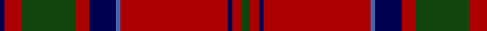

In pattern [BRGRBBRBRG](/patterns/brgrbbrbrg/).

This was sourced from weddslist.  It is a [10 stripes tartan](/stripes/stripes10/).

Original link http://www.weddslist.com/cgi-bin/tartans/pg.pl?source=tinsel

## Attestations

This cloth appears in 2 source records; the oldest owns this page.

- undated — MacDonell of Keppoch (weddslist, [record](http://www.weddslist.com/cgi-bin/tartans/pg.pl?source=tinsel))
- undated — MacDonell of Keppoch (weddslist, [record](http://www.weddslist.com/cgi-bin/tartans/pg.pl?source=x))

## Thread count
DB/2 DR8 DG24 DR6 DB12 B2 DR48 DB2 DR4 DG/4

## Palette
Each colour and its ΔE from the base-6 reference it is a variant of.

| Colour | Shade | Base | ΔE (OKLab) |
|---|---|---|---|
| B | <code style="background-color:#4367AE;">#4367AE</code> `#4367AE` | B <code style="background-color:#2C4084;">#2C4084</code> | 0.13 |
| DB | <code style="background-color:#000052;">#000052</code> `#000052` | B <code style="background-color:#2C4084;">#2C4084</code> | 0.20 |
| DG | <code style="background-color:#11450D;">#11450D</code> `#11450D` | G <code style="background-color:#006400;">#006400</code> | 0.10 |
| DR | <code style="background-color:#AA0000;">#AA0000</code> `#AA0000` | R <code style="background-color:#C80000;">#C80000</code> | 0.06 |

## Nearest tartans

The nearest existing variants by ΔTartan distance.

1. [MacDonell of Keppoch](/setts/s10/g4r4b2r48ba2b12r6g24r8b2-b2c2c80-ba5c8ca8-g285800-rc80000/) — ΔT 0.77
1. [MacDonell of Keppoch Clan Tartan Tartan Number: 511. Earliest known date: 1906 MacDonells of Keppoch are an independant branch of Clan Donald. See products available Copyright © Blair Urquhart, Comrie, 2015](/setts/s10/g4r4b2r48ba2b12r6g24r8b2-b2c2c80-ba5c8ca8-g006818-rc80000/) — ΔT 0.78
1. [Chisholm D](/setts/s10/r12w2r48b12g4b2g4b2g24r2-b5a3094-g004c00-rc80000-wd0d0d0/) — ΔT 0.78
1. [MacGillivray](/setts/s13/r8b2ba2r64b4r4ba24r4g32r8b2r8ba4-b4367ae-ba000052-g11450d-raa0000/) — ΔT 0.84
1. [Hughes (Welsh Name)](/setts/s11/g4r34b20r4b8r6ba2r5b2r3g4-b003c64-ba202060-g006818-rc80000/) — ΔT 0.86
1. [Scott](/setts/s10/g8r6k2r56g28r8g8y6g8r8-g11450d-k000000-raa0000-yaaaaaa/) — ΔT 0.87
1. [Scott](/setts/s10/g4r3k1r28g14r4g4y3g4r4-g11450d-k000000-raa0000-yaaaaaa/) — ΔT 0.87
1. [MacDonell of Keppoch](/setts/s10/g4r4b2r48w2b12r6g24r8b2-b00004c-g004c00-rc80000-wd0d0d0/) — ΔT 0.94
1. [Cumming VS](/setts/s10/r8g16y2g16r8g8r4g8r48k4-g11450d-k000000-raa0000-yaaaaaa/) — ΔT 0.94
1. [Chisholm](/setts/s10/r12w2r48b12g4b2g4b2g24r2-b2c2c80-g006818-rc80000-wfcfcfc/) — ΔT 0.94

## Neighbour map

Every grey dot is one of 15726 variants placed by the first two principal components of the ΔTartan feature space (44% of its variance). Red is this tartan; blue dots are its nearest — click one to open its page.

<svg viewBox="0 0 640 380" role="img" style="max-width:100%;height:auto;border:1px solid #e0e0e0;border-radius:4px;display:block" xmlns="http://www.w3.org/2000/svg"><image href="/nn/cloud.v1.png" width="640" height="380"/><a href="/setts/s10/g4r4b2r48ba2b12r6g24r8b2-b2c2c80-ba5c8ca8-g285800-rc80000/"><circle cx="399.6" cy="129.3" r="4" fill="#3465a4"><title>MacDonell of Keppoch</title></circle></a><a href="/setts/s10/g4r4b2r48ba2b12r6g24r8b2-b2c2c80-ba5c8ca8-g006818-rc80000/"><circle cx="393.5" cy="127.5" r="4" fill="#3465a4"><title>MacDonell of Keppoch Clan Tartan Tartan Number: 511. Earliest known date: 1906 MacDonells of Keppoch are an independant branch of Clan Donald. See products available Copyright © Blair Urquhart, Comrie, 2015</title></circle></a><a href="/setts/s10/r12w2r48b12g4b2g4b2g24r2-b5a3094-g004c00-rc80000-wd0d0d0/"><circle cx="371.9" cy="124.8" r="4" fill="#3465a4"><title>Chisholm D</title></circle></a><a href="/setts/s13/r8b2ba2r64b4r4ba24r4g32r8b2r8ba4-b4367ae-ba000052-g11450d-raa0000/"><circle cx="388.4" cy="103.9" r="4" fill="#3465a4"><title>MacGillivray</title></circle></a><a href="/setts/s11/g4r34b20r4b8r6ba2r5b2r3g4-b003c64-ba202060-g006818-rc80000/"><circle cx="365.0" cy="143.7" r="4" fill="#3465a4"><title>Hughes (Welsh Name)</title></circle></a><a href="/setts/s10/g8r6k2r56g28r8g8y6g8r8-g11450d-k000000-raa0000-yaaaaaa/"><circle cx="407.3" cy="139.2" r="4" fill="#3465a4"><title>Scott</title></circle></a><a href="/setts/s10/g4r3k1r28g14r4g4y3g4r4-g11450d-k000000-raa0000-yaaaaaa/"><circle cx="407.3" cy="139.2" r="4" fill="#3465a4"><title>Scott</title></circle></a><a href="/setts/s10/g4r4b2r48w2b12r6g24r8b2-b00004c-g004c00-rc80000-wd0d0d0/"><circle cx="373.6" cy="120.3" r="4" fill="#3465a4"><title>MacDonell of Keppoch</title></circle></a><a href="/setts/s10/r8g16y2g16r8g8r4g8r48k4-g11450d-k000000-raa0000-yaaaaaa/"><circle cx="394.3" cy="150.8" r="4" fill="#3465a4"><title>Cumming VS</title></circle></a><a href="/setts/s10/r12w2r48b12g4b2g4b2g24r2-b2c2c80-g006818-rc80000-wfcfcfc/"><circle cx="363.3" cy="122.6" r="4" fill="#3465a4"><title>Chisholm</title></circle></a><circle cx="396.6" cy="134.3" r="5" fill="#c00000"/></svg>

ID: /setts/s10/g4r4b2r48ba2b12r6g24r8b2-b000052-ba4367ae-g11450d-raa0000/
