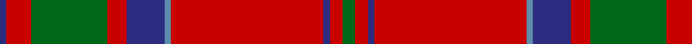

In pattern [BRGRBBRBRG](/patterns/brgrbbrbrg/).

This was sourced from house-of-tartan.  It is a [10 stripes tartan](/stripes/stripes10/).

Original link http://www.house-of-tartan.scotland.net/house/TartanViewjs.asp?colr=Def&tnam=511

## Thread count
DB/2 R8 G24 R6 DB12 B2 R48 DB2 R4 G/4

## Palette
Each colour and its ΔE from the base-6 reference it is a variant of.

| Colour | Shade | Base | ΔE (OKLab) |
|---|---|---|---|
| B | <code style="background-color:#5C8CA8;">#5C8CA8</code> `#5C8CA8` | B <code style="background-color:#2C4084;">#2C4084</code> | 0.23 |
| DB | <code style="background-color:#2C2C80;">#2C2C80</code> `#2C2C80` | B <code style="background-color:#2C4084;">#2C4084</code> | 0.05 |
| G | <code style="background-color:#006818;">#006818</code> `#006818` | G <code style="background-color:#006400;">#006400</code> | 0.02 |
| R | <code style="background-color:#C80000;">#C80000</code> `#C80000` | R <code style="background-color:#C80000;">#C80000</code> | 0.00 |

## Nearest tartans

The nearest existing variants by ΔTartan distance.

1. [MacDonell of Keppoch](/setts/s10/g4r4b2r48ba2b12r6g24r8b2-b2c2c80-ba5c8ca8-g285800-rc80000/) — ΔT 0.24
1. [MacDonell of Keppoch](/setts/s10/g4r4b2r48ba2b12r6g24r8b2-b304080-ba5480b0-g008000-rc00000/) — ΔT 0.34
1. [Chisholm D](/setts/s10/r12w2r48b12g4b2g4b2g24r2-b5a3094-g004c00-rc80000-wd0d0d0/) — ΔT 0.40
1. [Chisholm](/setts/s10/r12w2r48b12g4b2g4b2g24r2-b2c2c80-g006818-rc80000-wfcfcfc/) — ΔT 0.52
1. [Chisholm of Strathglass Clan Tartan Tartan Number: 1455. Earliest known date: 1830 A slight variation in proportions from the Chisholm sett in the collection of the Highland Society of London. Logan gives this sett as Chisholm, as do Smibert(1850) and the Smiths (1850), but Grant (1886) shows the Vestiarium design. See products available Copyright © Blair Urquhart, Comrie, 2015](/setts/s10/r14w4r72b12g6b6g6b6g24r8-b2c2c80-g006818-rc80000-we0e0e0/) — ΔT 0.53
1. [Chisholm of Strathglass](/setts/s10/r14w4r72b12g6b6g6b6g24r8-b304080-g008000-rc00000-we0e0e0/) — ΔT 0.53
1. [Chisholm of Strathglass (Clan)](/setts/s10/r14w4r72b12g6b6g6b6g24r8-b1474b4-g00643c-rc80000-wfcfcfc/) — ΔT 0.57
1. [Chisholm, The (MacGregor-Hastie)](/setts/s10/r24w4r74b12g6b6r8b6g42r8-b1474b4-g006818-rc80000-wfcfcfc/) — ΔT 0.62
1. [Chisholm, The](/setts/s10/r24w4r74b12g6b6r8b6g42r8-b304080-g008000-rc00000-we0e0e0/) — ΔT 0.63
1. [Chisholm, The](/setts/s10/r12w2r48b12g4b2g4b2g24r2-b304080-g008000-rc00000-we0e0e0/) — ΔT 0.67

## Neighbour map

Every grey dot is one of 15726 variants placed by the first two principal components of the ΔTartan feature space (44% of its variance). Red is this tartan; blue dots are its nearest — click one to open its page.

<svg viewBox="0 0 640 380" role="img" style="max-width:100%;height:auto;border:1px solid #e0e0e0;border-radius:4px;display:block" xmlns="http://www.w3.org/2000/svg"><image href="/nn/cloud.v1.png" width="640" height="380"/><a href="/setts/s10/g4r4b2r48ba2b12r6g24r8b2-b2c2c80-ba5c8ca8-g285800-rc80000/"><circle cx="399.6" cy="129.3" r="4" fill="#3465a4"><title>MacDonell of Keppoch</title></circle></a><a href="/setts/s10/g4r4b2r48ba2b12r6g24r8b2-b304080-ba5480b0-g008000-rc00000/"><circle cx="394.6" cy="129.1" r="4" fill="#3465a4"><title>MacDonell of Keppoch</title></circle></a><a href="/setts/s10/r12w2r48b12g4b2g4b2g24r2-b5a3094-g004c00-rc80000-wd0d0d0/"><circle cx="371.9" cy="124.8" r="4" fill="#3465a4"><title>Chisholm D</title></circle></a><a href="/setts/s10/r12w2r48b12g4b2g4b2g24r2-b2c2c80-g006818-rc80000-wfcfcfc/"><circle cx="363.3" cy="122.6" r="4" fill="#3465a4"><title>Chisholm</title></circle></a><a href="/setts/s10/r14w4r72b12g6b6g6b6g24r8-b2c2c80-g006818-rc80000-we0e0e0/"><circle cx="377.1" cy="133.1" r="4" fill="#3465a4"><title>Chisholm of Strathglass Clan Tartan Tartan Number: 1455. Earliest known date: 1830 A slight variation in proportions from the Chisholm sett in the collection of the Highland Society of London. Logan gives this sett as Chisholm, as do Smibert(1850) and the Smiths (1850), but Grant (1886) shows the Vestiarium design. See products available Copyright © Blair Urquhart, Comrie, 2015</title></circle></a><a href="/setts/s10/r14w4r72b12g6b6g6b6g24r8-b304080-g008000-rc00000-we0e0e0/"><circle cx="378.8" cy="134.9" r="4" fill="#3465a4"><title>Chisholm of Strathglass</title></circle></a><a href="/setts/s10/r14w4r72b12g6b6g6b6g24r8-b1474b4-g00643c-rc80000-wfcfcfc/"><circle cx="379.7" cy="134.5" r="4" fill="#3465a4"><title>Chisholm of Strathglass (Clan)</title></circle></a><a href="/setts/s10/r24w4r74b12g6b6r8b6g42r8-b1474b4-g006818-rc80000-wfcfcfc/"><circle cx="379.0" cy="140.1" r="4" fill="#3465a4"><title>Chisholm, The (MacGregor-Hastie)</title></circle></a><a href="/setts/s10/r24w4r74b12g6b6r8b6g42r8-b304080-g008000-rc00000-we0e0e0/"><circle cx="380.6" cy="141.4" r="4" fill="#3465a4"><title>Chisholm, The</title></circle></a><a href="/setts/s10/r12w2r48b12g4b2g4b2g24r2-b304080-g008000-rc00000-we0e0e0/"><circle cx="366.2" cy="124.9" r="4" fill="#3465a4"><title>Chisholm, The</title></circle></a><circle cx="393.5" cy="127.5" r="5" fill="#c00000"/></svg>

ID: /setts/s10/g4r4b2r48ba2b12r6g24r8b2-b2c2c80-ba5c8ca8-g006818-rc80000/
