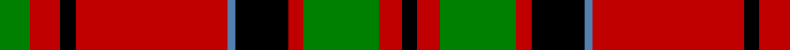

In pattern [GRKRBKRGRK](/patterns/grkrbkrgrk/).

This was sourced from weddslist.  It is a [10 stripes tartan](/stripes/stripes10/).

Original link http://www.weddslist.com/cgi-bin/tartans/pg.pl?source=sts

## Thread count
G/8 R8 K4 R40 B2 K14 R4 G20 R6 K/4

## Palette
Each colour and its ΔE from the base-6 reference it is a variant of.

| Colour | Shade | Base | ΔE (OKLab) |
|---|---|---|---|
| B | <code style="background-color:#5480B0;">#5480B0</code> `#5480B0` | B <code style="background-color:#2A418A;">#2A418A</code> | 0.19 |
| G | <code style="background-color:#008000;">#008000</code> `#008000` | G <code style="background-color:#006100;">#006100</code> | 0.10 |
| K | <code style="background-color:#000000;">#000000</code> `#000000` | K <code style="background-color:#000000;">#000000</code> | 0.00 |
| R | <code style="background-color:#C00000;">#C00000</code> `#C00000` | R <code style="background-color:#CC0000;">#CC0000</code> | 0.03 |

## Nearest tartans

The nearest existing variants by ΔTartan distance.

1. [MacKillop (Scottish Tartan Society)](/setts/s10/g4r2k2r20b1k7r2g10r3k2~b3c82af-g005020-k101010-rdc0000~x2/) — ΔT 0.83
1. [Grant, Kilt](/setts/s15/r5k1r2k2r16b2r2k9r2g2r2g13r2k2r4~b5480b0-g008000-k000000-rc00000~x2/) — ΔT 0.90
1. [MacKillop Clan Tartan Tartan Number: 1001. Earliest known date: pre 2003 The MacKillops are a Sept of MacDonald of Keppoch, whose tartan this sett closely resembles. See products available Copyright © Blair Urquhart, Comrie, 2015](/setts/s10/g4r4k2r20b1k7r2g10r3k2~b5c8ca8-g006818-k101010-rc80000~x2/) — ΔT 0.94
1. [MacLeod, and MacNicol](/setts/s12/r8g1r8g16r4k2b1k4r8g1r8k1~b5480b0-g008000-k000000-rc00000~x2/) — ΔT 1.09
1. [MacNicol](/setts/s11/r8g2r8k8b1k3r2g15r8k2r6~b304080-g008000-k000000-rc00000~x4/) — ΔT 1.12
1. [MacPhail](/setts/s6/r25k7r3g13b1k2~b5480b0-g008000-k000000-rc00000~x4/) — ΔT 1.12
1. [Hallingdal (District)](/setts/s12/g2y1r2k12r2k2r2k2r13k2y1r2~g006818-k101010-rc80000-ye8c000~x2/) — ΔT 1.20
1. [Scoepaig, fragment](/setts/s10/k10b1k1r10b1k1b1r10g6r2~b5480b0-g008000-k000000-rc00000~x2/) — ΔT 1.23
1. [MacDuff](/setts/s7/r4k2r24k6b6g16r3~b304080-g008000-k000000-rc00000~x2/) — ΔT 1.24
1. [Wilson's No.005](/setts/s10/g5r4g17w5r32w5g17r4g5wa2~g044028-rc80000-w00fcfc-wafcfcfc~x2/) — ΔT 1.25

## Neighbour map

Every grey dot is one of 15726 variants placed by the first two principal components of the ΔTartan feature space (44% of its variance). Red is this tartan; blue dots are its nearest — click one to open its page.

<svg viewBox="0 0 640 380" role="img" style="max-width:100%;height:auto;border:1px solid #e0e0e0;border-radius:4px;display:block" xmlns="http://www.w3.org/2000/svg"><image href="/nn/cloud.v1.png" width="640" height="380"/><a href="/setts/s10/g4r2k2r20b1k7r2g10r3k2~b3c82af-g005020-k101010-rdc0000~x2/"><circle cx="306.3" cy="138.2" r="4" fill="#3465a4"><title>MacKillop (Scottish Tartan Society)</title></circle></a><a href="/setts/s15/r5k1r2k2r16b2r2k9r2g2r2g13r2k2r4~b5480b0-g008000-k000000-rc00000~x2/"><circle cx="275.1" cy="127.3" r="4" fill="#3465a4"><title>Grant, Kilt</title></circle></a><a href="/setts/s10/g4r4k2r20b1k7r2g10r3k2~b5c8ca8-g006818-k101010-rc80000~x2/"><circle cx="318.2" cy="145.8" r="4" fill="#3465a4"><title>MacKillop Clan Tartan Tartan Number: 1001. Earliest known date: pre 2003 The MacKillops are a Sept of MacDonald of Keppoch, whose tartan this sett closely resembles. See products available Copyright © Blair Urquhart, Comrie, 2015</title></circle></a><a href="/setts/s12/r8g1r8g16r4k2b1k4r8g1r8k1~b5480b0-g008000-k000000-rc00000~x2/"><circle cx="316.3" cy="152.8" r="4" fill="#3465a4"><title>MacLeod, and MacNicol</title></circle></a><a href="/setts/s11/r8g2r8k8b1k3r2g15r8k2r6~b304080-g008000-k000000-rc00000~x4/"><circle cx="244.8" cy="168.6" r="4" fill="#3465a4"><title>MacNicol</title></circle></a><a href="/setts/s6/r25k7r3g13b1k2~b5480b0-g008000-k000000-rc00000~x4/"><circle cx="325.1" cy="153.3" r="4" fill="#3465a4"><title>MacPhail</title></circle></a><a href="/setts/s12/g2y1r2k12r2k2r2k2r13k2y1r2~g006818-k101010-rc80000-ye8c000~x2/"><circle cx="295.0" cy="141.4" r="4" fill="#3465a4"><title>Hallingdal (District)</title></circle></a><a href="/setts/s10/k10b1k1r10b1k1b1r10g6r2~b5480b0-g008000-k000000-rc00000~x2/"><circle cx="246.8" cy="165.7" r="4" fill="#3465a4"><title>Scoepaig, fragment</title></circle></a><a href="/setts/s7/r4k2r24k6b6g16r3~b304080-g008000-k000000-rc00000~x2/"><circle cx="260.2" cy="182.0" r="4" fill="#3465a4"><title>MacDuff</title></circle></a><a href="/setts/s10/g5r4g17w5r32w5g17r4g5wa2~g044028-rc80000-w00fcfc-wafcfcfc~x2/"><circle cx="260.1" cy="151.7" r="4" fill="#3465a4"><title>Wilson's No.005</title></circle></a><circle cx="291.9" cy="138.0" r="5" fill="#c00000"/></svg>

ID: /setts/s10/g4r4k2r20b1k7r2g10r3k2~b5480b0-g008000-k000000-rc00000~x2/
