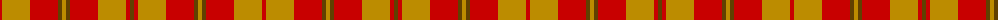

In pattern [GRYRGYGRYR](/patterns/gryrgygryr/).

This was sourced from register-of-tartans.  It is a [10 stripes tartan](/stripes/stripes10/).

Original link https://www.tartanregister.gov.uk/tartanDetails.aspx?ref=4307

## Thread count
R/4 DY28 R28 T4 DY4 T4 R28 DY28 R4 T/4

## Palette
Each colour and its ΔE from the base-6 reference it is a variant of.

| Colour | Shade | Base | ΔE (OKLab) |
|---|---|---|---|
| DY | <code style="background-color:#BC8C00;">#BC8C00</code> `#BC8C00` | Y <code style="background-color:#F2BF00;">#F2BF00</code> | 0.16 |
| R | <code style="background-color:#C80000;">#C80000</code> `#C80000` | R <code style="background-color:#CC0000;">#CC0000</code> | 0.01 |
| Ra | <code style="background-color:#A03400;">#A03400</code> `#A03400` | R <code style="background-color:#CC0000;">#CC0000</code> | 0.09 |
| Rb | <code style="background-color:#A00048;">#A00048</code> `#A00048` | R <code style="background-color:#CC0000;">#CC0000</code> | 0.12 |
| T | <code style="background-color:#604000;">#604000</code> `#604000` | G <code style="background-color:#006100;">#006100</code> | 0.14 |

## Nearest tartans

The nearest existing variants by ΔTartan distance.

1. [Prince David #1 (Royal)](/setts/s7/g6y4g36y42y4g6y4-g604000-yd87c00/) — ΔT 1.69
1. [Antigua & Barbuda](/setts/s14/r60g6y6g6y6g6y6g6y6g6y6g6y20r10-g289c18-rc80000-yd87c00/) — ΔT 1.79
1. [Miyuki #4](/setts/s8/r6y16r6y40g40y6g16y6-g604000-rc80000-ya08858/) — ΔT 1.79
1. [Unidentified Scarlett #17](/setts/s12/r24ra4g8ra4r4g12r4ra4g8ra4r24k2-g006818-k101010-ra00000-rac80000/) — ΔT 1.88
1. [Burnett of Powis (Personal)](/setts/s8/b6r42g6r6g38y6g38r6-b2888c4-g5c6428-rc80000-ye8c000/) — ΔT 1.89
1. [MacNab](/setts/s13/g16r2g2r2g2r12ra16r2ra16r12g14r2g2-g004c00-rc80000-rab00000/) — ΔT 1.99
1. [Dewar (Name)](/setts/s6/g6r6g42r24ra42r6-g285800-ra00000-rac80000/) — ΔT 2.00
1. [Burnett of Powis (Modern) (Personal)](/setts/s14/g38y6g38r6g38y6g38r6g6r42b6r42g6r6-b2888c4-g5c6428-rc80000-ye8c000/) — ΔT 2.04
1. [Maguire, Black (Name)](/setts/s6/r116g8r8g8r24y84-g00643c-rd0002c-ybc8c00/) — ΔT 2.06
1. [Kozlosky (Personal)](/setts/s10/r20ra6y12r28ra16y42ra16r28y12ra6-rc80000-rae87878-ye8c000/) — ΔT 2.10

## Neighbour map

Every grey dot is one of 15726 variants placed by the first two principal components of the ΔTartan feature space (44% of its variance). Red is this tartan; blue dots are its nearest — click one to open its page.

<svg viewBox="0 0 640 380" role="img" style="max-width:100%;height:auto;border:1px solid #e0e0e0;border-radius:4px;display:block" xmlns="http://www.w3.org/2000/svg"><image href="/nn/cloud.v1.png" width="640" height="380"/><a href="/setts/s7/g6y4g36y42y4g6y4-g604000-yd87c00/"><circle cx="364.1" cy="210.0" r="4" fill="#3465a4"><title>Prince David #1 (Royal)</title></circle></a><a href="/setts/s14/r60g6y6g6y6g6y6g6y6g6y6g6y20r10-g289c18-rc80000-yd87c00/"><circle cx="321.2" cy="160.6" r="4" fill="#3465a4"><title>Antigua &amp; Barbuda</title></circle></a><a href="/setts/s8/r6y16r6y40g40y6g16y6-g604000-rc80000-ya08858/"><circle cx="351.1" cy="251.4" r="4" fill="#3465a4"><title>Miyuki #4</title></circle></a><a href="/setts/s12/r24ra4g8ra4r4g12r4ra4g8ra4r24k2-g006818-k101010-ra00000-rac80000/"><circle cx="359.4" cy="188.0" r="4" fill="#3465a4"><title>Unidentified Scarlett #17</title></circle></a><a href="/setts/s8/b6r42g6r6g38y6g38r6-b2888c4-g5c6428-rc80000-ye8c000/"><circle cx="352.4" cy="222.4" r="4" fill="#3465a4"><title>Burnett of Powis (Personal)</title></circle></a><a href="/setts/s13/g16r2g2r2g2r12ra16r2ra16r12g14r2g2-g004c00-rc80000-rab00000/"><circle cx="257.3" cy="212.5" r="4" fill="#3465a4"><title>MacNab</title></circle></a><a href="/setts/s6/g6r6g42r24ra42r6-g285800-ra00000-rac80000/"><circle cx="285.8" cy="259.7" r="4" fill="#3465a4"><title>Dewar (Name)</title></circle></a><a href="/setts/s14/g38y6g38r6g38y6g38r6g6r42b6r42g6r6-b2888c4-g5c6428-rc80000-ye8c000/"><circle cx="354.6" cy="205.9" r="4" fill="#3465a4"><title>Burnett of Powis (Modern) (Personal)</title></circle></a><a href="/setts/s6/r116g8r8g8r24y84-g00643c-rd0002c-ybc8c00/"><circle cx="456.3" cy="204.6" r="4" fill="#3465a4"><title>Maguire, Black (Name)</title></circle></a><a href="/setts/s10/r20ra6y12r28ra16y42ra16r28y12ra6-rc80000-rae87878-ye8c000/"><circle cx="233.6" cy="226.7" r="4" fill="#3465a4"><title>Kozlosky (Personal)</title></circle></a><circle cx="350.7" cy="225.2" r="5" fill="#c00000"/></svg>

ID: /setts/s10/g4r4y28r28g4y4g4r28y28r4-g604000-rc80000-ybc8c00/
