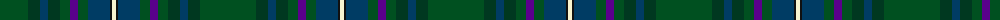

In pattern [GGBGGBGBKW](/patterns/ggbggbgbkw/).

This was sourced from register-of-tartans.  It is a [10 stripes tartan](/stripes/stripes10/).

Original link https://www.tartanregister.gov.uk/tartanDetails.aspx?ref=11360

## Thread count
G/56 DG12 DB8 DG12 G10 P8 G10 DB22 K2 LY/4

## Palette
Each colour and its ΔE from the base-6 reference it is a variant of.

| Colour | Shade | Base | ΔE (OKLab) |
|---|---|---|---|
| DB | <code style="background-color:#003C64;">#003C64</code> `#003C64` | B <code style="background-color:#2C4084;">#2C4084</code> | 0.07 |
| DG | <code style="background-color:#003820;">#003820</code> `#003820` | G <code style="background-color:#006400;">#006400</code> | 0.16 |
| G | <code style="background-color:#005020;">#005020</code> `#005020` | G <code style="background-color:#006400;">#006400</code> | 0.08 |
| K | <code style="background-color:#101010;">#101010</code> `#101010` | K <code style="background-color:#000000;">#000000</code> | 0.17 |
| LY | <code style="background-color:#F8F4D0;">#F8F4D0</code> `#F8F4D0` | W <code style="background-color:#F4F4F0;">#F4F4F0</code> | 0.04 |
| P | <code style="background-color:#5A008C;">#5A008C</code> `#5A008C` | B <code style="background-color:#2C4084;">#2C4084</code> | 0.12 |

## Nearest tartans

The nearest existing variants by ΔTartan distance.

1. [Yorkland (Personal)](/setts/s8/b72r4b8w2g28ga8y4ga36-b2c6074-g805400-ga006818-rc80000-we0e0e0-ye8c000/) — ΔT 1.34
1. [State Seal of Arkansas (Fashion)](/setts/s10/b98y6g26b24r8b10k14ga52b8r4-b003c64-g604000-ga5c6428-k101010-rc80000-ybc8c00/) — ΔT 1.53
1. [Telfer Green (Name)](/setts/s8/g14y4g10ga74b12r32b10ba4-b1c1c50-ba1870a4-g006818-ga004c2c-r880000-ybc8c00/) — ΔT 1.60
1. [Glencross (Tynron) (Personal)](/setts/s6/b6g26ba26y4ga68w6-b680018-ba084555-g3b522f-ga052f14-wddd5af-yc58310/) — ΔT 1.61
1. [US Army Regimental Tartan Tartan Number: 6307. Earliest known date: 2004 The Army was the only arm of the U.S. Forces not to have its own tartan. The colours were chosen to represent the uniforms - black for the beret, khaki for the summer uniform, light green for the original sniper and now part of the summer uniform, dark blue for the original dress uniform, olive for the combat uniform and gold for the cavalry. See products available Copyright © Blair Urquhart, Comrie, 2015](/setts/s6/b24k34g8ga102y6gb8-b003c64-g8c7038-ga003820-gb006818-k101010-ye8c000/) — ΔT 1.62
1. [Scottish Parliament (Official)](/setts/s12/b45g3ba7bb2ba7g3b4w2bc36w2b11ba4-b3e5e5d-ba272844-bb592237-bc362841-g33625c-wffffff/) — ΔT 1.63
1. [Stansbury (2014)](/setts/s8/g56r6k56b16ba2g16r4k6-b003c64-ba2888c4-g003820-k101010-rc80000/) — ΔT 1.70
1. [Muir-Hill (Personal)](/setts/s7/w4k4r2b40k30g60y2-b003c64-g003820-k101010-rc80000-we0e0e0-yfccc00/) — ΔT 1.70
1. [Field Gun Association (Corporate)](/setts/s13/r4g24ga6g4ga4g4ga32b8g24w2ga16g28y4-b5c8ca8-g004c2c-ga006818-rc80000-we0e0e0-ye8c000/) — ΔT 1.72
1. [Highlander](/setts/s12/g66b8g8b8g10g26ga26ba26ga4b22ga2r4-b1870a4-ba780078-g408060-ga005448-r888888/) — ΔT 1.72

## Neighbour map

Every grey dot is one of 15726 variants placed by the first two principal components of the ΔTartan feature space (44% of its variance). Red is this tartan; blue dots are its nearest — click one to open its page.

<svg viewBox="0 0 640 380" role="img" style="max-width:100%;height:auto;border:1px solid #e0e0e0;border-radius:4px;display:block" xmlns="http://www.w3.org/2000/svg"><image href="/nn/cloud.v1.png" width="640" height="380"/><a href="/setts/s8/b72r4b8w2g28ga8y4ga36-b2c6074-g805400-ga006818-rc80000-we0e0e0-ye8c000/"><circle cx="358.8" cy="144.2" r="4" fill="#3465a4"><title>Yorkland (Personal)</title></circle></a><a href="/setts/s10/b98y6g26b24r8b10k14ga52b8r4-b003c64-g604000-ga5c6428-k101010-rc80000-ybc8c00/"><circle cx="353.7" cy="141.2" r="4" fill="#3465a4"><title>State Seal of Arkansas (Fashion)</title></circle></a><a href="/setts/s8/g14y4g10ga74b12r32b10ba4-b1c1c50-ba1870a4-g006818-ga004c2c-r880000-ybc8c00/"><circle cx="289.2" cy="160.3" r="4" fill="#3465a4"><title>Telfer Green (Name)</title></circle></a><a href="/setts/s6/b6g26ba26y4ga68w6-b680018-ba084555-g3b522f-ga052f14-wddd5af-yc58310/"><circle cx="297.5" cy="185.0" r="4" fill="#3465a4"><title>Glencross (Tynron) (Personal)</title></circle></a><a href="/setts/s6/b24k34g8ga102y6gb8-b003c64-g8c7038-ga003820-gb006818-k101010-ye8c000/"><circle cx="346.7" cy="182.6" r="4" fill="#3465a4"><title>US Army Regimental Tartan Tartan Number: 6307. Earliest known date: 2004 The Army was the only arm of the U.S. Forces not to have its own tartan. The colours were chosen to represent the uniforms - black for the beret, khaki for the summer uniform, light green for the original sniper and now part of the summer uniform, dark blue for the original dress uniform, olive for the combat uniform and gold for the cavalry. See products available Copyright © Blair Urquhart, Comrie, 2015</title></circle></a><a href="/setts/s12/b45g3ba7bb2ba7g3b4w2bc36w2b11ba4-b3e5e5d-ba272844-bb592237-bc362841-g33625c-wffffff/"><circle cx="324.0" cy="129.6" r="4" fill="#3465a4"><title>Scottish Parliament (Official)</title></circle></a><a href="/setts/s8/g56r6k56b16ba2g16r4k6-b003c64-ba2888c4-g003820-k101010-rc80000/"><circle cx="353.4" cy="180.2" r="4" fill="#3465a4"><title>Stansbury (2014)</title></circle></a><a href="/setts/s7/w4k4r2b40k30g60y2-b003c64-g003820-k101010-rc80000-we0e0e0-yfccc00/"><circle cx="284.9" cy="152.2" r="4" fill="#3465a4"><title>Muir-Hill (Personal)</title></circle></a><a href="/setts/s13/r4g24ga6g4ga4g4ga32b8g24w2ga16g28y4-b5c8ca8-g004c2c-ga006818-rc80000-we0e0e0-ye8c000/"><circle cx="331.0" cy="180.7" r="4" fill="#3465a4"><title>Field Gun Association (Corporate)</title></circle></a><a href="/setts/s12/g66b8g8b8g10g26ga26ba26ga4b22ga2r4-b1870a4-ba780078-g408060-ga005448-r888888/"><circle cx="364.7" cy="155.7" r="4" fill="#3465a4"><title>Highlander</title></circle></a><circle cx="340.8" cy="154.7" r="5" fill="#c00000"/></svg>

ID: /setts/s10/g56ga12b8ga12g10ba8g10b22k2w4-b003c64-ba5a008c-g005020-ga003820-k101010-wf8f4d0/
