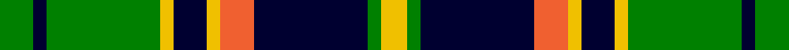

In pattern [GKGYKYRKGY](/stripes/gkgykyrkgy/).

This was sourced from weddslist.  It is a [10 stripe tartan](/stripes/stripes10/).

Original link http://www.weddslist.com/cgi-bin/tartans/pg.pl?source=sts

## Thread count
G/10 DB4 G34 Y4 DB10 Y4 O10 DB34 G4 Y/8

## Palette
Each colour and the base-6 reference it is a variant of.

| Colour | Shade | Base |
|---|---|---|
| DB | <code style="background-color:#000030;">#000030</code> `oklch(14.0% 0.097 264.1)` <small>#000030</small> | K <code style="background-color:#000000;">#000000</code> |
| G | <code style="background-color:#008000;">#008000</code> `oklch(52.0% 0.177 142.5)` <small>#008000</small> | G <code style="background-color:#006100;">#006100</code> |
| O | <code style="background-color:#F06030;">#F06030</code> `oklch(66.7% 0.188 38.0)` <small>#F06030</small> | R <code style="background-color:#CC0000;">#CC0000</code> |
| Y | <code style="background-color:#F0C000;">#F0C000</code> `oklch(82.7% 0.169 90.5)` <small>#F0C000</small> | Y <code style="background-color:#F2BF00;">#F2BF00</code> |

## Nearest tartans

The nearest existing variants by ΔTartan distance.

1. [Tweedside, hunting](/setts/s9/db21g5k5g15w3g5w3g5k3~x2/) — ΔT 1.01
1. [Louise](/setts/s11/g2k1db9k7g1k1g1k1g9r1g1~x4/) — ΔT 1.02
1. [Allon/Allan](/setts/s10/g8w1g1r1g4k4db8k1db1k1~x2/) — ΔT 1.10
1. [Cape Breton](/setts/s7/ly5k5g17k6y24k6ly3~x2/) — ΔT 1.12
1. [Wellecomme, Bernard (Personal)](/setts/s10/db4dg8k8db4ly3dg21k3lb4k3lb4~x2/) — ΔT 1.20
1. [Skene](/setts/s12/k4db24k4r3k4g24k4lo3k4g24r3k4~x2/) — ΔT 1.20
1. [Crantock](/setts/s8/g24p3g3p3g3p7dg20r3~x2/) — ΔT 1.21
1. [Corstorphine Trial A](/setts/s10/k6ly2g18w3g13k3ly4k3db18w3~x2/) — ΔT 1.22
1. [Hackett (Personal)](/setts/s7/k20w4r4g20w5g2g2~x2/) — ΔT 1.23
1. [Heritage of Ireland (Fashion)](/setts/s12/k5lo4g25k14lo5k5w5k2w3g3k2lo5~x2/) — ΔT 1.23

## Neighbour map

Every grey dot is one of 14299 variants placed by the first two principal components of the ΔTartan feature space (44% of its variance). Red is this tartan; blue dots are its nearest — click one to open its page.

<svg viewBox="0 0 640 380" role="img" style="max-width:100%;height:auto;border:1px solid #e0e0e0;border-radius:4px;display:block" xmlns="http://www.w3.org/2000/svg"><image href="/nn/cloud.v1.png" width="640" height="380"/><a href="/setts/s9/db21g5k5g15w3g5w3g5k3~x2/"><circle cx="189.0" cy="202.1" r="4" fill="#3465a4"><title>Tweedside, hunting</title></circle></a><a href="/setts/s11/g2k1db9k7g1k1g1k1g9r1g1~x4/"><circle cx="194.9" cy="172.8" r="4" fill="#3465a4"><title>Louise</title></circle></a><a href="/setts/s10/g8w1g1r1g4k4db8k1db1k1~x2/"><circle cx="168.3" cy="172.3" r="4" fill="#3465a4"><title>Allon/Allan</title></circle></a><a href="/setts/s7/ly5k5g17k6y24k6ly3~x2/"><circle cx="132.8" cy="200.0" r="4" fill="#3465a4"><title>Cape Breton</title></circle></a><a href="/setts/s10/db4dg8k8db4ly3dg21k3lb4k3lb4~x2/"><circle cx="163.2" cy="179.9" r="4" fill="#3465a4"><title>Wellecomme, Bernard (Personal)</title></circle></a><a href="/setts/s12/k4db24k4r3k4g24k4lo3k4g24r3k4~x2/"><circle cx="178.3" cy="157.4" r="4" fill="#3465a4"><title>Skene</title></circle></a><a href="/setts/s8/g24p3g3p3g3p7dg20r3~x2/"><circle cx="219.9" cy="191.9" r="4" fill="#3465a4"><title>Crantock</title></circle></a><a href="/setts/s10/k6ly2g18w3g13k3ly4k3db18w3~x2/"><circle cx="147.9" cy="168.4" r="4" fill="#3465a4"><title>Corstorphine Trial A</title></circle></a><a href="/setts/s7/k20w4r4g20w5g2g2~x2/"><circle cx="153.4" cy="166.0" r="4" fill="#3465a4"><title>Hackett (Personal)</title></circle></a><a href="/setts/s12/k5lo4g25k14lo5k5w5k2w3g3k2lo5~x2/"><circle cx="172.0" cy="147.8" r="4" fill="#3465a4"><title>Heritage of Ireland (Fashion)</title></circle></a><circle cx="170.0" cy="177.4" r="5" fill="#c00000"/></svg>

ID: /setts/s10/g5k2g17ly2k5ly2r5k17g2ly4~x2/
