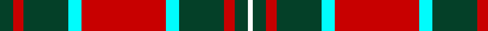

In pattern [GRGWRWGRGW](/patterns/grgwrwgrgw/).

This was sourced from register-of-tartans.  It is a [10 stripes tartan](/stripes/stripes10/).

Original link https://www.tartanregister.gov.uk/tartanDetails.aspx?ref=4645

## Thread count
DG/10 R8 DG34 LB10 R64 LB10 DG34 R8 DG10 W/4

## Palette
Each colour and its ΔE from the base-6 reference it is a variant of.

| Colour | Shade | Base | ΔE (OKLab) |
|---|---|---|---|
| DG | <code style="background-color:#044028;">#044028</code> `#044028` | G <code style="background-color:#006100;">#006100</code> | 0.13 |
| LB | <code style="background-color:#00FCFC;">#00FCFC</code> `#00FCFC` | W <code style="background-color:#F7F7F7;">#F7F7F7</code> | 0.17 |
| R | <code style="background-color:#C80000;">#C80000</code> `#C80000` | R <code style="background-color:#CC0000;">#CC0000</code> | 0.01 |
| W | <code style="background-color:#FCFCFC;">#FCFCFC</code> `#FCFCFC` | W <code style="background-color:#F7F7F7;">#F7F7F7</code> | 0.01 |

## Nearest tartans

The nearest existing variants by ΔTartan distance.

1. [Annan](/setts/s10/r15g1r2y2r2g1r3k8g10r3x4~g808080-k000000-r906030-yff8500/) — ΔT 0.79
1. [Braemar or Blair Atholl](/setts/s8/b2w2k6b3k2r14k1r1x4~b441800-k101010-ra07c58-wffffff/) — ΔT 0.88
1. [Blair Atholl (Fashion)](/setts/s8/b2y2k6b3k2r14k1r1x4~b441800-k101010-ra07c58-yb8b8b8/) — ΔT 0.96
1. [Fraser Gathering, Red](/setts/s9/r2b12r2g11r4b5g2r24w2x2~b000050-g008000-rc00000-we0e0e0/) — ΔT 1.00
1. [Vaughan (Welsh Series)](/setts/s11/w2k35g30k3y30k2y4k2y30k3w2~g00643c-k101010-wfcfcfc-ydc943c/) — ΔT 1.00
1. [Hannay Dress (Dance)](/setts/s10/k9y4k2y4k2y29k9y4ya14yb2x2~k101010-ye08070-ya48a4c0-ybe8c000/) — ΔT 1.01
1. [Glenfinnan (Fashion)](/setts/s10/r5w2g3w2r10g10r2w1r2ga1x4~g006818-ga005448-r880000-we0e0e0/) — ΔT 1.02
1. [Fort William (Fashion)](/setts/s11/r10w2y3w2b24w4b4r34b2w3b2x2~b381c0c-rb07430-w94acfc-y38c438/) — ΔT 1.03
1. [Braemar or Blair Atholl Trade Tartan Tartan Number: 1741. Earliest known date: 1984 Nothing See products available Copyright © Blair Urquhart, Comrie, 2015](/setts/s10/g1w2k5g3k1y5k1y11k1y1x4~g604000-k101010-we0e0e0-ya08858/) — ΔT 1.09
1. [Braemar, or Blair Atholl](/setts/s10/r1w2k5r3k1ra5k1ra11k1ra1x4~k000000-r806050-ra906030-we0e0e0/) — ΔT 1.12

## Neighbour map

Every grey dot is one of 15726 variants placed by the first two principal components of the ΔTartan feature space (44% of its variance). Red is this tartan; blue dots are its nearest — click one to open its page.

<svg viewBox="0 0 640 380" role="img" style="max-width:100%;height:auto;border:1px solid #e0e0e0;border-radius:4px;display:block" xmlns="http://www.w3.org/2000/svg"><image href="/nn/cloud.v1.png" width="640" height="380"/><a href="/setts/s10/r15g1r2y2r2g1r3k8g10r3x4~g808080-k000000-r906030-yff8500/"><circle cx="285.4" cy="159.0" r="4" fill="#3465a4"><title>Annan</title></circle></a><a href="/setts/s8/b2w2k6b3k2r14k1r1x4~b441800-k101010-ra07c58-wffffff/"><circle cx="254.5" cy="157.5" r="4" fill="#3465a4"><title>Braemar or Blair Atholl</title></circle></a><a href="/setts/s8/b2y2k6b3k2r14k1r1x4~b441800-k101010-ra07c58-yb8b8b8/"><circle cx="266.2" cy="162.7" r="4" fill="#3465a4"><title>Blair Atholl (Fashion)</title></circle></a><a href="/setts/s9/r2b12r2g11r4b5g2r24w2x2~b000050-g008000-rc00000-we0e0e0/"><circle cx="261.8" cy="162.0" r="4" fill="#3465a4"><title>Fraser Gathering, Red</title></circle></a><a href="/setts/s11/w2k35g30k3y30k2y4k2y30k3w2~g00643c-k101010-wfcfcfc-ydc943c/"><circle cx="233.5" cy="131.4" r="4" fill="#3465a4"><title>Vaughan (Welsh Series)</title></circle></a><a href="/setts/s10/k9y4k2y4k2y29k9y4ya14yb2x2~k101010-ye08070-ya48a4c0-ybe8c000/"><circle cx="266.6" cy="143.2" r="4" fill="#3465a4"><title>Hannay Dress (Dance)</title></circle></a><a href="/setts/s10/r5w2g3w2r10g10r2w1r2ga1x4~g006818-ga005448-r880000-we0e0e0/"><circle cx="260.7" cy="179.6" r="4" fill="#3465a4"><title>Glenfinnan (Fashion)</title></circle></a><a href="/setts/s11/r10w2y3w2b24w4b4r34b2w3b2x2~b381c0c-rb07430-w94acfc-y38c438/"><circle cx="297.0" cy="128.7" r="4" fill="#3465a4"><title>Fort William (Fashion)</title></circle></a><a href="/setts/s10/g1w2k5g3k1y5k1y11k1y1x4~g604000-k101010-we0e0e0-ya08858/"><circle cx="274.9" cy="164.8" r="4" fill="#3465a4"><title>Braemar or Blair Atholl Trade Tartan Tartan Number: 1741. Earliest known date: 1984 Nothing See products available Copyright © Blair Urquhart, Comrie, 2015</title></circle></a><a href="/setts/s10/r1w2k5r3k1ra5k1ra11k1ra1x4~k000000-r806050-ra906030-we0e0e0/"><circle cx="268.5" cy="163.4" r="4" fill="#3465a4"><title>Braemar, or Blair Atholl</title></circle></a><circle cx="260.1" cy="151.7" r="5" fill="#c00000"/></svg>

ID: /setts/s10/g5r4g17w5r32w5g17r4g5wa2x2~g044028-rc80000-w00fcfc-wafcfcfc/
