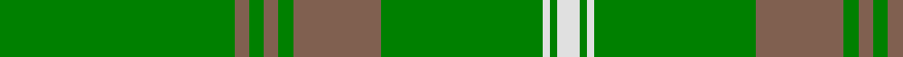

In pattern [GRGRGRGWGW](/patterns/grgrgrgwgw/).

This was sourced from weddslist.  It is a [10 stripes tartan](/stripes/stripes10/).

Original link http://www.weddslist.com/cgi-bin/tartans/pg.pl?source=sts

## Thread count
G/64 LT4 G4 LT4 G4 LT24 G44 LN2 G2 LN/6

## Palette
Each colour and its ΔE from the base-6 reference it is a variant of.

| Colour | Shade | Base | ΔE (OKLab) |
|---|---|---|---|
| G | <code style="background-color:#008000;">#008000</code> `#008000` | G <code style="background-color:#006100;">#006100</code> | 0.10 |
| LN | <code style="background-color:#E0E0E0;">#E0E0E0</code> `#E0E0E0` | W <code style="background-color:#F7F7F7;">#F7F7F7</code> | 0.07 |
| LT | <code style="background-color:#806050;">#806050</code> `#806050` | R <code style="background-color:#CC0000;">#CC0000</code> | 0.17 |

## Nearest tartans

The nearest existing variants by ΔTartan distance.

1. [Unidentified Plaid #2](/setts/s10/g64ga4g4ga4g4ga24g44w2g2w6-g005020-ga503c14-we0e0e0/) — ΔT 1.78
1. [Owen Welsh Name Tartan Tartan Number: 5750. Earliest known date: 2002 The tartan for this Welsh surname and its variations, Bowen, Ifan, is actually woven in Wales at the Cambrian Woollen Mill, weaving on the same site since 1830. This tartan differs from many traditional patterns in that the warp and weft differ, giving the finished worsted wool cloth more of a predominant stripe, vertically noticeable in the finished Kilt, or Cilt in Wales. See products available Copyright © Blair Urquhart, Comrie, 2015](/setts/s10/g6b2g4r2g6ba6g4ba4g36b4-b003c64-ba002048-g006818-rc80000/) — ΔT 1.82
1. [Unnamed Green (Teddy Bear)](/setts/s11/r2ra6g4ra6r2g48r2ra6g4ra6r2-g008000-rc00000-ra806050/) — ΔT 1.84
1. [Delta Lambda Phi (Corporate)](/setts/s12/y10k2y12g40w2g6w2g6w2g60k2y4-g006818-k101010-wfcfcfc-ybc8c00/) — ΔT 1.89
1. [Menzies, hunting](/setts/s8/g96r8g4r8g12r4g6r18-g008000-rc00000/) — ΔT 1.94
1. [Owen (Welsh Name)](/setts/s10/g6r2g4b2g6r6g4r4g36r4-b002048-g006818-rc80000/) — ΔT 2.02
1. [Montgomerie](/setts/s12/g54ga78b6ga6b8ga6b6ga78b6ga6b8ga6-b304080-g003000-ga008000/) — ΔT 2.08
1. [Menzies](/setts/s8/g96r8g4r8g12r4g6r18-g006818-rc80000/) — ΔT 2.11
1. [Glenlivet](/setts/s8/g18r6g75b6g13ra35g12b6-b304080-g008000-rc00000-ra806050/) — ΔT 2.11
1. [Highland Hospice (Fashion)](/setts/s10/g102b6g10y6g10b10g10b10g10y6-b28003c-g006818-ybc8c00/) — ΔT 2.12

## Neighbour map

Every grey dot is one of 15726 variants placed by the first two principal components of the ΔTartan feature space (44% of its variance). Red is this tartan; blue dots are its nearest — click one to open its page.

<svg viewBox="0 0 640 380" role="img" style="max-width:100%;height:auto;border:1px solid #e0e0e0;border-radius:4px;display:block" xmlns="http://www.w3.org/2000/svg"><image href="/nn/cloud.v1.png" width="640" height="380"/><a href="/setts/s10/g64ga4g4ga4g4ga24g44w2g2w6-g005020-ga503c14-we0e0e0/"><circle cx="579.3" cy="185.2" r="4" fill="#3465a4"><title>Unidentified Plaid #2</title></circle></a><a href="/setts/s10/g6b2g4r2g6ba6g4ba4g36b4-b003c64-ba002048-g006818-rc80000/"><circle cx="533.9" cy="185.6" r="4" fill="#3465a4"><title>Owen Welsh Name Tartan Tartan Number: 5750. Earliest known date: 2002 The tartan for this Welsh surname and its variations, Bowen, Ifan, is actually woven in Wales at the Cambrian Woollen Mill, weaving on the same site since 1830. This tartan differs from many traditional patterns in that the warp and weft differ, giving the finished worsted wool cloth more of a predominant stripe, vertically noticeable in the finished Kilt, or Cilt in Wales. See products available Copyright © Blair Urquhart, Comrie, 2015</title></circle></a><a href="/setts/s11/r2ra6g4ra6r2g48r2ra6g4ra6r2-g008000-rc00000-ra806050/"><circle cx="505.5" cy="166.3" r="4" fill="#3465a4"><title>Unnamed Green (Teddy Bear)</title></circle></a><a href="/setts/s12/y10k2y12g40w2g6w2g6w2g60k2y4-g006818-k101010-wfcfcfc-ybc8c00/"><circle cx="512.2" cy="128.0" r="4" fill="#3465a4"><title>Delta Lambda Phi (Corporate)</title></circle></a><a href="/setts/s8/g96r8g4r8g12r4g6r18-g008000-rc00000/"><circle cx="575.5" cy="181.8" r="4" fill="#3465a4"><title>Menzies, hunting</title></circle></a><a href="/setts/s10/g6r2g4b2g6r6g4r4g36r4-b002048-g006818-rc80000/"><circle cx="513.0" cy="165.8" r="4" fill="#3465a4"><title>Owen (Welsh Name)</title></circle></a><a href="/setts/s12/g54ga78b6ga6b8ga6b6ga78b6ga6b8ga6-b304080-g003000-ga008000/"><circle cx="446.8" cy="194.1" r="4" fill="#3465a4"><title>Montgomerie</title></circle></a><a href="/setts/s8/g96r8g4r8g12r4g6r18-g006818-rc80000/"><circle cx="584.2" cy="185.0" r="4" fill="#3465a4"><title>Menzies</title></circle></a><a href="/setts/s8/g18r6g75b6g13ra35g12b6-b304080-g008000-rc00000-ra806050/"><circle cx="470.8" cy="220.7" r="4" fill="#3465a4"><title>Glenlivet</title></circle></a><a href="/setts/s10/g102b6g10y6g10b10g10b10g10y6-b28003c-g006818-ybc8c00/"><circle cx="557.8" cy="174.8" r="4" fill="#3465a4"><title>Highland Hospice (Fashion)</title></circle></a><circle cx="565.8" cy="174.6" r="5" fill="#c00000"/></svg>

ID: /setts/s10/g64r4g4r4g4r24g44w2g2w6-g008000-r806050-we0e0e0/
